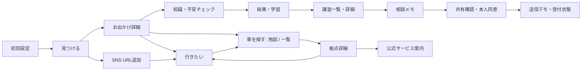

# Drive+ — スマートフォン向けUXモック

「行きたい」を「行ける」に変える、お出かけ発見・運転準備アプリの操作可能なモックです。新アプリPRD v0.2を仕様、添付の画面イメージをデザインの基準として実装しています。アプリ名は仮称です。

## 起動

追加開発の操作手順・画像・本番化の残作業は [下見・お出かけ条件・SNS保存のレビュー](docs/reviews/development-batch-1/README.md) にまとめています。

Node.js **24.20.0**、npm **11.19.0**で動作確認しています。Node.jsの指定は`.nvmrc`、npmの指定は`package.json`に記載しています。

```bash
npm ci
npm run dev
```

表示されたURL（通常は `http://localhost:5173`）を開きます。スマートフォンではPCと同じネットワークに接続し、起動時に表示される **Network URL** を開いてください。

- PC: iPhone 17の画面比率に合わせた402 × 874pxの画面を中央表示。端末枠とUI全体を最大90%で等比縮小し、ウィンドウが低い場合も縦横比を保って収めます。
- スマートフォン: 端末幅いっぱいに表示。スクロールはアプリ内部に限定します。
- 初回: ウェルカム → 出発エリア → 同行者 → 興味 → ホーム。スキップ可能です。
- もう一度最初から試す: 右上プロフィール → 設定 →「モックの保存データを削除」。

```bash
npm run build           # TypeScriptの型チェックとサンプル検証版のビルド
npm run verify:preview  # 配信するファイル・設定の検査
npm run preview         # ビルドした静的ファイルの確認（通常 http://localhost:4173）
```

今回の結果と確認画像は [Issue #5・#14のレビュー](docs/reviews/static-preview/README.md) にまとめています。データ差し替えの構成、ビルド設定、CIで生成する配信ファイル、後日の配信・巻き戻し手順は [静的検証版のガイド](docs/STATIC_PREVIEW.md) を参照してください。外部サービスへの配信はまだ実施していません。

## 実装した画面

| 領域 | 画面・操作 |
| --- | --- |
| 初回設定 | ウェルカム、出発エリア、同行者、複数の興味選択、戻る・次へ・スキップ |
| 見つける | 写真カード、検索、おすすめ・今週末・イベント・スポット、趣味の絞り込み、おすすめ理由・非表示、出発エリア変更 |
| お出かけ詳細 | 保存、目標メモ、情報源・開催状態・確認日、運転準備、車探し、公式情報・外部地図・SNSの案内 |
| 行きたい | お出かけと車候補の切り替え、保存・解除の同期、SNS URL追加・削除、内容未確認の表示 |
| 知識・不安チェック | 経験の自己申告、不安な場面、道路イラストへのマーク、3問の選択式、前後移動、未回答でスキップ、結果 |
| 学ぶ | 用途別の一覧、学習詳細、解説、前・次の問題、学習済み記録、質問を相談メモに追加 |
| 車を探す | 地図のドラッグ、複数ピン、現在地のデモ、地域検索、種別・事業者フィルター、地図／一覧、拠点カード・詳細、保存、公式・外部地図案内 |
| 講習 | 会社一覧、エリア・練習内容・予算・車両の絞り込み、会社・講師詳細、希望日時の相談 |
| 相談 | メモの自動保存、共有先・項目確認、同意、端末内の送信デモ、受付後の表示、共有内容・同意日時、取り下げ |
| マイページ | プロフィール、興味・出発エリア編集、保存数、学習履歴、相談・共有履歴 |
| 振り返り・設定 | お出かけ／講習の振り返り、講師の助言と本人メモを分離、文字サイズ、動きの低減、非表示の解除、保存データ削除 |

下部ナビゲーションの順序は **見つける → 行きたい → 車を探す → 学ぶ → 講習** です。マイページは各主要画面の右上から開きます。

## 主な画面遷移



チェックを経由せず、学習・車探し・講習相談を利用できます。戻る操作はURL履歴を使い、一覧のスクロール位置と地図の検索条件も維持します。直接URLを開いた場合も各画面を確認できるゲストモックです。

## 技術・ファイル構成

既存リポジトリは空だったため、React / TypeScript / Vite / React Router / 独自CSS / Lucideを採用しました。

```text
src/
  App.tsx                    画面ルーティング
  main.tsx                   エントリーポイント
  styles.css                 スマホ枠・共通トークン・各画面のスタイル
  components/
    MobileFrame.tsx           端末、ステータスバー、スクロール管理
    ui.tsx                   Header、ナビ、ボタン、チップ、シート、モーダル等
    Cards.tsx                EventCard、StationCard、LessonCard、SchoolCard等
    RentalMap.tsx            SVG地図、ドラッグ、選択可能なピン
    RoadScene.tsx            SVG道路場面、確認箇所のマーク
  content/
    catalog.ts               掲載データの型・ID整合性検査・読み取り用スナップショット
    sampleCatalog.ts         同梱サンプルを集約する入口
    ContentProvider.tsx      各画面へのデータ供給
  data/
    types.ts                 API置き換え時にも使えるデータ型
    mockData.ts              お出かけ、拠点、設問、教材、講習会社等
    options.ts               選択肢・初期プロフィール
  state/AppState.tsx          状態更新・localStorage・通知
  screens/                   各領域の画面実装
public/images/               同梱したイメージ写真（実行時の外部取得なし）
tests/flows.spec.ts           操作フローのブラウザテスト
scripts/capture-ui.mjs        デザイン確認用スクリーンショットの再生成
docs/IMPLEMENTATION_PLAN.md  着手前の調査・画面・遷移・実装計画
docs/screenshots/            PC・スマホ表示の実際のスクリーンショット
docs/ASSETS.md               写真の取得元・ライセンス
```

localStorageキーは `driveplus.mock.v1`。初回回答、お出かけ・車の保存、SNSリンク、知識回答、不安、学習済み状態、相談メモ、同意した項目のスナップショット、相談・振り返り履歴を保存します。保存領域が使えない環境では、そのタブ内のメモリに保持し、画面に通知します。

## 試すときの補足

- 地図は**架空の配置**です。渋谷に6拠点、新宿に2拠点を用意しています。ほかの地域では候補ゼロの画面を確認できます。
- 地図をドラッグすると見える配置を動かせます。実際の座標・道路・距離の再現や経路検索はありません。
- 「現在地」は渋谷を使った表示デモで、位置情報の権限は要求しません。
- 「今週末」は **2026年9月19〜20日を想定するサンプル**と表示します。実在する開催情報ではありません。
- 店舗・講師・料金はサンプル。実在事業者の名称を含む場合も提携・実在店舗の営業状況を表すものではありません。
- 知識の回答、経験、不安、未確認を分けて表示し、実技能力の点数化・安全判定はしません。教材は**未監修のUIサンプル**です。
- 相談には同意が必要です。選択した項目だけを、その時点の内容としてデモ履歴に保存します。後からメモを変更しても過去の共有内容は変わりません。
- 「公式で空き状況・予約を確認」等は案内モーダルです。外部サイトを開かず、予約や送信を実行しません。
- SNSリンクは取得・解析せず、個人の「内容未確認」リストに保存します。ホームのおすすめには自動掲載しません。

## 検証

```bash
npx playwright install chromium
npm run test:e2e     # 開発サーバーで操作を確認
npm run build
CI=true PLAYWRIGHT_PORT=5176 npm run test:preview  # 配信ファイルで確認
npm run test:report  # 画像・操作結果付きHTMLレポートを開く
```

PCとiPhone相当のモバイルサイズで、初回設定、5タブ、保存、SNS追加、チェック・未回答、学習履歴、地図と絞り込み、同意付き相談、プロフィール、振り返り、データ削除、戻る、フォーカス制御、横はみ出し、画像欠損を確認します。実機Safari・Android端末でのネイティブ動作は別途確認が必要です。

GitHubのPRではビルド済みの静的ファイルを検査し、そのファイルで操作確認を自動実行します。成功した配信ファイルは `static-preview-<SHA>` Artifactに保存します（自動デプロイは行いません）。成功した各テストの操作後の画面と、失敗時の画像・トレースをHTMLレポートに保存します。CI実行画面のArtifactsからダウンロードでき、保持期間は14日です。Issueへの結果報告とレビューの手順は[CONTRIBUTING.md](CONTRIBUTING.md)を参照してください。

スクリーンショットは開発サーバー起動中に再生成できます。

```bash
node scripts/capture-ui.mjs
```

## モックとして省略したもの

認証、DB、バックエンド、外部API、SNS自動収集、空車情報、実予約、決済、GPSナビ、通知配信、分析基盤、運営向け管理画面、実際の監修済み教材を省略しています。レーティングや実績は作っていません。

## 本実装に向けたTODO

1. 初期エリア・対象者・アプリ名・対応OS、各データの正式スキーマを確定。
2. イベント情報源の許諾と、発見・レビュー・重複整理・終了／中止・鮮度管理を実装。写真も適切な実在情報に置き換え。
3. 設問・解説の根拠資料、監修者、更新日、公開審査を整備。未監修サンプルは教材として公開しない。
4. 地図提供元、拠点データ取得・再表示条件・更新方法を決定。実際の座標・検索と公式URLを接続。
5. 講習会社の対応条件・料金・取消条件、掲載／紹介の契約を確認。
6. 同意管理と必要最小限の情報共有、受付・予約・受講・キャンセルを区別するAPI、重複送信防止を実装。
7. サーバー保存に切り替える範囲で、認証、データ保存期間・削除、権限管理を整備。
8. 実機で文字拡大・読み上げ・片手操作・キーボード表示・セーフエリアを検証。

詳しい着手時の判断は [実装計画](docs/IMPLEMENTATION_PLAN.md)、デザインの確認結果は [検証メモ](docs/VERIFICATION.md) を参照してください。
