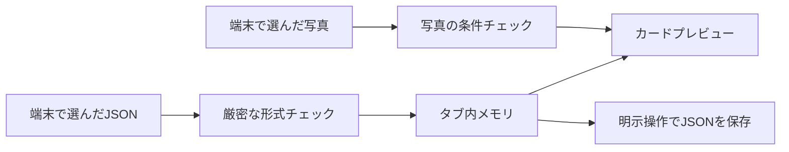

# 掲載情報の入力チェック（Issue #17 の先行実装）

情報源、項目ごとの確認日、写真の利用条件を整理するローカルツールです。施設選定・素材の確認を保留したまま、架空の入力例で検証できます。

## 起動・操作

Node.js / npm はアプリと同じ指定バージョンを使います。新しいパッケージ・外部サービスは不要です。

```bash
npm ci
npm run review
```

http://127.0.0.1:4180/ を開きます。標準設定は同じPCからのアクセスです。

1. 「確認用サンプル」で架空のイベントを読み込み、基本情報を編集します。
2. 「情報源・確認」で公式告知・X・TikTok・施設／現地確認を追加し、名称・場所・開催日時ごとに根拠をひも付けます。
3. 確認日・再確認期限と確認状態を入力します。名称・場所・日時・参照元を変えると、関連する確認状態が未確認に戻ります。
4. 写真を使う場合は「写真の条件」で端末のファイルを選び、権利者・許諾記録の参照先・利用範囲・クレジット・代替テキスト・期限を入力します。
5. フォーム下の「入力チェック結果」から、不足項目を選んで修正できます。カードは入力に合わせて変化します。
6. 「入力JSONを保存」で途中の入力も保存できます。「JSONを読み込む」で復元できます。写真本体は含まないので、再選択・再確認が必要です。

入力はタブ内のメモリだけで扱い、アプリのlocalStorage、サーバー、公開リポジトリへ自動保存しません。ページを閉じる・再読み込みすると未保存の入力は失われます。保存ダイアログでファイルが保存されたことを確認してください。ブラウザの離脱確認は端末によって動作が異なります。

編集中に新規・サンプル・別JSONへ置き換える場合は確認ダイアログが開きます。不正なJSONの読み込みでは、元の入力を維持します。

JSONには確認メモ・許諾記録の参照先が含まれます。実情報を扱う場合、ファイルはリポジトリの外で管理し、Gitや配信フォルダに追加しないでください。サンプルとスクリーンショットの入力はすべて架空です。

## 入力形式

`tools/content-review/model.ts` の `Draft` が型と検証処理、`sample.ts` が架空の記入例です。JSONは1候補ずつ、128 KiB以内で扱います。未知のキーや型の違う値を黙って捨てず、読み込みエラーにします。未入力の文字列や未確認状態は下書きとして保存できます。

| 項目 | 内容 |
| --- | --- |
| `schemaVersion` | 現在は `1` |
| `id / kind` | 管理ID、イベント／常設スポット |
| `title / summary / area / description / tags` | 名称・短い紹介・場所・説明・タグ |
| `eventYear / startsAt / endsAt` | 開催年・開始終了日時。常設スポットは `null / "" / ""` |
| `sources[]` | 独立した情報源ID、種類、名称、URL、参照可能かどうか |
| `checks.title / location / schedule` | 確認状態、根拠のID配列、確認日、再確認期限 |
| `photo` | 写真の使用有無、ファイル名、利用条件・確認状態・期限。写真のバイト列やURLは保存しない |
| `internalNote` | カードに出さない確認メモ |

`sources` は20件、タグは8件までです。情報源IDを重複させたり、存在しない根拠IDで確認を満たしたりすることはできません。参照できないSNS投稿は候補として記録できますが、その投稿だけでは確認済みの根拠を満たしません。URLは形式・種類を検査するだけで、ページ内容や現在の実在性は取得・判定しません。

イベント日時は `2026-10-01T10:00:00+09:00` のように秒とタイムゾーンを付けます。実在日・前後関係を検査し、開催年は開始日時を日本時間に変換した年と照合します。確認日・再確認期限は `YYYY-MM-DD`。判定日は日本時間で、期限当日は有効として扱います。サンプルの30日後という日付は入力例で、運営の更新期限を決めるものではありません。

写真はPNG・JPEG・WebP、5 MiB以内です。利用条件に不足・期限切れ・取り下げがある場合は表示しません。選び直した場合は同じファイル名でも利用条件をクリアします。読み込めない画像には代替表示を出します。

## コマンドで検査する

```bash
npm run content:check -- --sample
npm run --silent content:check -- /path/to/private-draft.json
```

終了コードは `0`：入力項目が揃った、`1`：不足・矛盾がある、`2`：読込・形式エラーです。検査処理は入力内容や許諾メモを出力せず、項目名と固定のエラー文を返します。結果の `publication` は常に `not-implemented` です。

「入力項目が揃いました」は、記録の形式と有無の確認結果です。内容が正しいこと、写真の許諾があること、公開が承認されたことを意味しません。入力JSONを `ContentCatalog` やアプリの掲載データへ自動変換する処理はありません。

## アプリの配信からの分離



- `npm run build`：アプリを `dist/` に生成。
- `npm run build:review`：ローカルツールを `review-dist/` に別生成。
- `npm run preview:review`：ビルド済みツールをローカルで確認。
- アプリの生成物にツールのコードが混ざらないことをテストしています。CIが保存する `static-preview-<SHA>` はアプリの `dist/` だけです。
- ツールの入力や写真は外部送信しません。ビルド済みツールのCSPでも外部通信を制限します。認証を備えた管理サービスとして外部配信する設定はありません。

## 検証

```bash
npm run format:check
npm run build
npm run build:review
CI=true PLAYWRIGHT_PORT=5176 npm run test:preview
CI=true npm run test:review
npx playwright show-report review-playwright-report
```

既存アプリ52件、入力ツール18件の合計70件を確認します。入力ツールのテストには、形式・日時境界・根拠参照・写真条件、JSON往復、元の入力の保持、キーボード操作、外部通信やアプリの保存領域への書き込みがないこと、HTML文字列の表示、配信物への分離を含みます。

CIには `content-review-report` を追加し、14日間保存します。実機Safari・iOSのファイル選択・ダウンロード・離脱確認の検証は後続です。架空のテストデータだけをCIで使用します。

## 後続の作業

| 担当 | 今後の作業 |
| --- | --- |
| 人間 | 施設選定・素材の確認、確認担当・承認担当・更新期限の決定（引き続き保留） |
| 開発 | 編集権限・承認フロー・監査履歴・公開／非公開のサーバー処理（#13・#15・#17） |
| 開発 | 終了・中止・別年度・素材停止の運用と配信への反映（#18） |
| 共同 | 承認済みデータだけを公開用に取り出す形式と、私的メモを除外するレビュー・運用 |

#17全体の完了条件は未達です。今回の成果は、入力形式・ローカル検査・カードプレビューの先行部分です。
