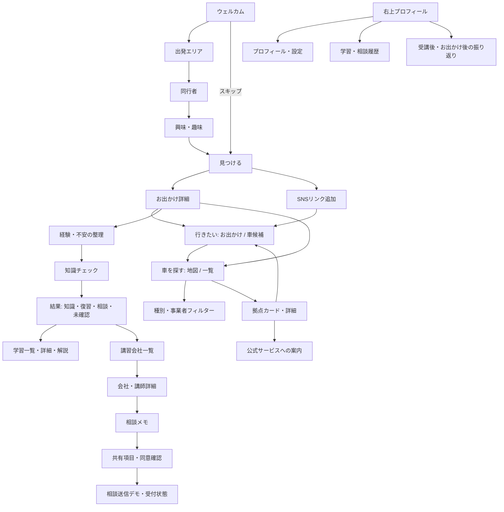

# Drive+（仮）スマートフォンモック 実装計画

## 確認した資料と環境

- 仕様: 新アプリPRD v0.2（2026-09-13）。[元ドキュメント](https://docs.google.com/document/d/1PAdM_xDRuSDMuraAjECRCV3K8jzK9lUQjGAA7gE187Y/edit)
- デザイン: 添付5画像。全体フローの写真カード・ティール配色、特に `drive_app_ui_03.png` の地図、ピン、下部カード、詳細を基準とする。
- 既存リポジトリ: `.git` のみ。既存実装、依存関係、起動手順、適用される AGENTS.md はなし。
- 環境: Node.js 24 / npm 11。React + TypeScript + Vite、独自CSS、Lucideアイコン、React Routerで新規構築。

## 画面と主要遷移

下部タブの順序は **見つける / 行きたい / 車を探す / 学ぶ / 講習**。詳細画面でも維持する。マイページは右上から開く。

## 共通部品と状態

- `MobileFrame`, `Header`, `BottomNavigation`, `PrimaryButton`, `Chip`, `BottomSheet`, `Modal`, `EmptyState`
- `EventCard`, `RentalMap`, `StationCard`, `LessonCard`, `RoadScene`
- `src/data/`: お出かけ、拠点、講習会社、設問、学習、初期プロフィールを型付きで分離。
- Context + イミュータブルな状態更新 / localStorage: 初回回答、保存、SNSリンク、知識回答、不安、学習履歴、相談メモ・共有内容、振り返り。
- URLルーティングとブラウザ履歴で戻る操作を維持。地図・一覧は同じ絞り込み状態を共有。

## 表示・仕様上の判断

- PCは390 × 844px基準の端末を中央表示。高さの低い画面では枠を縮め、内部だけスクロール。スマホでは100%幅・動的ビューポート高。
- 写真は同梱のイメージ素材。地図・道路場面はコードで作るSVG。外部API・GPSは使わない。
- 全掲載情報はサンプルであることを明示。架空の実績・口コミ、実技認定、未取得の空車表示は作らない。
- SNSの追加リンクは「内容未確認」として個人の保存リストだけに保持。
- 学習は未監修のUIサンプルと表示。本番公開前の根拠・監修はTODO。
- 相談は共有先・項目・本人同意を確認後、端末内のデモ履歴だけを作成。予約確定と区別。

## 実装と検証の順序

1. 基盤、共通部品、データ、端末フレームと初回設定。
2. 発見・保存・詳細・SNS、地図と車候補。
3. 知識チェック・学習、講習・相談、プロフィール・履歴・振り返り。
4. ビルド、Playwrightで主要UXと状態保持、戻る、同意、レスポンシブを確認。
5. デスクトップとスマホのスクリーンショットを添付画像と比較して調整。READMEと本実装TODOを整備。
