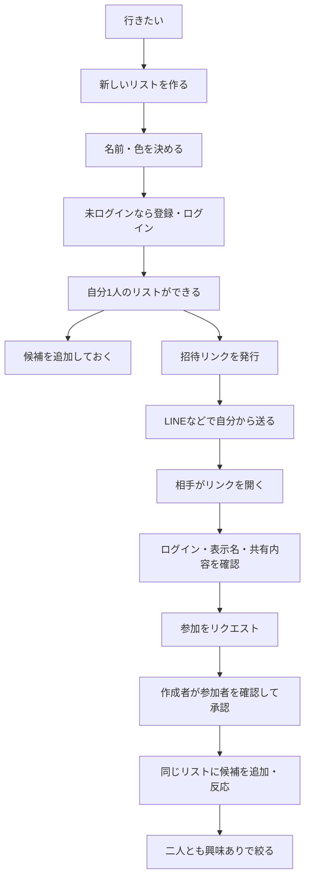
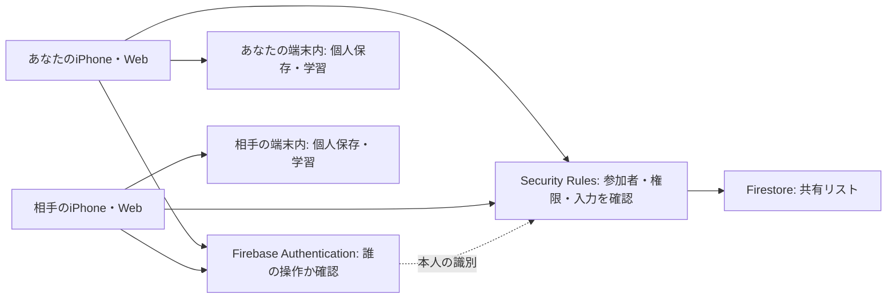

# 「行きたい」を一緒に育てる — TimeTree調査と機能設計案

> 2026-10-04更新：#93の本人用保存は利用者確認・マージ済み。#94で相手への招待・候補・反応を接続しました。現在の操作は[実共有の3ステップ](SHARED_WISHLIST_CLOUD.md)を参照してください。以下はこの段階までの設計／準備記録です。

2026-10-03 / 関連Issue [#39](https://github.com/Greek-Academy/Let-s-go-anywhere/issues/39)・[#40](https://github.com/Greek-Academy/Let-s-go-anywhere/issues/40)

**2026-10-03追記：ユーザーが設計を承認し、Issue #90で端末内の共有体験デモを実装しました。** [今回の操作方法と未実装範囲](SHARED_WISHLIST_DEMO.md)を参照してください。Firebaseは未作成で、別端末共有・ログイン・サーバー接続は未実装です。下記の人数・期限・権限はTimeTreeの仕様そのものではなく、Drive+向けに設計したルールです。

## まず、できるようにしたいこと

「自分の行きたい」を今までどおり貯めながら、「ふたりの休日」「友だちとの旅行」などのリストを作り、招待した相手と候補を持ち寄ります。参加するのはそのリストだけで、個人の保存一覧や学習メモは見えません。

例：自分が温泉を追加し、相手がカフェを追加。お互いが「行きたい」「気になる」「今回は見送り」を選び、二人とも興味のある候補だけを表示します。日付が決まっていなくても使えます。

おすすめの最小版は **リスト作成・招待と参加・候補の追加・リアクション・メンバー管理** です。まず2人・1リスト・10候補で、別々の端末から使う検証までを目指します。

## 1. TimeTreeを調べて分かったこと

公式ヘルプと公式の使い方記事を調査しました。TimeTreeアプリにアカウントを作り、実機で一連の操作を試した結果ではありません。対象は、身近な人と使う「共有カレンダー」です。誰でも閲覧できる「公開カレンダー」の管理者招待とは区別しています。

| 公式情報で確認したこと | Drive+への取り入れ方 |
| --- | --- |
| カレンダー一覧から新しい共有カレンダーを作る。[作成方法](https://support.timetreeapp.com/hc/ja/articles/204121559) | 「行きたい」内に複数の名前付きリストを持つ |
| 共有したいカレンダーを選び、そのカレンダーへの招待URLをLINE等で送る。通常の共有カレンダーの招待URLは90日間有効。[招待方法](https://support.timetreeapp.com/hc/ja/articles/203005579) | 共有先のリストを明示した招待リンクを作る。Drive+では短い期限を提案 |
| 相手は招待URLから参加操作を行い、使用するプロフィールを選ぶ。[参加方法](https://support.timetreeapp.com/hc/ja/articles/900006199983) | 勝手に参加させず、共有される内容と表示名を確認する |
| メモは日時を決めていない情報にも使え、カレンダーの参加者が確認できる。[メモの登録](https://support.timetreeapp.com/hc/ja/articles/207392706)・[メモの使い方](https://timetreeapp.com/intl/ja/usages/2026-09-08/how-to-use-memo) | 日付未定の「行きたい」を写真カードで持ち寄る |
| 作成者にはメンバーを削除する権限があり、他の権限は他メンバーと同じ。[作成者](https://support.timetreeapp.com/hc/ja/articles/115000038561) | Drive+でも管理する人を明示する。細かい権限は下記の独自案にする |
| 退出者は閲覧できなくなり、予定は残る。最後のメンバーが退出するとカレンダーが消える。作成者退出時は古い参加者に役割が移る。[退出・削除](https://support.timetreeapp.com/hc/ja/articles/204698785) | 退出・内容の保持・管理者の引き継ぎを、作成段階から説明する |

採用するのは「共有する箱を作り、その箱に人を招待する」考え方です。TimeTreeの画面を複製したり、TimeTreeのアカウント・APIと連携したりする設計ではありません。現在の白・ティール・写真カードのデザインを維持します。

## 2. 画面と使い方

下部は「見つける／行きたい／車を探す／学ぶ」の4タブを維持します。「行きたい」の中で共有先を切り替えます。

### 個人の保存をそのまま使う

ハートは引き続き「自分の行きたいに保存」です。リストを作成したり誰かを招待したりしても、これまでの全件を自動で共有しません。個人側の「お出かけ／車候補」の区分も維持します。

「私の行きたい ▼」を押すと、切り替え用のボトムシートを開きます。

```text
行きたい                         プロフィール
┌────────────────────────────┐
│ 私の行きたい             ▼ │
└────────────────────────────┘
  お出かけ        車候補
  これまでの保存カード

▼ リストを切り替える
  🔒 私の行きたい       自分だけ
  🌿 ふたりの休日       2人・8候補
  🧳 友だちとの旅行     3人・5候補
  ＋ 新しいリストを作る
  招待リンクから参加する
```

### 新しいリストを作る

リスト名（必須・40文字以内）、色・用意したアイコンを選びます。例は「ふたりの休日」「次の旅行」。カバー写真のアップロードは初期版に入れません。

名前を決めた後、共有用リストをクラウドに作る段階でログインを求めます。説明は「別の端末でも同じリストを開くために、アカウントが必要です」。個人の端末内保存にはログインを必須にしません。作成後は「メンバーを招待」「あとで招待」を選べます。1人の状態でも候補を準備できます。

### 招待して、参加する



**参加承認はDrive+向けの提案です。** 転送されたリンクを拾った人がそのまま参加するのを防ぐため、初期版は「相手の参加リクエスト → 作成者の承認」を挟みます。TimeTreeでこの承認手順が必須だと確認したわけではありません。承認待ちは画面に表示し、最初はプッシュ通知を追加しません。

### 共有リストで候補を持ち寄る

```text
〈 リスト一覧    ふたりの休日          …
   あなた・はるさん    2人        メンバー

  すべて    二人とも興味あり    未回答あり

┌────────────────────────────┐
│             写真           │
│ ○○温泉                 京都 │
│ あなたが追加               │
│ あなた：行きたい           │
│ はるさん：気になる         │
│                            │
│ 行きたい / 気になる / 見送り│
└────────────────────────────┘
  ＋ 候補を追加

  最終更新 14:20            更新する
```

ここでの名前・時刻・施設は画面構成を説明するための例です。写真が使えない候補は既存と同じプレースホルダーを使います。

候補追加には「自分の保存から選ぶ」「リンクとタイトルを入力する」を用意します。「見つける」の詳細にも「共有リストに追加」を置き、共有先と内容を確認してから追加します。私的メモは初期値にも引き継ぎません。

共有リスト内の候補詳細は、送った人の端末内IDに依存せず、受け取った人の端末でも開ける必要があります。共有用の詳細画面で情報源・確認状態と反応を表示し、既存の詳細部品を再利用します。

### 最初に用意する画面

| 画面 | 主な操作・戻り先 |
| --- | --- |
| 行きたい・リスト選択 | 私の行きたい／共有リストを切り替える。以前の選択を保持 |
| リスト作成 | 名前・色、ログイン案内、作成・キャンセル |
| 共有リスト詳細 | 候補カード、反応、絞り込み、更新、候補追加 |
| 候補追加・共有前の確認 | 元の個人保存は残し、共有する項目だけ確認 |
| 共有候補の詳細 | 出典・未確認表示、本人の反応、自分にも保存 |
| 招待 | 期限表示、共有メニュー、コピー、招待を取り消す |
| 招待の受け取り | 表示名、共有説明、参加リクエスト、承認待ち、辞退 |
| メンバー・設定 | 参加承認、削除、招待停止、名前変更、退出、管理者引き継ぎ、リスト削除 |

キャンセル・戻るで作成や参加を確定しません。詳細から戻ると、リスト・絞り込み・スクロール位置を復元します。

## 3. 最小版のルール案

### 規模と招待

- 複数リストを持てる構造。仮の上限は「1人が作るリスト3つ」「1リスト5人・100候補」。最初の検証は2人で行い、恋人専用にはしません。
- 招待は作成者だけが発行できる、7日間・1人分のリンク。承認完了で消費し、取り消し・期限切れ・再発行を扱います。人数分、別のリンクを作ります。
- リンクを開いただけでは参加せず、候補やメンバー一覧も取得できません。ログイン前は一般的な招待案内だけ。本人を識別して有効なリンクを確認した後に、リスト名と招待者の表示名を見せます。
- 同じリストの既存メンバーは再参加させず、そのリストを開きます。参加リクエスト送信後でも、承認時に期限・失効・人数を再確認します。
- 承認する相手は表示名だけで本人保証されたとは扱いません。必要ならLINE等の既存の連絡手段で相手に確認できます。

### 誰が何をできるか

| 操作 | 作成者 | 参加メンバー | 未参加・退出済み |
| --- | --- | --- | --- |
| 共有候補を見る・追加する | ○ | ○ | × |
| 自分の反応・共有メモを変更する | ○ | ○ | × |
| 他人の反応を変更する | × | × | × |
| 候補の内容を編集する | 自分の追加分 | 自分の追加分 | × |
| 候補をリストから削除する | 全候補・確認あり | 自分の追加分・確認あり | × |
| リスト名・色、招待・参加承認 | ○ | × | × |
| 他メンバーを外す・リスト全体を削除 | ○・確認あり | × | × |
| 退出する | 引き継ぎ後／1人なら削除 | ○ | ― |

追加者が退出した候補の内容修正は作成者が引き継ぎます。メンバーからの提案内容を作成者が無断で書き換えることは初期版の通常操作に含めません。

### 共有する情報・しない情報

| 共有する | 自動では共有しない |
| --- | --- |
| 選んだ候補の名前・地域・出典URL・掲載状態・確認日時 | 個人の「行きたい」全件、個人用のタイトルやメモ全件 |
| 許諾・掲載条件に合う写真、なければ代替表示 | 私的写真・未許諾のSNS画像 |
| リスト用表示名、追加者、自分で入力した共有メモ、反応 | 本名・メール・自宅・現在地・出発エリア |
| 明示的に選んだ共有先 | クイズ回答、不安、運転経験、学習履歴、学習メモ、振り返り、旧相談記録 |

名前・URLなどは共有前にプレビューします。私的な情報が含まれるリンクをそのまま送らないよう、利用者が確認できる形にします。リンクの自動取得・SNSログイン・AI要約はこの機能には追加しません。

既存ハートの保存解除は個人側だけ、共有リストからの削除は共有側だけに作用します。共有候補を自分の保存に残す操作は別に用意します。車候補の共同保存は後の拡張とし、個人側の車候補は維持します。

### 反応の意味

- 「行きたい」「気になる」「今回は見送り」「未回答」を区別し、自分の反応だけ変更・取り消しできます。追加した人も最初は未回答です。
- 2人なら「二人とも興味あり」＝現在の2人とも「行きたい」または「気になる」。未回答・見送りが1人でもいれば含めません。
- 3人以上なら同じ判定で「みんなが興味あり」。1人では一致フィルターを出さず、後からメンバーが増えた場合は再判定します。
- 反応は相手にも見えます。反応数を、運転できる・安全である・運転を引き受けた、という意味にはしません。

### 退出・削除

退出・メンバー削除後は、その人の読み書きをサーバー側で拒否します。本人が個人側に保存したものは残ります。共有に追加済みの候補はリストに残し、追加者表示は「退出したメンバー」、反応は現メンバー分だけにします。本人に紐づく不要データの削除処理も設計・検証対象にし、隠すだけで消去完了にはしません。

作成者が他の人を残して退出する場合は、引き継ぐ人を選び、その人の承諾後に退出します。1人だけならリスト削除になります。リスト全削除は全員に影響することを確認画面に示し、招待も失効させます。消去処理が途中なら、アクセスを止めたうえで「削除処理中」として再開可能にします。アカウント削除との整合も #29 で扱います。

退出や権限変更を検知したアプリは共有画面・メモリを破棄します。既に見た内容やスクリーンショットまで相手から回収できるとは約束しません。

## 4. 現在のコードと、追加する仕組み

確認時点の `src/screens/Saved.tsx` は、保存したお出かけ・Web候補・SNS URL・車候補の個人一覧です。`src/state/model.ts` にメンバー・招待・共有リストはなく、`src/platform/stateStore.ts` はWebならlocalStorage、iPhoneならPreferencesへ保存しています。`package.json` にFirebase SDKはありません。リンクを作るだけでは他の人に同期されません。

既存の構成資料で採用方針となっているReact＋Capacitor＋Firebaseに沿い、次の役割分担を提案します。構成資料は採用方針であり、接続済みの証拠ではありません。



Firebaseは「本人を確認する受付」と「共同で見る保存場所」を担当します。画面からボタンを隠すだけでなく、データの取得・変更そのものを参加者に限定します。[Firebaseの権限ルール](https://firebase.google.com/docs/firestore/security/rules-conditions)。

最初の登録方式はメール・パスワード＋メール確認を候補にします。パスワードはFirebase Authenticationが扱い、アプリ独自DBに保存しません。機種変更・パスワード再設定・ログアウト後の再参加も検証します。[公式の登録方式](https://firebase.google.com/docs/auth/web/password-auth)。

### データの分け方（開発向け）

| 保存するもの | 最小限の内容 |
| --- | --- |
| SharedList | ID、名前、色、作成者、状態、作成・更新日時、更新版番号 |
| Membership | リストID、本人ID、リスト用表示名、役割、参加状態、参加日時 |
| Invitation | 推測困難なトークン、対象リスト、発行者、有効期限、失効・消費状態 |
| JoinRequest | 招待参照、申請者、表示名、保留／承認／辞退／却下 |
| SharedItem | 共通ID、種類、追加者、表示に必要な最小スナップショット、出典・状態、共有用メモ、版番号 |
| Reaction | リストID・候補ID・本人IDに対して1つの反応、更新日時 |

`SharedItem`は既存お出かけ・Web候補・持ち込みURLを区別します。確認できない候補に架空の住所・写真・営業日を補いません。サンプル・Web取得未確認・終了・情報更新待ちを引き継ぎます。出典の削除や更新を把握した場合は、古い情報であることを表示します。自動監視を追加したことにはせず、最後に確認できた時点を示します。

アプリの状態全体をアップロードする実装にはしません。共有用の変換処理で許可した項目だけを取り出します。同じリストへの二重追加は候補の共通ID／正規化URLで検出し、既存候補を開きます。施設名だけで異なる施設を同一扱いしません。

`SharedListsRepository`などの読み書き窓口を設け、画面検証用とFirestore接続を分ける想定です。既存v1の個人保存を丸ごと移行せず、共有状態は別管理にして破損時の保護を維持します。

### 同期と失敗時の表示

最初は画面を開く・アプリに戻る・「更新する」を押す際に、相手の変更を取得します。双方で即時に文字が動く共同編集は後回しです。保存成功はサーバーの応答後に表示し、相手の未取得状態と区別します。

| 状態 | 表示・動作 |
| --- | --- |
| 保存中 | ボタンの二重送信を防ぎ、「保存中」 |
| 通信失敗・上限到達 | 「共有できませんでした」。入力を保持し、明示的に再試行 |
| オフライン | 個人保存は従来どおり。初期版の共同操作は停止し、未送信を保存済み扱いにしない |
| 同じ候補を同時追加 | 1件だけ作成し、もう一方は既存の候補を開く |
| 同じ内容を同時編集 | 版番号で競合を検出。自動で上書きせず、最新内容と再編集を案内 |
| 他人の反応が同時更新 | 本人ごとに別の記録へ保存し、互いを上書きしない |
| 招待切れ・失効 | 理由と「招待者に再発行をお願いする」を表示 |
| 退出・削除済み | 共有内容を消し、リスト一覧へ戻す |

共有データは初期版ではディスクに永続キャッシュせず、開くたびに参加権限を確認します。バックグラウンド・ログアウト時にも表示用の共有状態を破棄します。Firestoreの自動キャッシュや同一文書の後勝ち更新を無条件で採用しません。[公式のオフライン動作](https://firebase.google.com/docs/firestore/manage-data/enable-offline)。

招待受諾・参加承認・役割引き継ぎ・削除は、一部だけ成功しないように一連の更新をまとめて検証します。Security Rulesで成立する最小モデルをEmulatorで確かめ、成立しない仕様をクライアントの条件分岐だけで代用しません。

招待は有効な1件の確認に限定し、トークン一覧の取得は許可しません。外部サイトへトークンを引き渡さず、分析ログにも記録しない設計にします。承認・取り消しが同時に起きる場合も、確定時の状態を権限ルールで確認します。

## 5. 相手のスマホで開く方法と費用

**最初の実共有は、HTTPSの招待リンクをSafariで開いて参加できる形をおすすめします。** 相手にXcodeでのインストールを求めず、2人・別アカウントで検証できます。自分のiPhoneアプリから同じ保存先へ接続する確認も行います。導入済みのアプリでは「招待リンクから参加する」にリンクを貼り付けて進める案とし、アプリへの直接起動がなくても参加できます。

`localhost`やMac内の確認URLを相手へ送っても、そのまま共有サービスにはなりません。外から開ける招待ページが必要です。アプリをインストールした人向けのリンク起動は後でUniversal Linksに接続します。Capacitor公式手順ではiOSのUniversal LinksにApple Developer Program参加が前提となるため、無料の実共有検証の必須条件にはしません。[Capacitor公式](https://capacitorjs.com/docs/guides/deep-links)。

アプリ未導入ならWebで続行し、インストール後に戻る場合は元の招待リンクをもう一度開く案です。廃止されたFirebase Dynamic Linksは採用しません。[提供終了の公式案内](https://firebase.google.com/support/dynamic-links-faq)。

予算はこれまでどおり初期費用・運用費を含む累計3,000円。まずFirebaseのSparkで、Authentication・Firestore・静的Hostingの範囲に収める案です。2026-10-03の公式料金表では、Firestore Standardの無料枠は保存1GiB・読み取り5万件/日・書き込み2万件/日など、Hostingの配信は360MB/日などの制限があります。Cloud Functions・Cloud StorageはSparkの対象外です。[公式料金](https://firebase.google.com/pricing)。

したがって写真アップロード、SMS認証、独自ドメイン購入、Functionsの導入は最小検証に入れません。Sparkの枠内で追加料金0円を目指しますが、利用数を計測する前に全国公開・継続運用も無料と断定しません。上限時は共有停止を説明し、Blazeへの自動・無断変更はしません。無料枠の回復条件は利用サービスごとに確認します。[料金プランの説明](https://firebase.google.com/docs/projects/billing/firebase-pricing-plans)。

## 6. 実装する順序と、完了の見分け方

以下は #40 の実装単位です。#90で段階2と、段階4の端末内デモを実装しました。サーバー側の権限と実共有は後続です。

| 順序 | 作業単位 | 完了の確認 | 関連 |
| --- | --- | --- | --- |
| 1 | 共有ルール・画面案を確認 | 下記3つの提案と、共有項目を説明できる | #39 |
| 2 | リスト切り替え・作成・共有候補・反応のUI | デモと明示した画面で作成から戻るまで操作。個人保存が壊れない | #40 |
| 3 | ログイン・共有データ・権限 | Emulatorで別ユーザー・別リストの読み書き拒否、旧データ保護をテスト | #13・#15・#16・#31 |
| 4 | 招待・参加承認・退出・削除 | 期限・取消・同時参加・権限変更を含む一連のテスト | #40・#29 |
| 5 | HTTPS配信・2人の端末で実共有 | Aの追加をBが取得、Bの反応をAが取得。費用・回数を記録 | #14・#32・#40 |
| 後続 | iPhoneのリンク起動・通知・拡張 | 配布方法・費用を確認したうえで個別Issue化 | #68・#37 |

段階2だけでは、他人との共有は完成扱いにしません。段階5まで通って、今回望まれている「相手と同じ行きたいを見る」体験を検証できたと言えます。個人データの本番同期を全機能ぶん完成させる前でも、共有リストに必要な認証・保存・権限を小さく縦に実装できます。

後続に分けるもの：チャット、カレンダー表示、日程調整、通知、写真投稿、車候補の共同保存、現在地共有、AIの旅程提案、近い候補の自動提案。以前 #40 に含めた同一エリア提案も、まず招待・持ち寄りを確かめた後の段階に分けます。項目を消して完了扱いにはしません。

### 人間側で確認・準備すること

1. **共有ルール（承認済み）：** 5人まで、招待7日間、参加は作成者の承認制。退出後は候補が残ることも説明に含めます。
2. **実共有に進む際の準備：** Firebaseを管理するGoogleアカウント、検証用プロジェクト、テストする相手1人と別々のログイン。Firebase設定は必要ですが、OpenAI APIキー・検索課金枠は使いません。
3. **外部公開前：** 共有情報・退出・削除の説明と問い合わせ先を確認する（#6・#29）。写真の新規許諾が必要な投稿機能は最初は作りません。

Firebaseプロジェクトや有料契約は作成していません。準備は #91 と [Firebaseの準備手順](SHARED_WISHLIST_FIREBASE_SETUP.md) にまとめています。

### 受け入れ条件

- 未ログインで今の個人保存が使え、招待しただけで全件や学習情報が公開されない。
- リストAへ参加してもリストBは見えない。画面・直接のデータ取得の双方で確認する。
- 2人が別端末・別アカウントで候補と反応を共有でき、再起動後にも取得できる。
- 受け取った人が、追加した人の端末内データに依存せず共有候補の詳細・出典を開ける。
- 未回答・見送り・全員一致が区別され、他人の反応を上書きできない。
- 招待の期限・失効・重複・人数上限・転送時の未承認アクセスを確認する。
- 退出・削除・アカウント切り替え後の再取得を拒否し、旧共有画面を残さない。
- オフライン・保存失敗・競合を成功表示にしない。個人保存への影響がない。
- 既存4タブ、ハート、車候補、チェック・学習、既存保存の保護が動く。
- スマホ幅・文字拡大・iPhoneの共有メニュー・戻る操作を確認する。

## 7. 今回の到達点

TimeTreeの公式資料と既存の保存処理を調べて設計し、承認後に #90 の端末内デモへ進めました。デプロイ・課金設定・外部への招待送信・実ユーザーデータのアップロードは行っていません。実共有には権限ルールの実証と2端末での検証が必要です。
