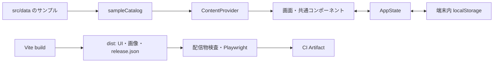

# サンプル検証版の構成・配信準備

対象：Issue #5・#14 の先行部分。2026-09-15時点で外部サービスへの配信は実施していません。

## 今回の選択

React / Vite、端末内保存、同梱画像を維持し、静的ファイルだけで既存のUXを検証します。新しい依存パッケージ・DB・認証・サーバーは追加していません。追加サービスの契約・課金はありません。現時点では実施設データの掲載や本番運用を可能にする変更ではありません。

| 選択肢 | 今回の扱いと理由 |
| --- | --- |
| ローカル・CIで静的ファイルを生成 | 採用。既存UIの検証に必要な範囲を開発だけで進められる |
| Cloudflare Pagesの静的配信 | 公開先の候補。アカウント・公開範囲・素材の扱いが決まってから採用を判断 |
| DB / 認証 / API / 管理画面 | 保存・共有・運営の要件確定後に比較。無料枠を前提に不要な基盤を先行構築しない |

Cloudflare Pagesは静的アセットのリクエストを無料・無制限と案内しています。この構成ではFunctionsを使いません。これは将来の運用全体の費用を保証する見積もりではなく、追加サービス費用を発生させず準備するための候補です。[公式の料金説明](https://developers.cloudflare.com/pages/functions/pricing/)

## データの流れ



- `src/content/catalog.ts` は掲載データを受け渡す型と、コピーした読み取り専用スナップショットの生成処理です。IDの重複・空欄、下見情報とお出かけIDの不整合を検査します。
- `src/content/sampleCatalog.ts` でサンプルを集約し、`App` の `catalog` 引数から注入します。画面側は `useContent()` で取得します。空の一覧を渡した場合にモック一覧で補う処理はありません。
- 選択肢・初期プロフィールは `src/data/options.ts` に分離しました。localStorageのキー・保存形式は変更していません。
- カタログは同期の、型が確認された入力用です。任意のJSON/APIレスポンスを検証する仕組みや通信処理ではありません。公開可否、写真の権利、教材の監修も判定しません。

### 今後の差し替え順

1. 掲載情報のスキーマ、根拠・確認期限・許諾・審査を確定する（#17・#18・#43等）。
2. 外部入力を検証・正規化するアダプターを追加する。情報の取得失敗・空データ・未確認を別々に扱う。
3. サンプル以外のデータ元を明示的に実装し、表示文言、読込・エラー画面、CSP、保存IDの移行を見直す。
4. 承認済みデータだけのビルドと検査を追加する。取得失敗時にサンプルへ自動で戻さない。
5. 個人データをサーバーへ保存・共有する段階で、認証・権限・削除・バックアップとAPI契約を実装する。

現在はサーバーのユーザー権限・運営権限・講習会社権限はありません。相談は端末内デモです。APIキーが必要になった場合は別途サーバー側で管理し、静的ファイルには含めません。

## 手元で確認する

```bash
npm ci
npx playwright install chromium
npm run format:check
npm run build
npm run verify:preview
CI=true PLAYWRIGHT_PORT=5176 npm run test:preview
npm run preview -- --port 4173 --strictPort
```

最後のコマンドで通常は http://localhost:4173/ を開けます。テストは一時的に別ポートでビルド済みのアプリを起動し、終了時に閉じます。`npm run test:e2e` は従来どおり開発サーバー向けです。

`.env.example` の値は省略時と同じです。コピー・鍵の登録は必須ではありません。

| 変数 | 今回実装している値 |
| --- | --- |
| `DRIVEPLUS_RELEASE_CHANNEL` | `preview` |
| `DRIVEPLUS_CONTENT_SOURCE` | `sample` |

未対応の値（`production`、`approved`、空文字等）ではビルド・開発サーバー起動を停止します。Vite自身の `production` モードは最適化方法の名前であり、アプリが本番掲載データになったことを意味しません。ブラウザ用環境変数の接頭辞は `DRIVEPLUS_PUBLIC_` に限定していますが、この接頭辞の変数は公開されるため秘密情報を入れません。[Vite公式の環境変数・モード説明](https://vite.dev/guide/env-and-mode)

## 配信物とCI

`dist/release.json` にデータ種別、Gitコミット、未コミット変更の有無、ビルド時刻を記録します。アップロード用の検査は、変更のないコミット済みチェックアウトからの生成を必須にします。

```bash
npm run build
npm run verify:preview -- --for-upload
```

作業中の変更がある場合、通常の検査とローカル操作確認は可能です。アップロード用の検査は失敗するので、PRのCIが生成するファイルを確認に使ってください。

CIは型チェック・ビルド・配信物検査・PC/スマホ幅のPlaywrightが成功した場合に `static-preview-<SHA>` を保存します。HTMLレポートも別のArtifactに保存し、保持期間は14日です。PRでは一時マージコミットのSHAになる場合があるため、PRの変更元コミットと単純に同一とは限りません。CI実行と `release.json` をセットで確認します。

検査対象はファイルの種類・サイズ・個数、エントリーの参照先、サンプル版のメタデータ等です。`.env`、ソースマップ、動的処理用ファイル、シンボリックリンク等の混入を検出します。画像やJSONの内容を含む万能な秘密情報スキャン・権利審査ではありません。

## 後日の手動配信手順

実際の公開操作は今回実施していません。公開範囲、管理アカウント、サンプル素材・未監修教材の扱いを決めてから実施する手順です。

1. 対象コミットのCIが成功していることを確認し、静的ファイルとHTMLレポートのArtifactをダウンロードする。
2. 静的ファイルのZIPを展開する。`index.html` と `release.json` のあるフォルダを確認し、ローカルで操作する。リポジトリ全体を配信フォルダにしない。
3. Cloudflare Pagesを採用する場合、Direct UploadへこのZIPまたはフォルダを渡す。提供元のURLを使い、独自ドメイン・Functionsは追加しない。
4. 配信先で `release.json` の一致、初回設定、保存・再読込、5タブ、画像、HTTPヘッダーを確認し、配信URL・CI実行・SHAを記録する。

Direct Uploadのダッシュボードは1,000ファイル・1ファイル25MiBまでです。検査はこの上限に合わせています。Direct Uploadプロジェクトは後からGit連携方式へ切り替えられないため、Git連携を選ぶ場合は作成前に判断します。[公式のDirect Upload手順](https://developers.cloudflare.com/pages/get-started/direct-upload/)

`public/_headers` はCloudflare Pages用です。Vite previewはこのファイルのHTTPヘッダーを再現しません。実際のHTTPヘッダー確認は配信後の残作業です。HTMLには別途CSPを入れ、現在不要な外部通信を制限します。[公式のヘッダー設定](https://developers.cloudflare.com/pages/configuration/headers/)

`noindex` と `robots.txt` は閲覧制限や認証ではありません。公開URLを知っている人のアクセスは防ぎません。限定閲覧が必要な場合は認証を備える配信方法を別途用意します。

## 戻し方

静的配信物を保存・照合・新しいフォルダへ復元するコマンドは[バックアップと復元の手順](RELEASE_RECOVERY.md)を参照してください。ローカルでの復旧試験を追加しました。外部サービスへの再配信と公開環境の確認は別途必要です。

配信前に、直前に確認できたArtifactを14日の期限より長く必要に応じて保管します。問題があればその一式を再配信し、`release.json` のSHAと操作を再確認します。端末内の保存データは配信を戻しても自動復元されません。保存形式の変更時は移行と互換性の確認が別途必要です。

CloudflareのダッシュボードのRollbackは成功済みのproduction deployment向けで、preview deploymentは対象外です。ここでいうCloudflareのproductionは配信先の区分です。アプリの `channel: preview` とは別の意味なので、上記の再配信手順を共通の戻し方にします。[公式のRollback説明](https://developers.cloudflare.com/pages/configuration/rollbacks/)

## 残作業・役割

| 担当 | 残作業 |
| --- | --- |
| 人間 | 先行施設と素材利用条件（保留）、掲載・教材の審査、公開範囲・管理アカウント・費用の決定 |
| 開発 | 承認済みコンテンツの入力検査と供給、実配信の疎通・HTTPヘッダー・復旧検証 |
| 共同 | 本番API/DB/認証・権限・運営管理の要件と構成決定、CIからのデプロイ方針 |

Issue #5・#14全体を完了扱いにはしません。今回はデータを受け取る境界と、検証済み静的ファイルを作る先行部分です。
