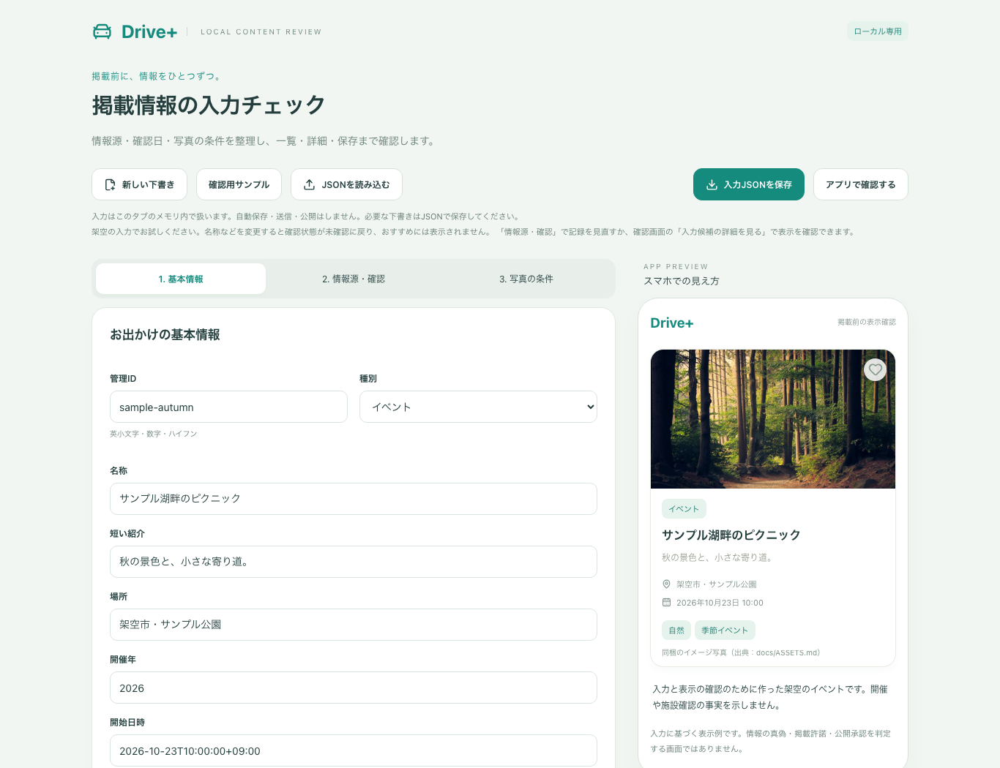
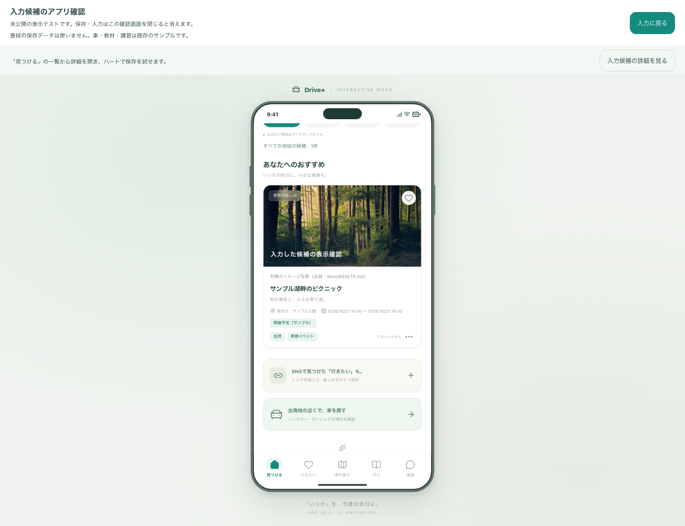
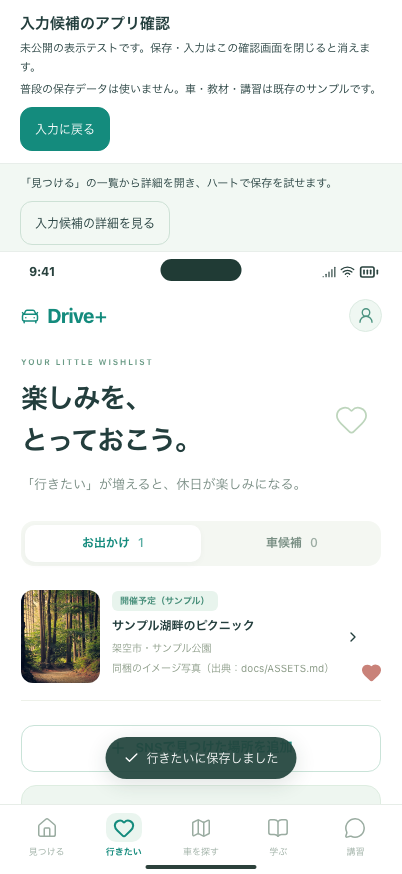
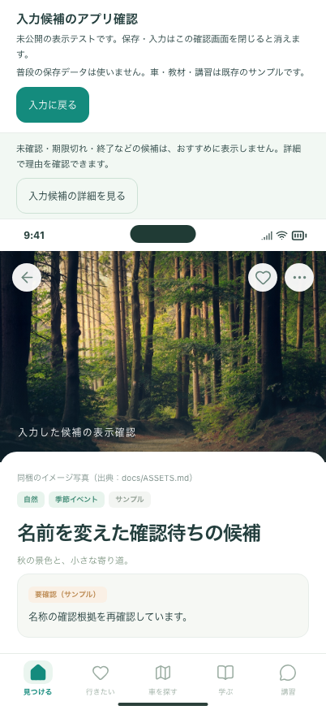

# 入力した候補を、実際のアプリ画面で確認する（#17・#19）

今までは入力した情報をカードの見本で確認していました。今回の変更では、同じアプリの「見つける」「詳細」「行きたい」で操作できます。実情報を掲載する前に、名前・説明・写真・未確認項目の見え方を確認するための先行実装です。

追加サービス費用は0円です。施設選定と写真条件の確認は保留を継続します。掲載承認、通常アプリへの公開、サーバー保存は後続です。

## あなたに試してほしい3つの操作

Macのブラウザで **http://127.0.0.1:4180/** を開きます。今回の入力ツールはブラウザ用です。iPhoneアプリにはこの入力ツールを追加していません。

1. **「確認用サンプル」→ 名称を変更する。** 例：「サンプル湖畔のピクニック」。変更すると名称が未確認に戻るので、「2. 情報源・確認」→「名称の確認状態」を「確認内容を入力済み」にします。今回は架空の例の操作確認です。
2. **「アプリで確認する」→ 入力した名前の候補を開く。** 一覧・詳細の名前が一致することを確認します。写真は選択・利用条件の入力がない場合、写真なしの表示になります。
3. **ハートで保存 → 下部の「行きたい」へ移動する。** 同じ候補が表示されます。「入力に戻る」でフォームの入力内容が残っていることを確認します。

確認画面内の保存は、その画面を閉じるまでの一時保存です。入力画面に戻って再び開くと、試しに保存した「行きたい」などは空に戻ります。普段のアプリの保存には影響しません。フォームの入力自体は「入力に戻る」で保持されますが、タブを閉じたり再読み込みしたりする前には「入力JSONを保存」を使ってください。

候補が一覧に出ない場合、未確認・期限切れ・終了、選択した地域や条件が理由になることがあります。上部の「入力候補の詳細を見る」で直接確認できます。最初は「すべての地域」で始まり、車・教材・講習の画面には既存のサンプルを使います。

## 起動する場合

```bash
npm run review
```

ビルド済みのツールを確認する場合は `npm run build:review` → `npm run preview:review` です。どちらも標準ポートは4180です。同時に起動しないでください。入力形式の説明は [CONTENT_REVIEW.md](../../CONTENT_REVIEW.md) を参照してください。

## 開発側の検証

- 型チェック・通常アプリ／入力ツールのビルド・整形・配信物の検査。
- 入力ツール48件：PCとスマホ幅のChromium、スマホ幅のWebKitで検証。名称変更から一覧・詳細・保存・戻る、5タブ、設定からの削除、写真の利用条件、入力エラーを確認。
- 普段の保存領域を読む・書く・削除する処理を監視し、確認画面ではいずれも呼ばれないことを確認。非公開のメモ・許諾記録・情報源URLは表示用データに含めない。
- 通常アプリ249件は作業フォルダで成功。配信復旧の3件は未コミット変更のないビルドで確認するため、PRのCIで別途結果を確認する。復旧処理の単体検査9件は成功。
- 既存の通常アプリへの保存方法は維持。通常配信物・iPhoneの同梱ファイルへ入力ツールのコードが混ざらないことを検査。
- 下記4枚は架空の入力だけで撮影。再撮影は `node scripts/capture-app-preview.mjs`。画像の出典は [ASSETS.md](../../ASSETS.md)。

最終コミットのCI結果はPRの「Checks」を参照してください。WebKitはブラウザエンジンの検証で、iPhone実機・読み上げ・実際の写真許諾を確認したことにはなりません。

## 表示例









## 残る作業

- 本番用の掲載承認、編集権限、監査、配信・同期は未実装。
- 複数候補の管理、都道府県の構造化入力、入力画面を閉じても残る確認用保存は今回の対象外。
- 施設・写真の確認、教材監修、講習会社との合意は人間の準備として継続。
- #17・#19は先行部分の実装です。Issue全体は閉じません。
