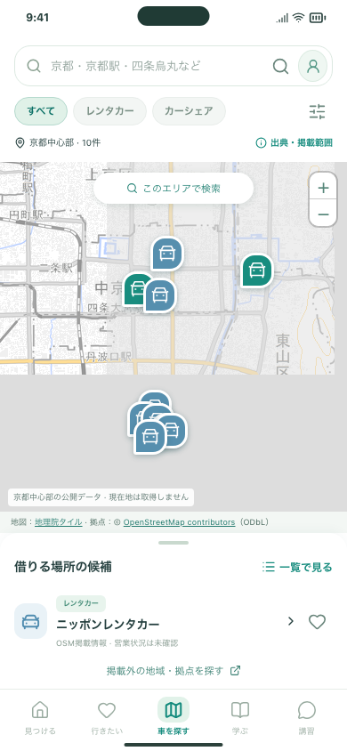
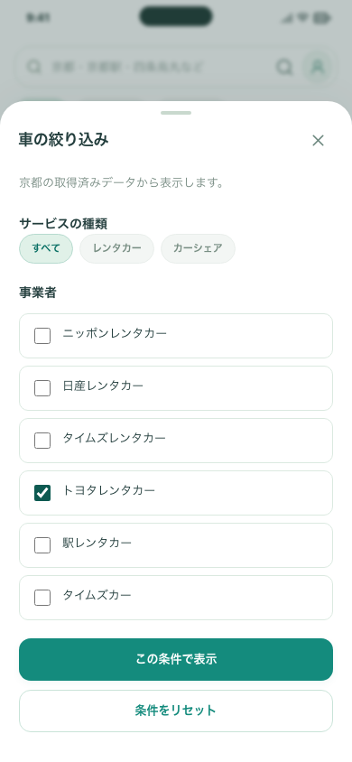
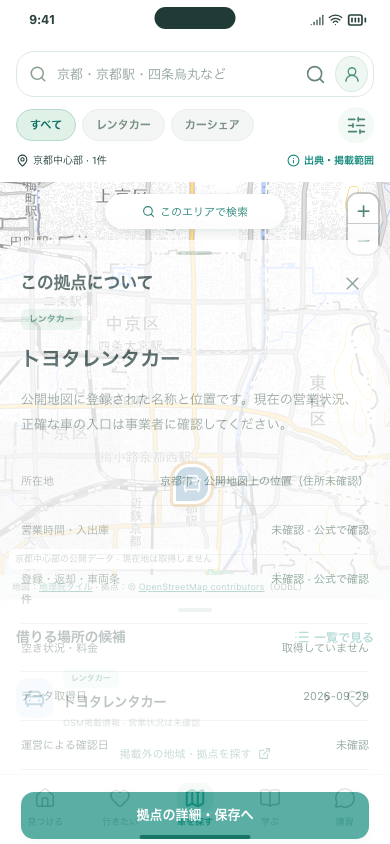
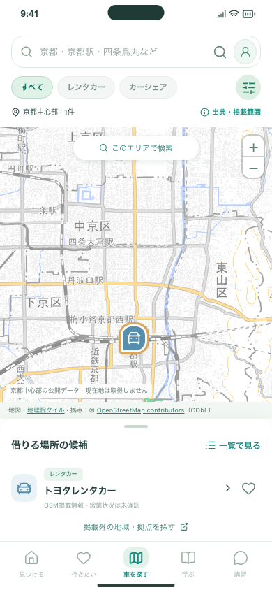
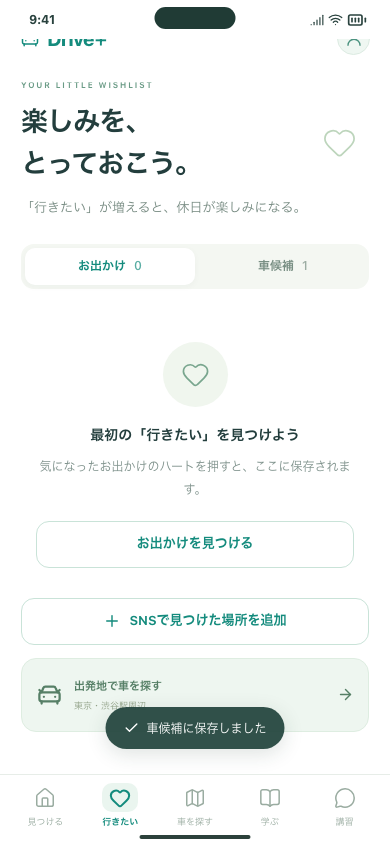
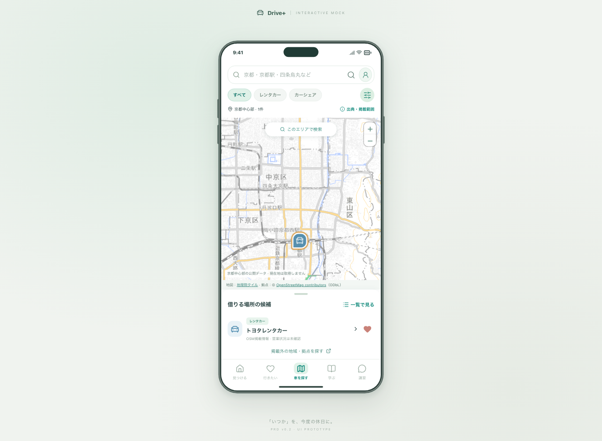

# 車を探す：今回の確認手順

2026-09-29 / Issue #75 / PR #76。

**京都の実地図と、公開地図に登録された10件の車の拠点を表示します。** APIキー・追加サービス契約は不要です。現在の営業・空き状況は未確認です。

## 確認していただきたい操作

1. **車を探す**タブを開く。地図を動かして「このエリアで検索」、＋／−で拡大縮小。レンタカー／カーシェアや右上の事業者フィルターを切り替える。
2. ピンを押す → **拠点の詳細・保存へ** → **車候補に保存**。「行きたい」→「車候補」に同じ拠点が出ることを確認する。
3. 検索欄に「京都駅」と入れて虫眼鏡を押す。「大阪」なら未収録の案内になる。「掲載外の地域・拠点を探す」から外部地図・公式検索へ進み、閉じてアプリへ戻る。

京都の全体表示に戻すには「京都」と入力してください。絞り込みを解除したいときはフィルター内の「条件をリセット」→「この条件で表示」です。

Web：`http://127.0.0.1:5173/#/cars`（`npm run dev` 起動中）。iPhoneは `npm run ios:sync` 後にXcodeで起動します。APIサーバーは不要です。

## 画面

以下は実際の地理院タイルを読み込んだ画面です。画像内の拠点はOpenStreetMapの登録情報で、営業確認済みの事業者一覧ではありません。

| 実地図                              | 事業者の絞り込み              |
| ----------------------------------- | ----------------------------- |
|  |  |

| ピンから開くカード              | 拠点詳細                                       |
| ------------------------------- | ---------------------------------------------- |
|  |  |

| 保存した車候補                      | PCの中央スマホ表示          |
| ----------------------------------- | --------------------------- |
|  |  |

地図の出典：[地理院タイル](https://maps.gsi.go.jp/development/ichiran.html)。拠点：© [OpenStreetMap contributors](https://www.openstreetmap.org/copyright) / ODbL。

## 開発側で確認すること

- 座標・件数・出典・ODbL、種別・事業者・地図範囲の一致。収録外の地域に架空ピンを作らない。
- 旧保存データを維持し、追加状態がない版から読み込めること。無効な座標・未知の拠点IDを受け入れない。
- PC／スマホ幅Chromium／スマホ幅WebKitで、ピン・カード・詳細・保存・戻る・再読込、拡大と範囲検索、地図通信失敗、320px幅、出典閲覧を確認。
- 地図画像以外に外部通信を増やさない。外部検索・公式検索は確認してから開き、個人メモをURLへ含めない。
- サンプル地図は `/cars/sample` に残し、既存の保存・サンプル外部リンクのブロックも回帰確認。

自動ブラウザテストの地図画像／外部ページはローカルの代替応答です。実配信の表示は別途ブラウザとiPhone 17シミュレーターで確認しています。拠点の現地調査、営業・空車の確認、各社検索結果の品質保証はテストに含みません。

## iPhone 17シミュレーター

専用のiPhone 17 / iOS 26.5で、実地図・ピン→詳細→保存→再起動後の車候補、外部ブラウザの開閉と条件復元を確認します。結果とCIへのリンクは[PR #76](https://github.com/Greek-Academy/Let-s-go-anywhere/pull/76)に記録します。

テスト対象は `AppUITests/DrivePlusUITests/testRealStationMap` と `testCarSearchBrowserReturn`。個人データ入りのシミュレーターにはテストを実行しません。

## 今回含めないもの・人間のTODO

全国検索、GPS、リアルタイム空車・料金、予約・決済、自動更新運用は未実装です。人間側では本公開前に対象地域・確認担当・更新頻度を決めます。[情報源・利用条件・処理の説明](../../CAR_SEARCH.md)にまとめました。#21・#22・#24全体は継続です。
