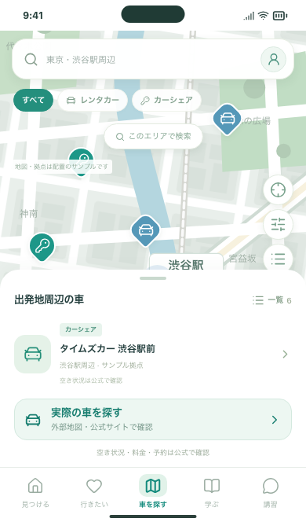
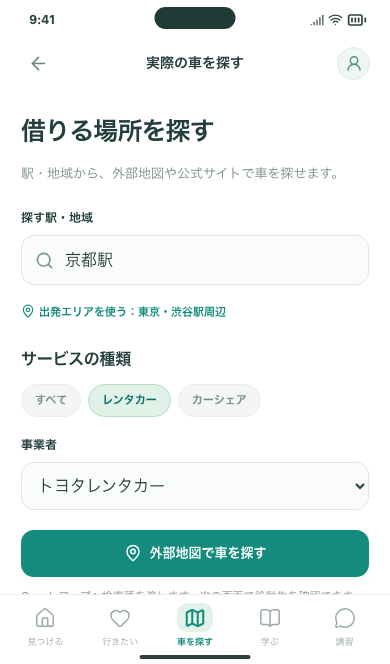
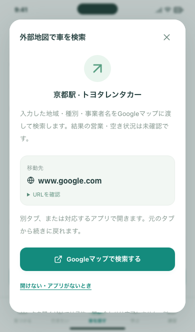
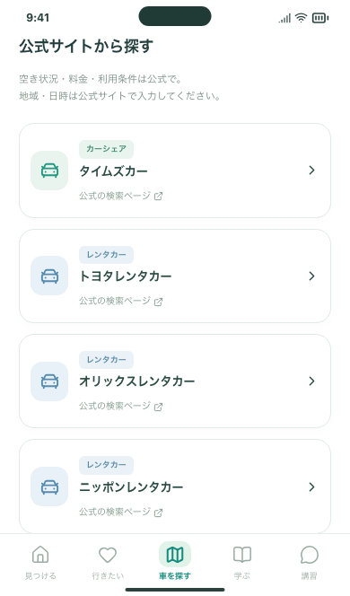
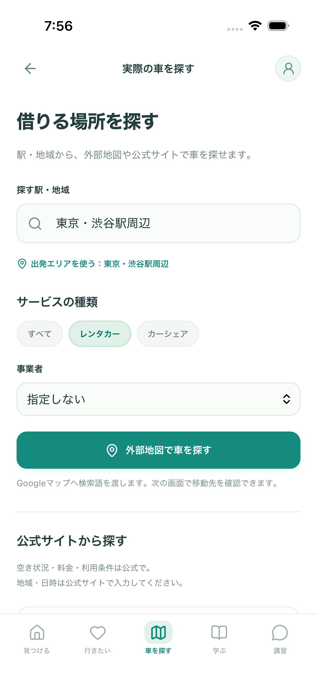

# 車を探す：3つの確認操作

2026-09-29 / Issue #75。APIキーや有料契約なしで、実際の外部地図・公式検索へ進めるようにしました。

## あなたに確認していただきたいこと

1. 「車を探す」→ **実際の車を探す** →「京都駅」「レンタカー」「トヨタレンタカー」を選択 → **外部地図で車を探す**。確認画面で検索語を見て、Googleマップを開く。
2. 外部画面を閉じ、**アプリに戻る**。入力した条件が残っていることを確認する。下にある公式検索ページも開けます。地域・日時は公式で入力する方式です。
3. 戻る → 地図と一覧を切り替える。サンプルのピン・詳細・保存も引き続き操作できることを見る。

Web：`http://127.0.0.1:5173/#/cars`（開発サーバー起動中）。iPhone版はAPIサーバーなしでこの導線を使用できます。

| 入口（背景と拠点はサンプル） | 地域・種別・事業者 |
| --- | --- |
|  |  |

| 外部へ移動する前の確認 | 公式検索入口 |
| --- | --- |
|  |  |

## 開発側の確認

- 検索語のエンコード・文字数・未入力・制御文字・未知の事業者・種別不一致を検査。
- 外部リンクを明示的に押す前には送信しない。表示した地域と種別／事業者だけをGoogleへ渡す。公式検索入口に地域・プロフィール・相談文を付けない。
- PC／スマホ幅Chromium／スマホ幅WebKitで、キャンセル・別タブ・外部404からの戻る・条件保持・再読み込み・既存サンプルを検証。
- 320px幅と文字拡大、既存の地図の一覧ボタンが隠れないことを確認。
- iPhoneのBrowser失敗・再試行と端末保存は、ブラウザ上でプラグインを差し替えて検証。実機での全操作確認は本人の確認事項です。

自動テストの外部ページ応答はローカルの偽応答です。実際の検索結果の質・営業状況・空車・料金を確認するテストではありません。画像はアプリのスクリーンショットで、実拠点カードを取得した記録ではありません。テスト件数・CI・シミュレーターの結果はPRとIssue #75に記録します。

## 今回含めないもの

アプリ内の実地図、拠点データの取得、GPS、検索結果のアプリへの取り込み・保存、予約・決済。親Issue #21・#22・#24は継続です。[処理の説明と人間のTODO](../../CAR_SEARCH.md)を参照してください。

## iPhone 17シミュレーターの確認

専用のiPhone 17 / iOS 26.5で、ネイティブのBrowser画面を開く → 閉じる → 入力画面へ戻る → アプリを再起動して条件を読む操作が成功しました。Googleの検索結果本文の読み込み完了・内容はテストの判定に含めません。

初回の新規シミュレーター起動ではWebViewの画面要素を検出できずに失敗しました。端末を起動し、アプリの描画を確認してから同じテストを再実行し成功しています。テストデータは専用シミュレーター内だけで操作しました。

Xcodeのテスト対象は `AppUITests/DrivePlusUITests/testCarSearchBrowserReturn`。実行前に専用シミュレーターを起動し、起動完了を待ちます。個人データ入りのシミュレーターにはテストを実行しないでください。
