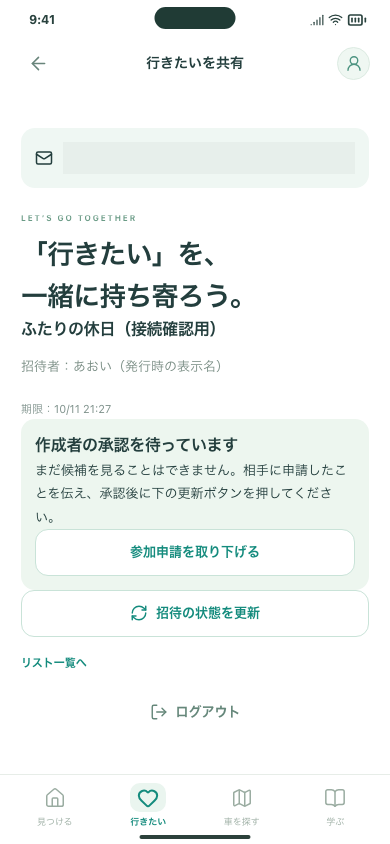
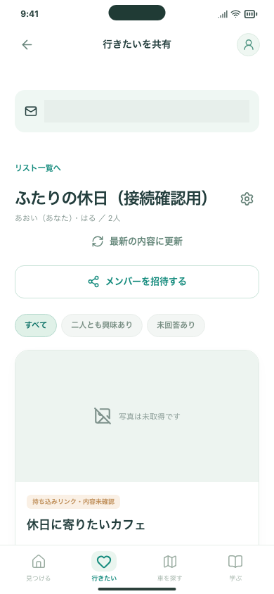
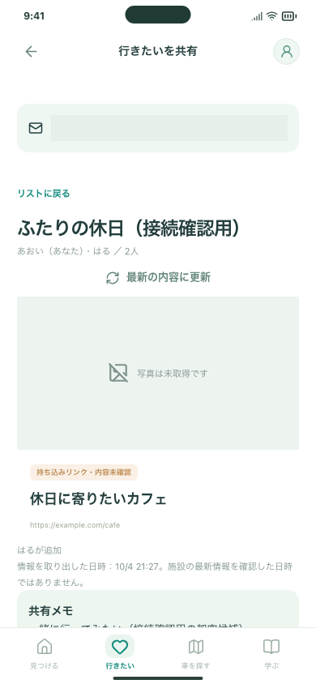

# 招待・候補・反応の実共有 — Issue #94

2026-10-04。#89・#92・#95はそれぞれ最新mainへ追随し、CI成功後にマージ済み。今回は#94としてその上に共有を実装しました。

- 入口：Firebase検証版「行きたい」→リスト切替→「ログインして共有する」。既存モックの端末内デモとは別です。
- 招待：7日・1人、申請→承認、取消・再発行、登録／確認／ログイン後も招待先を維持。
- 候補：選択した保存／URL・共有メモの確認→追加→反応→共通候補の絞り込み→個人保存へのコピー。
- 管理：表示名、3つの作成枠、5人・100候補、退出・メンバー削除、引き継ぎの受諾、途中から再開できる整理・削除。
- 保護：参加者だけの読み書き、本人の反応、所有権、同時編集、サーバー時刻。個人の学習・不安・現在地をアップロードする処理はありません。

## 確認結果

- Firestore権限テスト **20件成功**：本人用8件＋共有12件。未承認・他人・未確認メール・失効・古い更新・余分な項目・件数上限・削除の途中再開を検査。
- Firebase Emulatorブラウザ **36件成功**：PC Chromium／スマホ幅Chromium／WebKit。二つのアカウント・ブラウザを分けた招待承認、候補追加の往復、両者の反応、取消・退出による失効、重複・同時編集、明示的な準備リストのコピー、削除完了を確認。
- 整形・型チェック・通常ビルド・静的配信物検査は成功。
- 実クラウドとHTTPSの結果は下記。利用者と確認相手の実iPhoneでの往復は未確認です。

[利用者の3操作・保存する情報・無料枠・未実装の範囲](../../SHARED_WISHLIST_CLOUD.md)。

## 実クラウド・HTTPSでの確認

- 接続先：`driveplus-fbc33`、Firestore `(default)`。#93のルールを退避し、本人用の保存を残したまま共有ルールを反映。
- 反映したアプリ：`3b9de9d21f306f5b3d302a773c1ea4b72bba8f3d`、未コミット変更なしのFirebaseビルド。静的配信対象は25ファイル、ローカルビルド全体は約2.70 MB（未圧縮）。一般利用の月間配信費用の実測ではありません。
- Rules SHA-256：`83f30c1fdefb2e8ae2b99994ef6fe03239edda6527ff52a8c5ff9576de160bb1`。反映後のサーバーからの読み戻しと一致。
- HTTPS配信の200、no-store、noindex、no-referrer、CSP、埋め込み拒否を確認。実ログイン・Firestore通信にCSPエラーなし。
- **実Firebaseの別アカウント・別ブラウザで成功：** 招待発行→参加申請→承認→Aの候補をBが取得→Bの反応→Aの共通候補絞り込み→Bの候補をAが取得。未承認者・退出者の権限拒否、退出者の反応・投稿者情報の整理も確認。
- リスト削除は別の短い実クラウド検査で、作成→候補追加→再ログイン→画面から全削除まで成功。最初の通し検査は後片付け用のブラウザ操作が同じURLへの移動を再読込と誤認したため停止しました。該当データだけを管理権限で片付けた後、明示的な再読込に直して削除操作を再確認しています。製品コードの変更はありません。
- 合成アカウントは計5件、合成共有リストは計3件作成し、すべて削除済み。利用者のアカウント・準備リストは変更していません。確認メールは送信せず、合成アカウントのメール確認属性は管理操作で設定しました。本物のメールと相手のスマホ操作は人間確認です。
- 反映前後で請求先連携なし（`billingEnabled: false`）。Sparkを維持。Functions／Storage／OpenAI呼び出しなし。継続運用の利用量はFirebase Consoleで観察が必要です。

## 画面

実クラウドでの合成データです。アカウント欄はマスクしています。URLは架空の公開ページで、実在施設の最新情報とは扱いません。

| 参加申請・承認待ち | 双方が追加した候補の一覧 | 相手の候補の詳細 |
| --- | --- | --- |
|  |  |  |

## iPhoneと最終レビュー

`testCloudSharingLoginEntry`をXcode UIテストに追加しました。Firebase版で「行きたい」→リスト切替→登録／ログイン画面の操作を確認するテストです。認証情報を送信しません。通常モックのビルドでは対象外としてスキップします。

iPhone Simulatorの実行結果・CIの最終URLはPR #96／Issue #94の実装結果コメントに追記します。**相手の実iPhoneでの招待リンク・確認メール・共有の往復は、人間の確認を残しています。** このため#94を自動で閉じません。一般公開の残作業は親#40へ分離しています。
