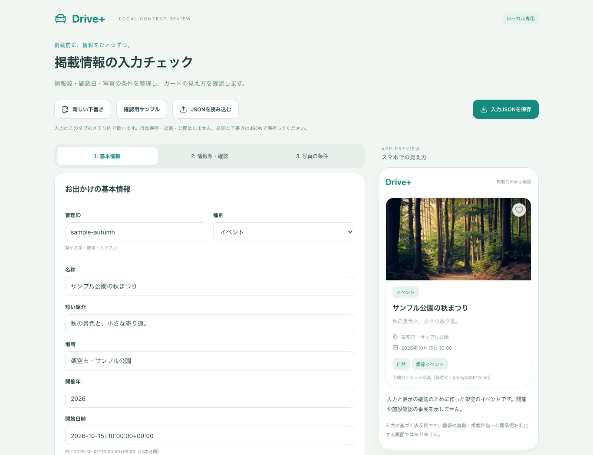
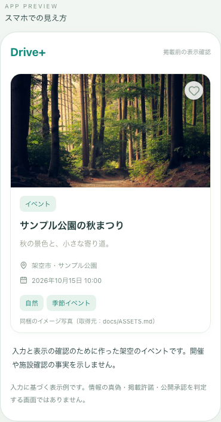

# Issue #17：ローカルの掲載情報入力・確認

情報源と写真条件の入力、検査、カードプレビューを実装しました。既存のアプリから独立したローカルツールで確認します。詳しい仕様・入力形式は [入力チェックのガイド](../../CONTENT_REVIEW.md) を参照してください。

## 確認方法

```bash
npm ci
npm run review
```

http://127.0.0.1:4180/ を開きます。

1. 「確認用サンプル」を押す。
2. 名称を変更する。カードに反映され、名称の確認状態が未確認に戻る。
3. 「情報源・確認」で参照先と日付を入力し直す。根拠が不足する項目はチェック結果に残る。
4. 「写真の条件」で写真を選ぶ。利用条件を入力するまで写真は表示しない。
5. 写真を選び直すと、同じファイル名でも利用条件がクリアされる。
6. 「入力JSONを保存」で保存し、再読み込み後にJSONを読み込む。入力を復元できる。写真本体はJSONに含まれない。

写真の入力に使える既存のイメージ写真は `public/images/` にあります。撮影施設の実情報や許諾の実施記録として扱わず、架空の入力例で試してください。

## 検証結果

- 型チェック・アプリとツールのビルド：成功。
- 既存アプリのPlaywright：52件成功。
- 入力ツールの判定・CLI・PC／スマホ幅の操作：18件成功。
- PC画面とスマホ幅のカードを撮影し、レイアウト・画像・余白を確認。
- 確認メモや許諾の参照先がカードに出ず、アプリの配信ファイルにツールが含まれないことを検査。
- CIの対象コミットと最終結果はPRのChecksを参照。入力ツールのレポートは `content-review-report`。

## 表示例

すべて架空の入力例です。使用したイメージ写真の出典は [ASSETS.md](../../ASSETS.md) に記載しています。





## 未実装・残作業

本番の管理者認証、権限、承認・監査、公開操作、実データとの接続は後続です。入力項目が揃っても公開承認にはなりません。施設選定・情報・写真の利用条件の確認は保留を継続し、Issue #17は部分実装としてOpenを維持します。
