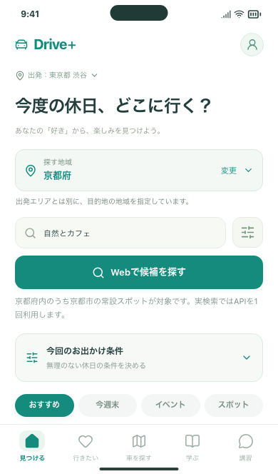
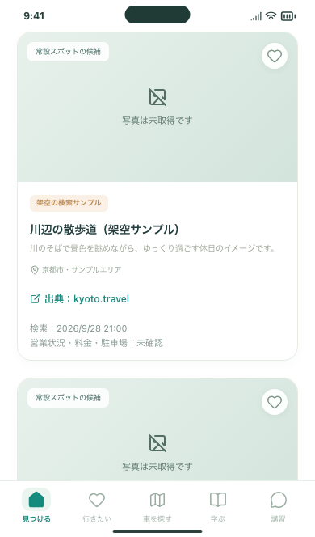
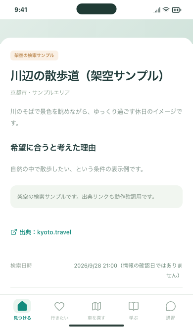
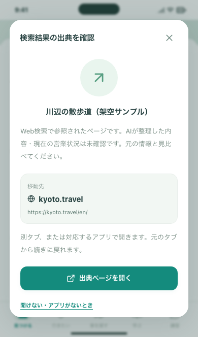
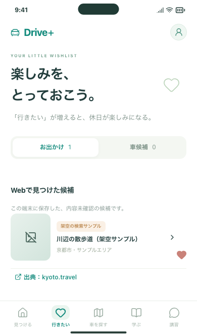
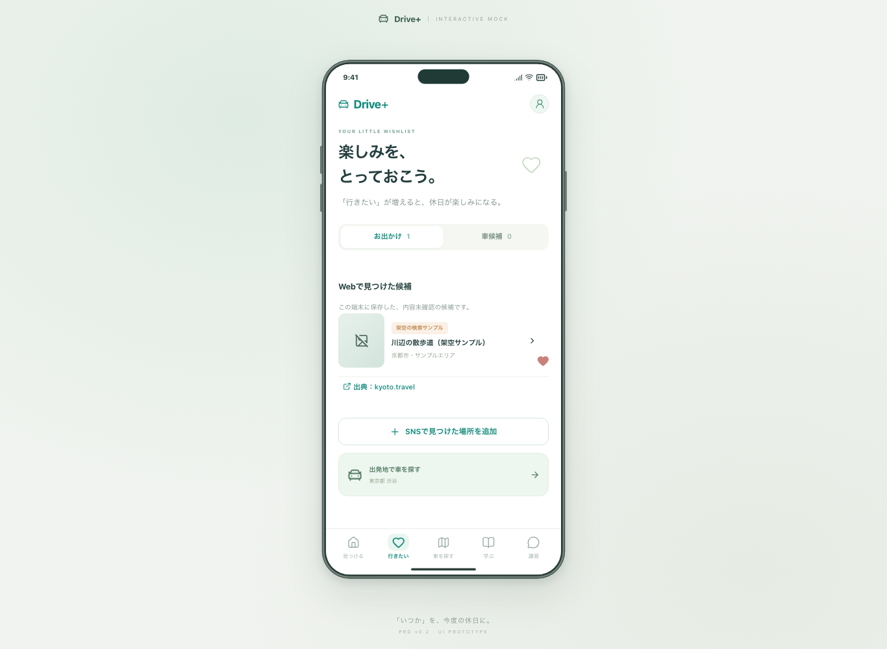

# 「見つける」とWeb検索の接続：確認資料

2026-09-28 / Issue #73。PR #72の検索サーバーを土台にした変更です。**検索 → 出典・未確認表示 → 詳細 → 保存 → 再読み込み後の詳細**を、いつもの画面から操作できるようにしました。

## あなたが試す3つの操作

Macで **http://127.0.0.1:5173/#/discover** を開きます。起動と無料サンプルへの切り替えは [操作ガイド](../../DISCOVERY_WEB_SEARCH.md) を参照してください。

1. 「探す地域」を京都府にし、「自然とカフェ」を入力。「おすすめ」で「Webで候補を探す」を押す。京都市の最大3件が対象です。
2. カードの出典 → 元ページ、カード → 詳細へ進む。紹介が希望に合うか、「未確認」の意味が分かるかを見る。
3. ハートで保存し、「行きたい」の「Webで見つけた候補」から開く。再読み込み後にも出典付きの詳細を開けることを見る。

実検索は#71と合わせて1/3回使用済み、残り2回です。今回の実装検証で追加の有料検索はしていません。保存・詳細・再読み込みは回数を使いません。下の画像は **費用なしの架空サンプル** です。

| 入力画面 | 検索結果 |
| --- | --- |
|  |  |

| 詳細 | 出典の確認 |
| --- | --- |
|  |  |

| 保存一覧 | PCの中央表示 |
| --- | --- |
|  |  |

## 開発側で確認したこと

- 独立した無料サンプルサーバーを経由し、検索・出典・保存・詳細・戻る・再読み込み・解除をPC / スマホ幅Chromium / スマホ幅WebKitで検証。
- 京都以外、入力なし、イベント、APIキーなし、上限、利用中を案内し、不要なAPI送信をしない。
- 0件・通信失敗・条件違い・遅れて届く結果を扱い、入力変更後の古い結果を区別する。連打で重複送信しない。
- 出典のドメイン・URL・未確認状態・保存形式を検査。同じ出典の再取得でIDが変わらず、既存のプロフィール・保存・メモが残る。
- 静的ビルドでは検索通信を行わず、保存候補の詳細は表示できる。既存の配信制限と保存の上書き保護を維持。
- 既存アプリと掲載情報入力ツールの回帰テスト、型チェック、ビルド、配信物検査を実施。具体的な結果とCIはPR / Issue #73へ記録。

API・回数制限のテストは偽の応答のみです。画面画像も検索経路をすべて偽の応答へ差し替え、既存の実検索サーバーには到達させていません。普段のブラウザ保存は変更していません。

加えて、#71で取得済みの実結果JSONをローカルで再生し、3件のカード表示と「京都御苑」の保存・詳細・再読み込みを確認しました。この再生もAPI通信を差し替えたもので、新しい検索ではありません。取得結果の私的ファイルはGitへ含めていません。

```bash
npm run format:check
npm run build
npm run build:review
npm run verify:preview
npm run test:release-backup
npm run test:research
CI=true PLAYWRIGHT_PORT=5176 npm run test:preview
CI=true npm run test:review
CI=true npm run test:research:ui
CI=true npm run test:discovery-search
```

接続テスト専用のサーバーは5178番 / 4183番で起動します。CIの`discovery-search-report`には各操作後の画面、失敗時のトレースを保存します。

## 未確認・後続

検索候補の質・本文の正確さ・利用条件・実請求額は自動テストでは認定しません。実検索1回目の記録は [#71の結果](../spot-search-pilot/LIVE_RESULTS.md) にあります。利用者の見た目と操作の確認後にIssueを完了へ整理します。

iPhone実機での新規検索、公開サーバー、ログイン、端末間同期、写真、SNS自動収集は今回含みません。WebKitの成功は実機確認の代わりではありません。iPhone向け資材の同期やインストールは今回行っていません。
