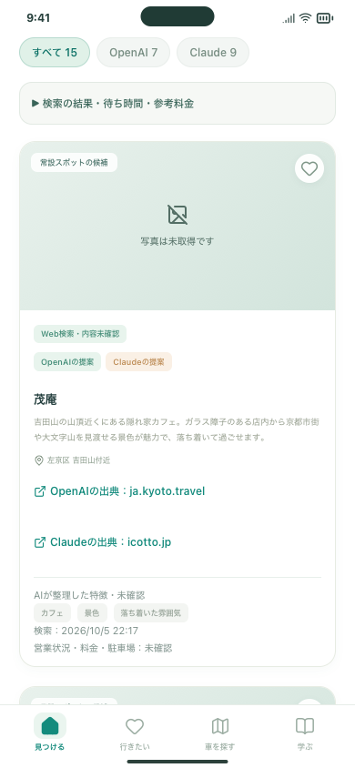
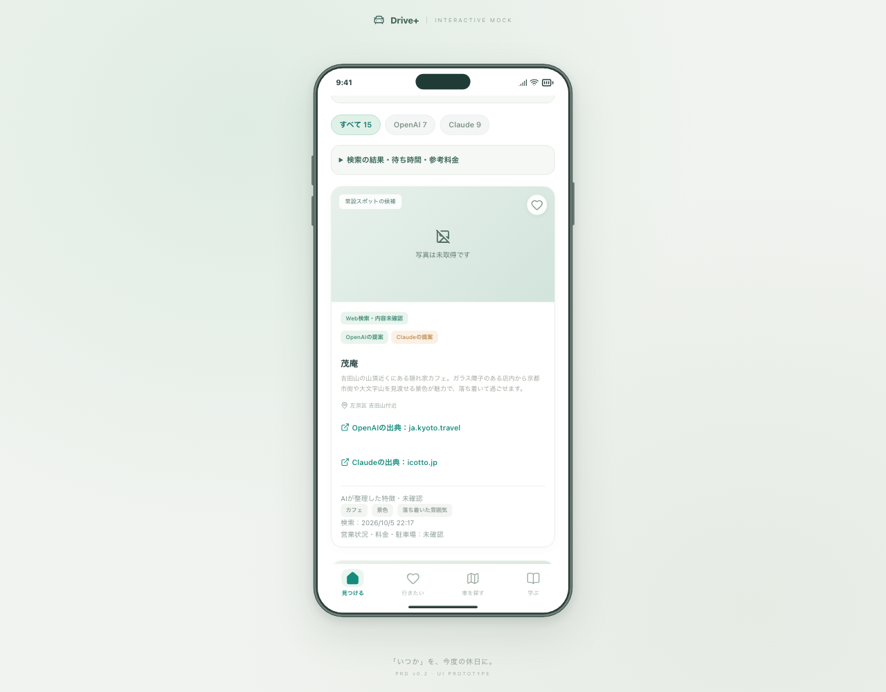

# 同じ店舗を1枚にまとめる修正 — 2026-10-05

今回の実結果に2枚あった「茂庵」をまとめ、**16枚から15枚**にしました。1枚の中にOpenAI・Claudeの提案元を表示し、各社の出典・提案理由を残します。提案元別の件数はOpenAI 7件・Claude 9件で、両社共通の1店を含みます。

## 確認する操作

http://127.0.0.1:5198/#/discover を再読み込みし、「前回の比較結果を開く（無料）」を押してください。

1. 全体が15枚、茂庵が1枚になり、両社の提案元・出典があることを確認。
2. 詳細を開いて、OpenAI・Claude両方の提案理由を確認。
3. 保存・保存解除を操作。以前に別々のカードを保存していても「行きたい」では1枚で表示します。

今回の統合は保存済み結果を読むときに行います。追加API、検索枠のリセット、利用台帳の変更はありません。

## 同一店舗と判断する方法

同じ店名・同じエリア表記は従来どおりまとめます。住所表記が異なる場合は、根拠を確認した対応表を使います。**名前だけ、同じ区だけ、同じ紹介記事URLだけでは統合しません。**

今回の「茂庵」は、[店舗公式](https://www.mo-an.com/)と[京都市観光協会の掲載](https://ja.kyoto.travel/tourism/single01.php?category_id=4&tourism_id=2861)で、吉田山と京都市左京区吉田神楽岡町8が同じ所在地を示すことを確認しました。店名・エリア・今回の出典URLの組み合わせを `src/data/placeIdentityReviews.json` に記録しています。判定処理は `src/domain/placeIdentity.ts` をサーバーと画面で共用します。

現段階の表記違い対応は確認できた店舗から追加する方式です。全国のあらゆる表記違いを自動判定するものではありません。APIの店舗ID・住所正規化を利用した拡張は #19 の後続です。

## 保存済み候補への影響

- 元の保存ID・説明・任意の好みは自動で削除しません。表示するときにまとめます。
- 旧カードの詳細URLも引き続き開けます。まとめた候補の保存解除は、対応する旧保存も解除します。
- 好み順では同一店を二重に数えません。選択した理由は元の保存単位で保持し、まとめた表示には最大3つを使います。
- プロフィールの件数と、共有リストへ追加する際の個人候補一覧もまとめます。既に相手と共有したデータを勝手に書き換える処理はありません。
- 店舗が同じという確認と、営業・価格・写真の利用許諾・運転適性の確認は別です。未確認表示は維持しています。

## 検証

- 検索処理27件：表記違いの統合、理由・出典の保持、別支店・別住所の非統合、10枚超の保存結果の再表示、元ファイルと利用回数の保持。
- 保存・好みのテスト15件：元ID、保存形式の互換性、選択した好み、同一店の二重加算防止。
- 検索画面39件：PC Chromium、スマホ幅Chromium、スマホ幅WebKit。旧保存2枚→1枚→両社の詳細→好み変更→旧URL→解除→再読み込みを検証。
- 実結果でもPC Chromiumとスマホ幅WebKitで15枚・茂庵1枚・両社の詳細を確認。APIの追加POSTは0回、利用台帳は変更なし。
- 型チェック・ビルド・整形。全体とFirebaseの回帰検証はPR #98の最新CIを参照してください。

## 写真を載せるには

画像表示自体は可能です。現在の比較検索は文章・出典URLのみで、写真は取得していません。店舗の画像として無関係なイメージ写真を自動で割り当てる変更もしていません。

最小検証では、利用許可を得た店舗写真や、再利用条件を確認できる写真を少数店舗に登録し、撮影者・出典を表示する方法が取れます。[Wikimedia Commons](https://commons.wikimedia.org/wiki/Commons:Reusing_content_outside_Wikimedia)なども画像ごとに条件・対象店舗を確認します。

[Google Placesの写真API](https://developers.google.com/maps/documentation/places/web-service/place-photos)を使う方法もあります。写真の識別子、APIキー、必要な撮影者等の表示を扱い、料金・利用条件を確認してから接続します。今回、新しい写真APIの契約・課金設定・写真取得は行っていません。

総額3,000円の予算内での写真検証は #7 / #19 の後続として記録します。

