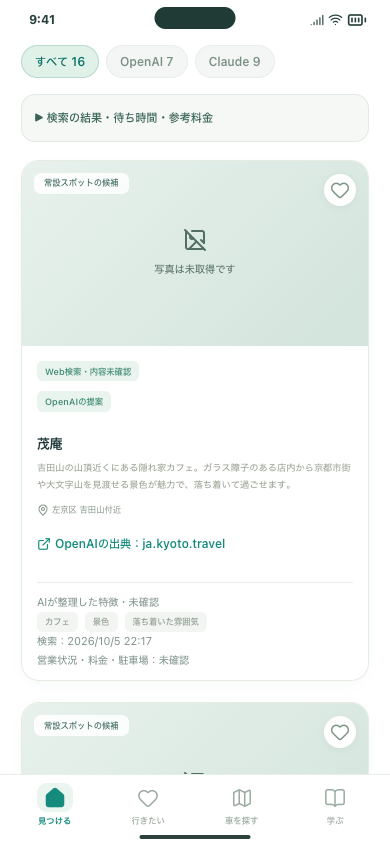
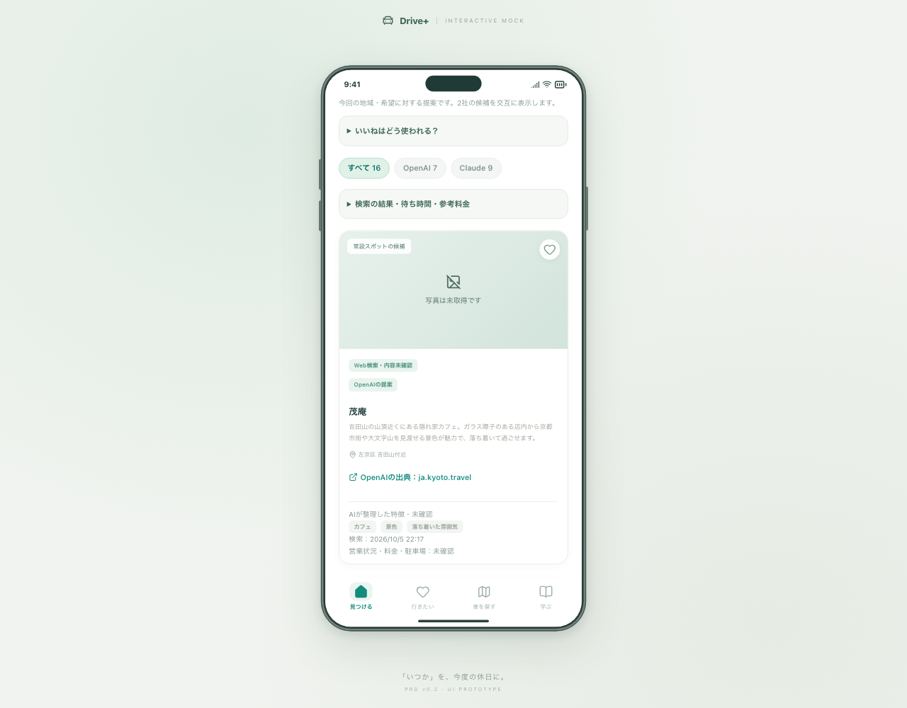

# 2社の実検索を1回試した結果 — 2026-10-05

同じ条件をOpenAI・Claudeへ1回ずつ送信し、既存の「見つける」に表示できました。今回は候補が取得・保存できることの検証で、全店の営業状況や説明内容を確認済みにしたものではありません。

## 画面を確認する

このMacの実結果プレビュー： **http://127.0.0.1:5198/#/discover**

「前回の比較結果を開く（無料）」を押すと、今回の結果を読み込みます。OpenAI／Claudeの切り替え、ハートで保存、詳細、好み順を確認できます。再表示ではAPIを呼びません。5197番は引き続き架空サンプル用です。

検証枠の1回を使用したため、新しい比較検索は停止します。回数の記録はリセットしていません。

## 入力と結果

地域は「京都府」。希望は「京都市内で、自然や景色を楽しんだ後に立ち寄れる、落ち着いたカフェを探したい。二人の休日向け。」です。

| 項目 | OpenAI | Claude |
| --- | --- | --- |
| モデル | gpt-5-mini | claude-haiku-4-5-20251001 |
| APIリクエスト | 1回 | 1回 |
| 実行されたWeb検索 | 1回 | 2回 |
| 採用候補 | 7件 | 9件 |
| 除外 | 0件 | 1件（出典URLの完全一致を確認できず） |
| 応答までの時間 | 約16.2秒 | 約21.3秒 |
| 入力／出力トークン | 9,237／1,559 | 18,674／2,441 |
| 参考料金 | $0.01542725 | $0.050879 |

両社を同時に呼んだため、全体は約21.3秒でした。合計の参考額は **$0.06630625**。API応答の使用量と実装済みの公開単価による計算で、請求書・税・為替・前払い残高とは別です。両社の請求画面との照合は利用者の確認が残っています。

**カードは16件ですが、住所表記が異なる「茂庵」が2枚あります。16店舗を重複なく取得できたという意味ではありません。** 件数を増やすための追加検索はしていません。

## 実回答で見つかった不具合と修正

Claudeの応答は正常に完了していましたが、前置きの文章とJSONのコードブロック、説明内の引用記号があり、最初の読み取りで失敗しました。

保存済みの応答を使い、前置きの後にある単一の完全なJSONブロックを読み、引用の表示記号を除くよう修正しました。壊れたJSON・複数のJSONブロック・任意のHTMLは受け入れず、出典URLの照合も維持しています。モデルへの再問い合わせ・JSONの自動生成・追加課金はありません。

最初の結果、元の応答、再処理の記録はMac内の非公開フォルダに保存。1回分の利用台帳と従来の3回検索の台帳は変更せず、元データやキーはGitHubに含めていません。

## 確認できたことと改善点

- 実結果の無料再表示、提案元切り替え、保存、好み順、詳細、戻る、再読み込みをPC Chromiumとスマホ幅WebKitで確認。追加の検索POSTは0回。
- [茂庵の京都市観光協会の紹介](https://ja.kyoto.travel/tourism/single01.php?category_id=4&tourism_id=2861)、[MUNIの公式カフェ紹介](https://munihotels.com/cafe/)、[GREEN TERRACE公式](https://www.g-terrace.jp/details)、[OMOFU公式](https://omofuroasterycafe.jp/)の出典ページを開いて店舗の掲載を抜き取り確認しました。全件の正確性・営業継続・条件への適合の確認とは別です。
- 住所の表記が違う同一店舗をまとめる処理は改善が必要です。名前だけでまとめると別支店を誤って統合するため、住所や公式ページの識別を整える後続課題とします。
- 公式以外の紹介記事も出典に含まれます。記事の古さ、所在地や文化財の説明、カフェ希望に対する施設の適合は追加確認が必要です。AIの分類は未確認のままです。
- Claudeの説明には記事の引用に近い文章があります。今後の公開掲載に向けて、簡潔な独自要約・引用の明示・掲載条件を整理します。

これらは #97 / #19 の残作業として記録します。iPhone・公開版からの新規実検索に必要な公開サーバー・認証・費用制限は、引き続き #13 / #14 / #31 の範囲です。

## 実結果の画面

