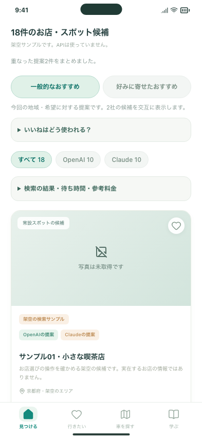
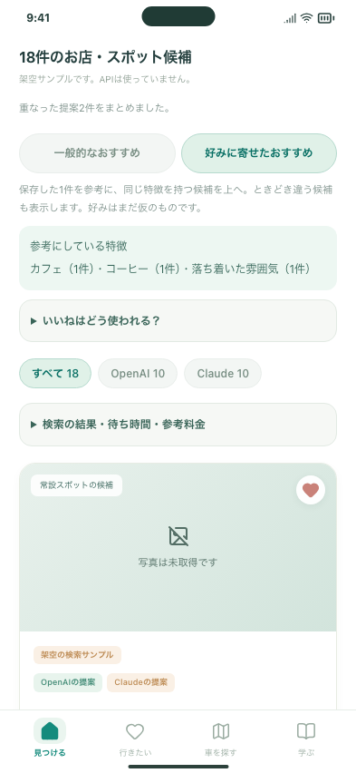
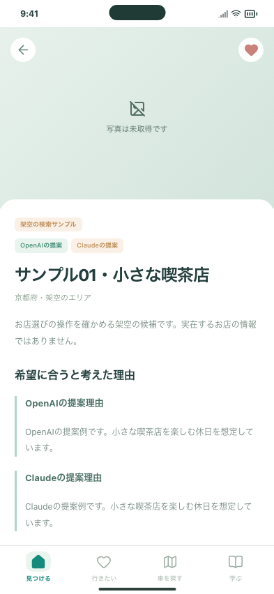
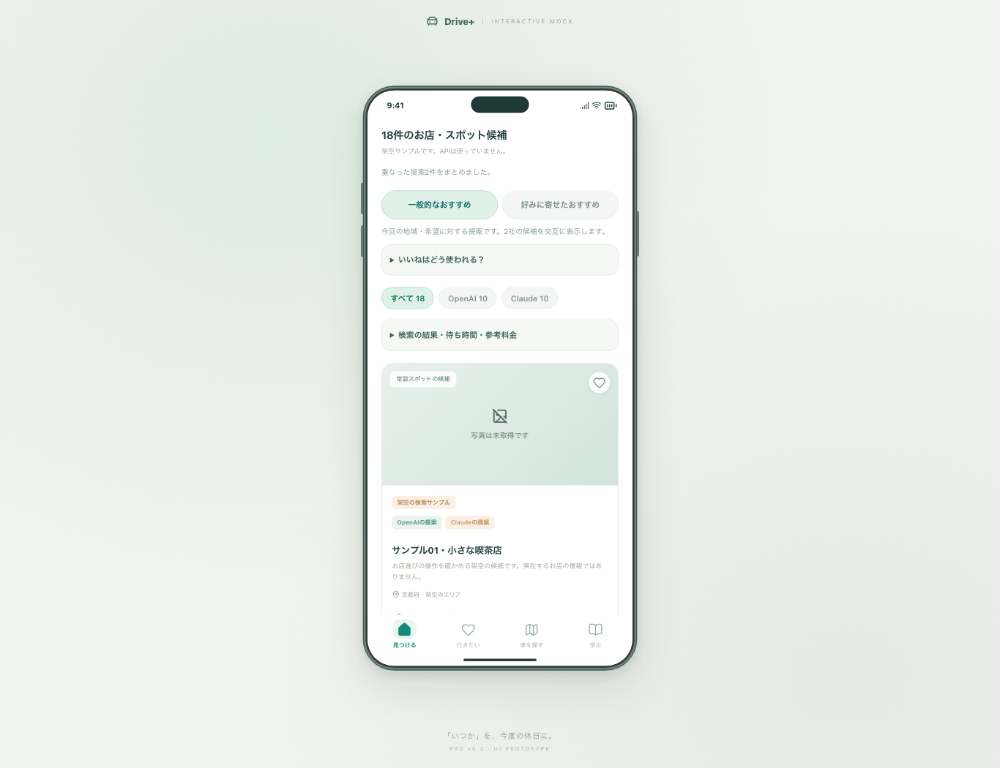

# #97：2社の候補比較と、いいねによる好み順

「見つける」にOpenAI・Claudeの検索結果をまとめ、両社の違いと本人の好みを見比べる最小版です。写真取得や店舗の事実確認を完了したものではありません。

実結果で見つかった住所表記違いへの対応は[重複統合の記録](DEDUPLICATION.md)を参照してください。現在の実結果は15枚です。

## 確認する3操作

1. 都道府県と希望を入力し「OpenAI・Claudeで比較」で検索。候補と両社の提案元を確認します。
2. OpenAI／Claudeで切り替え、出典と詳細の提案理由を見ます。
3. ハートで保存し「好みに寄せたおすすめ」へ。「好きなところ」を変更したり、保存を解除して参考から外せます。詳細から戻っても選んだ並び順・探し方を維持します。

起動・キー設定・費用・人間のTODOは [操作ガイド](../../DISCOVERY_COMPARISON.md) にまとめました。再読み込み後は「前回の比較結果を開く（無料）」で確認できます。

## 変更と影響

| 項目 | 今回の変更 |
| --- | --- |
| 候補 | 各社最大10件。合計15〜20件を目指し、根拠不足は水増ししない |
| 重複 | 同名・同エリア、または根拠を確認した住所の表記違いを整理。両社の理由と出典を保持 |
| いいね | 個人保存の特徴から端末内で並び替え。無反応は嫌いにしない |
| 費用 | 比較はまず1回。各社API1回・Web最大2回。以前の3回台帳を変更しない |
| 外部送信 | 都道府県・検索欄だけ。個人のいいね、学習、不安、現在地、相手の情報を自動送信しない |
| 保存 | 既存の端末内保存に分類と提案元を追加。比較の最後の結果はMac内に保存 |
| 失敗 | 片社失敗なら他社の候補とエラーを表示。自動再試行なし。料金不明は0円にしない |
| 共有 | 明示して選んだ候補の共有を維持。好みの理由は共有データに含めない |

旧版に戻して保存の保護表示が出た場合は、データを消さずにこの変更を含む版で開き直してください。既存の京都候補は引き続き読めます。

## 開発側の検証

- Nodeの検索テスト：23件。2社の上限、秘密情報を返さない失敗、並行送信、未取得出典の排除、台帳継続、無料再表示を検査。
- 検索の操作テスト：PC Chromium・スマホ幅Chromium・スマホ幅WebKit。比較→フィルター→出典→保存→好み順→詳細→戻る→再読み込みを検査。従来検索の操作も維持。
- 保存・並び替えの境界テスト：従来候補との混在、不正データ保護、保存解除、理由の解除、サンプルと実検索を混ぜないことを検査。
- 型チェック・通常ビルド・入力ツールビルド・配信物検査を実施。全体とFirebaseの回帰チェックはPRのCI結果から確認できます。

**2026-10-05に実APIの1回検証を実施しました。** [実検索の結果・費用・改善点](LIVE_VALIDATION.md)を参照してください。自動テストは引き続き偽のAPI応答・架空データです。実店舗の情報品質・両社の実際の請求額・実機iPhoneでの新規検索を確認済みとはしていません。

## 確認画像（すべて架空サンプル）

| 比較画面 | 好み順 | 詳細 |
| --- | --- | --- |
|  |  |  |

PCではスマホ枠の中だけをスクロールします。

