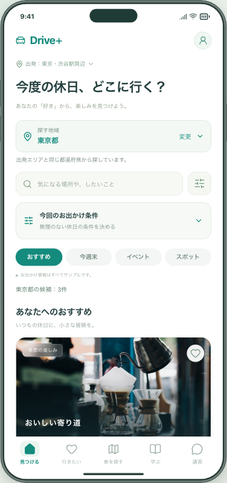
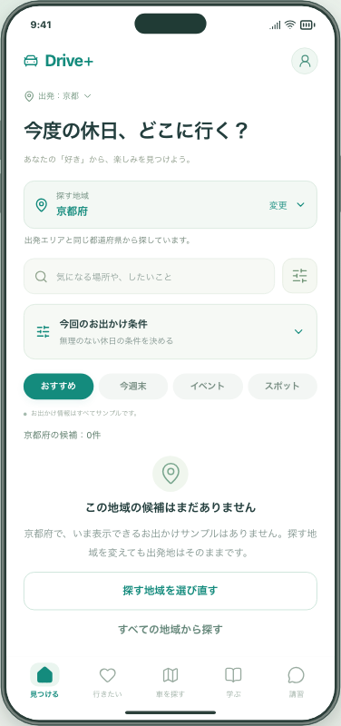
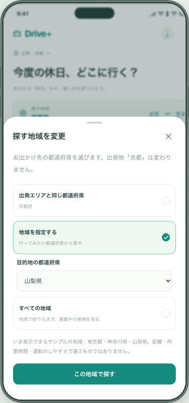
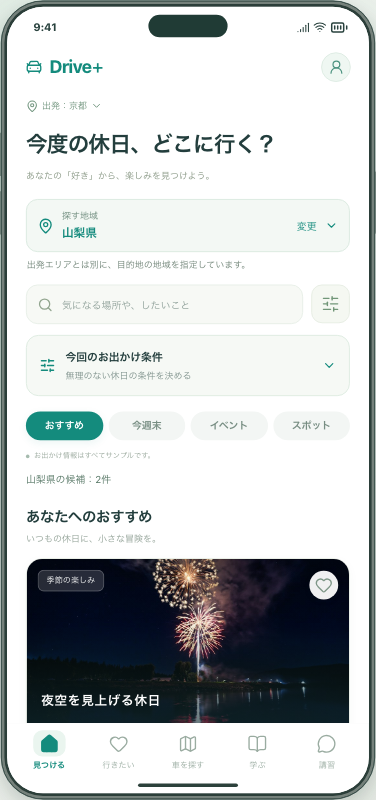

# 探す地域と出発地を分ける（Issue #19の先行部分）

出発地を京都にしても東京・山梨などの同じ6候補が並んでいたため、何を基準に表示しているか分かりにくい状態でした。お出かけ先の都道府県を選び、候補がない地域では理由と次の操作を表示するようにしました。

確認用URL：**http://127.0.0.1:4191/**（開発PCで起動中のみ）。普段の5173番とは別の保存場所です。新しいURLで最初に表示される場合は「まずは見てみる」から進めます。

## 試していただきたい3つの操作

1. **見つける → 上部の「出発」を押す → 「京都」にして保存。** 「探す地域」が京都府になり、サンプルがない理由と、探す地域を選び直すボタンが表示されます。
2. **「探す地域を選び直す」→「地域を指定する」→「山梨県」→「この地域で探す」。** 山梨県のサンプルに切り替わります。上部の出発地は京都のままです。「すべての地域から探す」でも範囲を広げられます。
3. **候補を保存 → 詳細を見る → 戻る／再読み込み。** 選んだ地域と保存が残ります。詳細の「出発地で車を探す」には京都を引き継ぎます。

「出発する場所と探す場所の違いが分かるか」「候補がないときに次の操作を見つけられるか」を確認してください。コードの確認は不要です。

## 画面

画像は2026年9月17日時点を固定した、架空データの操作例です。現在の日時が開催期間・情報確認期限を過ぎると表示件数は変わります。

| 出発地と同じ都道府県                 | 候補がない地域の案内                                                 |
| ------------------------------------ | -------------------------------------------------------------------- |
|  |  |

| 探す地域の変更                                                    | 出発地を維持して山梨県を表示                                   |
| ----------------------------------------------------------------- | -------------------------------------------------------------- |
|  |  |

[幅320px・文字拡大時の画面](images/05-narrow-sheet.png)では、シート内をスクロールして確定・閉じるを操作できます。

## 開発側で確認したこと

- 東京から京都へ変更したときの候補と説明、自分で全地域へ広げる操作。
- 指定した目的地の地域が、出発地変更・キャンセル・戻る・再読み込みで意図せず変わらないこと。
- 保存した候補、詳細から戻る位置、車探しに渡す出発地の保持。
- 趣味順、カテゴリ、検索語、非表示、今回の条件との併用。条件をリセットしても地域は保持。
- 終了・期限切れ・掲載停止した情報が、地域変更でおすすめへ戻らないこと。
- 以前の保存データの読み込みと、新しい地域指定が不正な場合の原本保護。
- PC、スマートフォン幅のChromium、WebKitでの操作。幅320px・文字拡大・キーボードによるシート開閉も確認。
- 新機能の操作で外部へのリクエストが発生しないこと。

ローカルではアプリ全体237件、入力ツール18件が成功しました。その後の空表示の余白調整についても関連する21件を再確認しました。最終コミットのCI結果はPR・Issueに記載します。実際のiPhone／Android端末での確認とは区別します。

## データと費用

### 復旧機能との統合確認（2026-09-22）

PR #63を含むmainに更新した際、復旧試験が「初期画面に山梨県の花火がある」前提のまま止まることをCIで確認しました。初期表示が東京都に絞られる仕様に合わせ、既存の共通操作で「すべての地域」を選んでから保存する手順へ修正しました。アプリ本体の表示・保存の実装は変更していません。

バックアップ作成、503応答の模擬、別フォルダへの復元、同じ配信元での保存内容・地域指定の保持、5タブ・画像の確認は継続します。タイムアウト時もテスト用サーバーと一時ファイルの後片付けを行うようにしました。統合後のCI結果はPR・Issueに記録します。

保存データに「探す地域」を追加します。従来の保存には「出発エリアと同じ都道府県」を補い、既存の保存・メモ・絞り込みを保持します。削除・アカウント移行・外部送信はありません。

新しいアプリで保存したデータを、古いアプリに戻して読み込む互換性は今回の対象外です。確認用URLを分け、普段のブラウザの保存データは変更していません。

追加サービス費用は0円。初期費用・運用費を含む累計3,000円の上限を維持しています。

## 範囲と残作業

- 地域は都道府県単位です。サンプルに明示した都道府県を使い、場所の文字列から目的地を推測しません。
- 出発地の先頭に都道府県名がある場合のみ読み取ります。「東京・渋谷」のような省略は扱いますが、「府中駅」「横浜」など市名・駅名だけの場合は地域選択を案内します。位置情報や検索APIは使いません。
- 「近い」「日帰りできる」「運転しやすい」という判定や、距離・所要時間の補完は行いません。
- 本物の掲載情報・API、情報入力ツールとの接続、公開地域の決定は残っています。Issue #19全体は閉じません。
- 施設選定と施設・写真の利用条件の確認は保留のままです。

## 開発時の確認

```bash
npm ci
npm run format:check
npm run build
npm run build:review
npm run verify:preview
CI=true PLAYWRIGHT_PORT=5195 npm run test:preview
CI=true npm run test:review
npm run dev -- --host 127.0.0.1 --port 4191 --strictPort
```

主な変更は、掲載サンプルの都道府県、地域判定、地域選択のシート、発見画面、保存データ検証です。起動方法の詳細はリポジトリのREADMEを参照してください。
