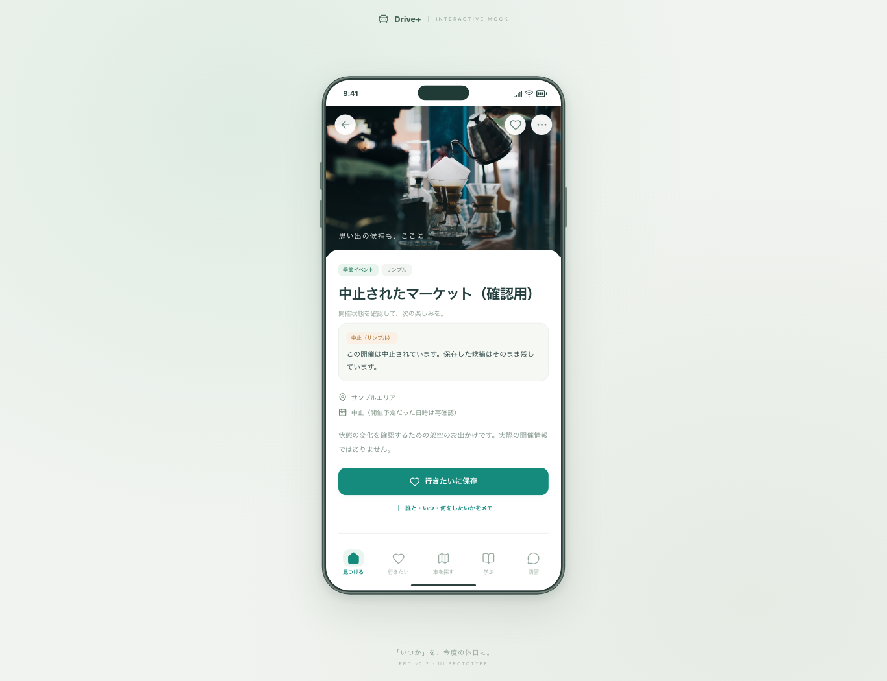
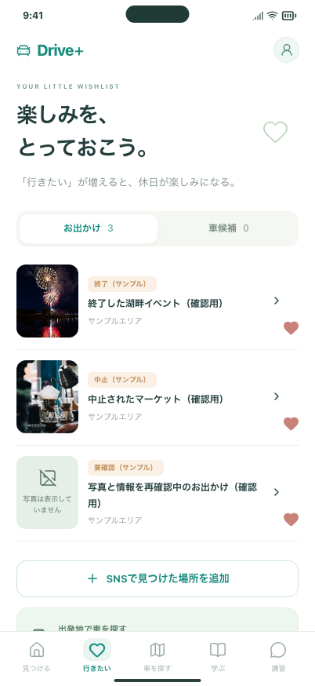
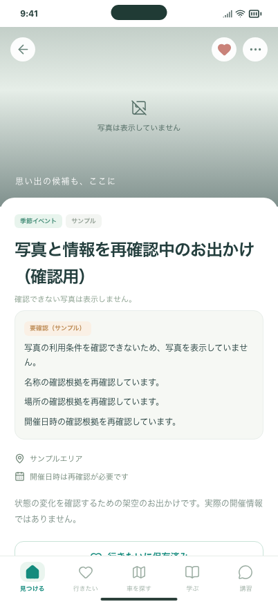

# #18 開催状態・写真停止の確認

対象はモック上の判定と表示です。情報の真偽・許諾・運転能力を認定する機能ではありません。

## 手元で確認する

```bash
npm ci
npm run build
npm run preview -- --host 127.0.0.1 --port 4186 --strictPort
```

1. http://127.0.0.1:4186/#/events/sample-cancelled を開き、中止表示を確認して「行きたいに保存」。
2. http://127.0.0.1:4186/#/events/sample-ended を開き、終了表示を確認して保存（サンプルの確認期限内に限る）。
3. 「行きたい」タブで状態付きの候補が残ることを確認。再読み込みと詳細→戻る操作でも保存は維持される。
4. http://127.0.0.1:4186/#/events/sample-photo-stopped では写真の代替表示と要確認を確認。保存一覧でも写真を出さない。
5. http://127.0.0.1:4186/#/events/sample-withdrawn と末尾に `/arrival` を付けたURLでは、掲載停止の案内のみで以前の紹介・下見情報を出さない。
6. 「見つける」にはこれらの終了・中止・再確認中・停止中のサンプルは表示されない。

確認用レコードの確認期限は2026-12-31です。以後は再確認の表示になります。以下の画像とブラウザテストは日本時間2026-09-16の時計で確認しています。OS時計や保存データを書き換える必要はありません。

## 確認画像







## 自動確認

```bash
npm run format:check
npm run build
npm run build:review
npm run verify:preview
CI=true PLAYWRIGHT_PORT=5186 npm run test:preview
CI=true npm run test:review
```

追加テスト：開始／終了時刻、JSTの確認期限、未来・不正・未確認の日時、根拠の欠落、写真と事実の独立性、中止・延期の継続、別年度／別会場の分離、週末の重なり。ブラウザでは保存・戻る・再読み込み、表示中の時刻更新、写真URLのリクエスト抑止、直接URLの掲載停止、画像読み込み失敗を確認します。

PCとスマホ幅のChromiumで確認します。実機Safari/iOSと、サーバー・CDNの本番キャッシュ停止は対象外です。CIのHTMLレポートはPRのChecksから参照できます。詳細な仕様・残作業は [EVENT_LIFECYCLE.md](../../EVENT_LIFECYCLE.md) を参照してください。

ローカル検証結果：アプリ78件（既存52件＋今回26件）と入力ツール18件、計96件が成功しました。整形・型チェック・両ビルド・配信物検査も確認します。CIの結果はPRとIssueの報告に記載します。
