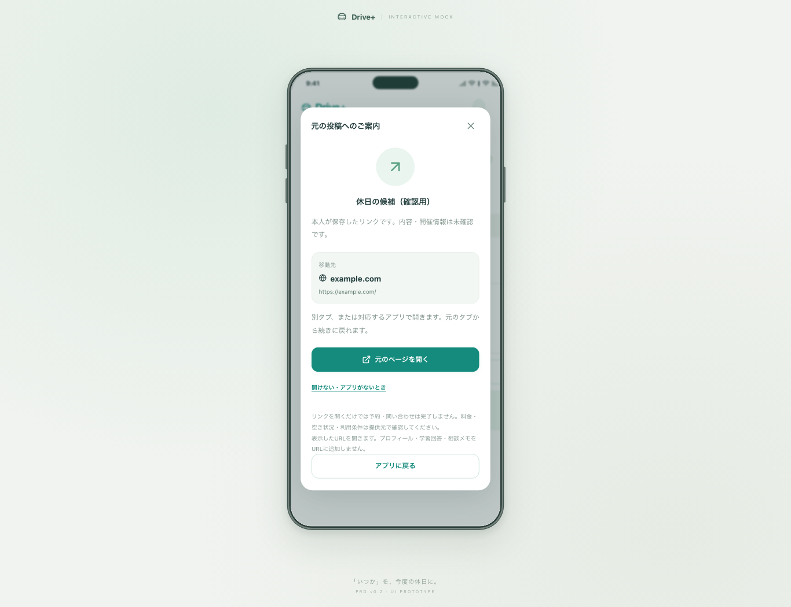
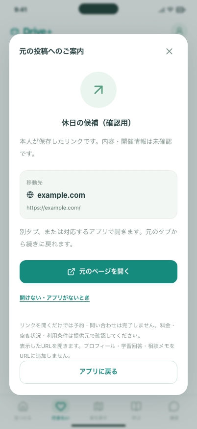
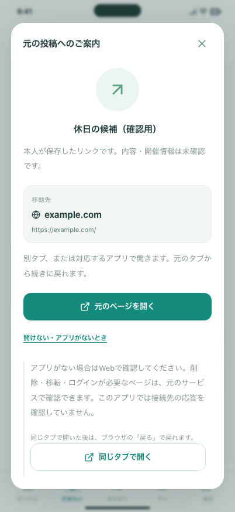
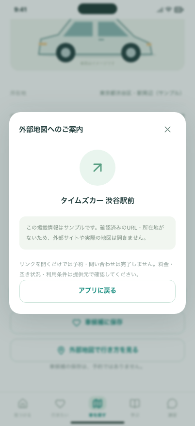

# #24 外部リンクの確認

今回の確認は、本人が保存したURLを開く操作と、確認済みデータへ置き換えるための共通処理です。サンプルの施設・車拠点・講習会社から実際の地図や公式サイトは開きません。

## 手元で確認する

```bash
npm ci
npm run build
npm run preview -- --host 127.0.0.1 --port 4187 --strictPort
```

http://127.0.0.1:4187/ を開きます。

1. 「まずは見てみる」→「行きたい」→「SNSで見つけた場所を追加」。
2. 確認用には `https://example.com/`、またはご自身で選んだ公開HTTPSの投稿URLを保存。
3. 「元の投稿を確認」でホストとURLを確認。この時点では外部ページを取得しない。
4. 「元のページを開く」で別タブへ移動。元タブへ戻り「アプリに戻る」。リンクは内容未確認のまま残る。
5. 「開けない・アプリがないとき」→「同じタブで開く」も確認。ブラウザの戻るで保存一覧に戻れる。
6. `http://example.com/` を保存した場合は、保存は残るが外部へ開くリンクは出ない。HTTPSへ自動変更しない。
7. 車の拠点詳細の「公式で空き状況・予約を確認」「外部地図で行き方を見る」は、未確認のサンプルであることを案内。架空の拠点へ案内しない。

## 確認画像









画像には確認用URLと架空の保存タイトルだけを使っています。実際の施設情報や個人の相談メモは含めません。

## 自動確認

```bash
npm run format:check
npm run build
npm run build:review
npm run verify:preview
CI=true PLAYWRIGHT_PORT=5188 npm run test:preview
CI=true npm run test:review
```

追加テストでは、不正スキーム・端末内URL・認証情報・偽装ホスト・長すぎるURL・確認期限、未承認サンプルの遮断、公式Webへの代替、地図座標・住所と引き渡すパラメーターを確認します。

ブラウザでは、外部のHTTP応答をPlaywrightでローカルに差し替えたうえで、別タブ・404ページへの同一タブ遷移・ブラウザの戻る、保存と検索条件の維持、opener／Referrerの抑止、予約状態が変わらないこと、320px幅・文字拡大・フォーカス移動を確認します。実サービスへはテスト通信しません。

実機や実在施設のリンク有効化は後続です。[仕様・確認範囲・残作業](../../EXTERNAL_LINKS.md)を参照してください。

ローカル検証：アプリ102件（既存78件＋今回24件）と入力ツール18件、合計120件が成功しました。整形・型チェック・両ビルド・配信物検査も実施します。GitHub CIの結果はPRとIssueに記載します。
