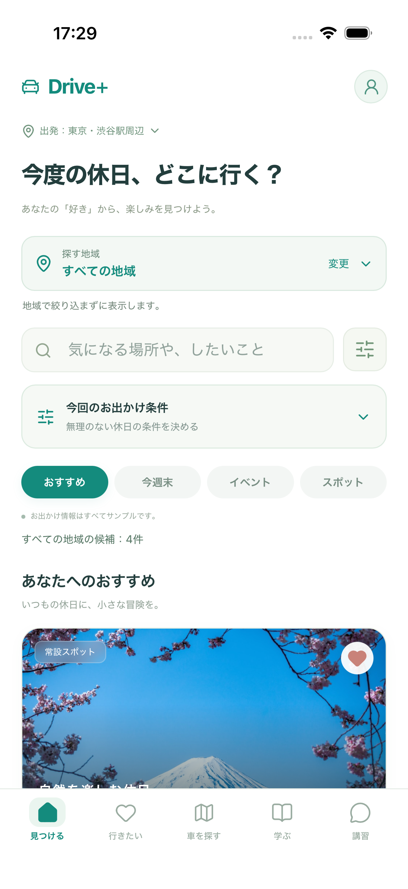
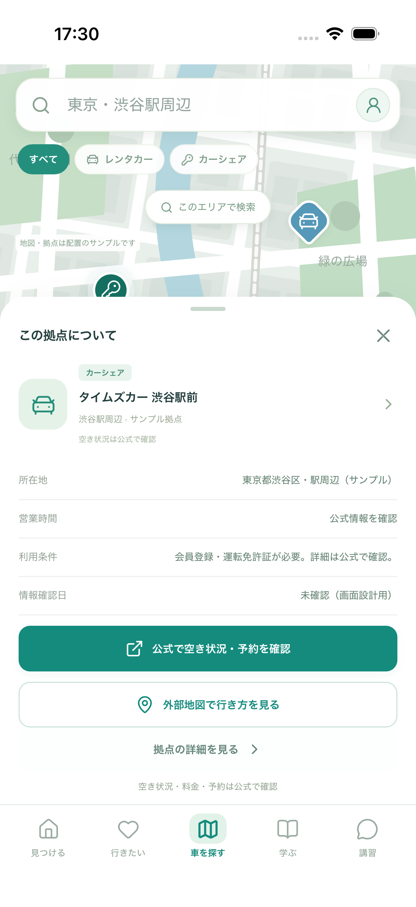
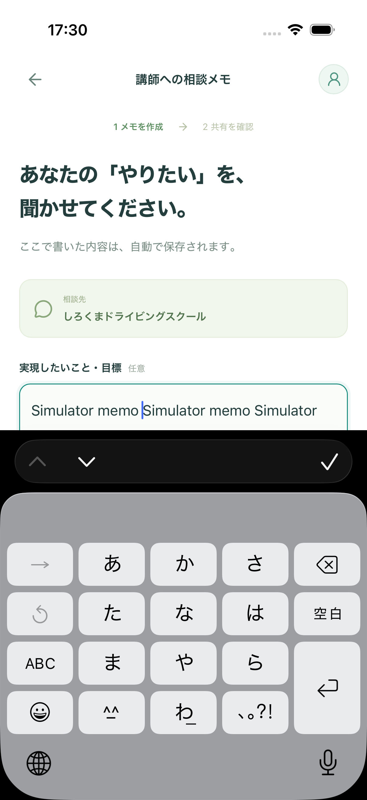
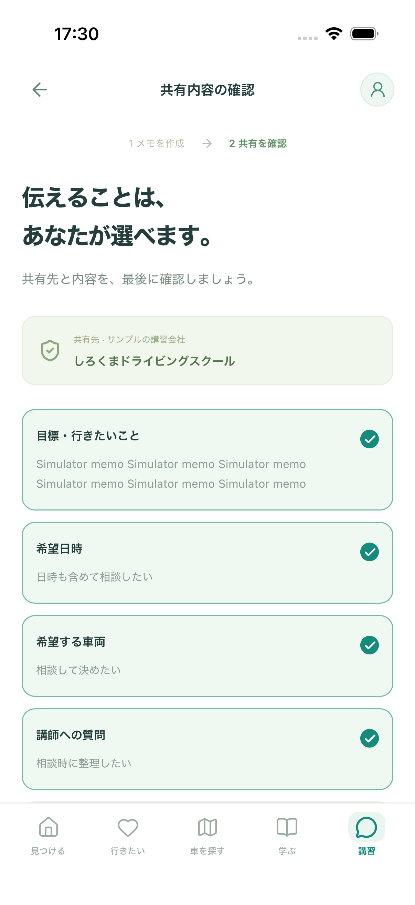
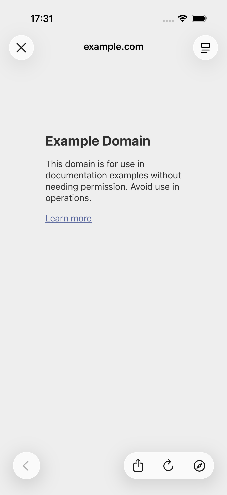
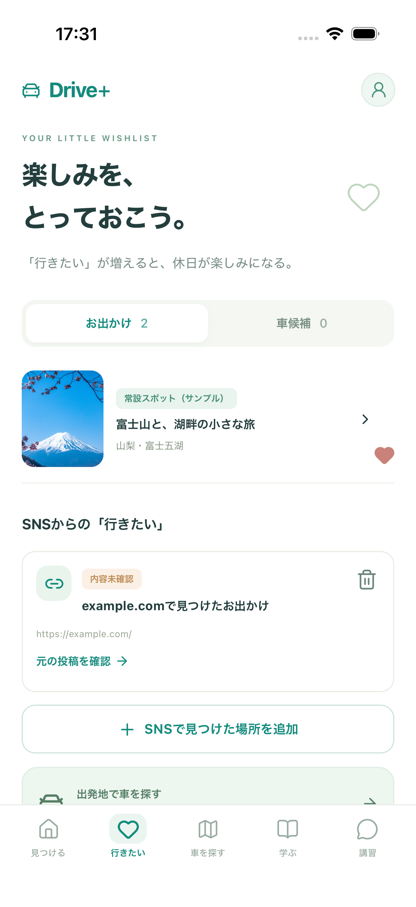

# Issue #68：iPhoneで確認する土台

## 何が変わるか

PCブラウザで触っていた画面を、**Drive+ MockというiPhoneアプリ**として起動できます。まずMacのiPhoneシミュレーターで確認し、同じReact＋Capacitorのプロジェクトを自分のiPhoneへ入れます。Expo Goは使いません。追加サービス費用は0円です。

アプリに画面とサンプル写真を入れているため、localhostへ接続せず基本操作できます。本番の情報・認証・Firebase・相談送信は追加していません。施設・写真の確認は保留を継続しています。

## あなたが試すこと

[起動・更新・実機インストールの説明](../../IOS_DEVELOPMENT.md)に沿って起動してください。

| 操作 | 期待する結果 |
| --- | --- |
| 初回設定か「まずは見てみる」→5タブ | iPhoneの画面を使って操作でき、PC用の枠やステータスバーが重ならない |
| 探す地域を変更→保存→アプリを終了・再起動 | 選択した地域と「行きたい」が残る |
| 講習→詳細→相談メモ入力→キーボードを閉じる→共有確認→戻る | メモを見直せる。相談先には実送信しない |

PC版とアプリ版のデータは別々です。アプリを削除するとアプリ側の保存も消えます。今回の保存は端末内だけで、サーバー同期やクラウドバックアップはありません。保存エラー時は上書きを止めて通知し、元のJSONを本人の操作でコピー等できます。

## シミュレーターの画面

iPhone 17 / iOS 26.5上の、インストールしたアプリを撮影しています。ブラウザのスマホ表示ではありません。

| 見つける | 地図のピンを選択 |
| --- | --- |
|  |  |

| 相談メモとキーボード | 共有する内容の確認 |
| --- | --- |
|  |  |

| 本人が保存したURLを開く | 閉じてアプリへ戻る |
| --- | --- |
|  |  |

## 開発側の確認と残ること

確認日：2026-09-22。Xcode 26.6、Node.js 24.20.0 / npm 11.19.0。

- XCTest **2/2成功**。シミュレーター：同梱したアプリの起動、5タブ、地域の変更、保存と再起動、地図ピン、相談メモのキーボード・共有確認・戻る・再起動後の保持を操作。
- 外部リンク：確認した本人保存URLをiOSのブラウザ画面へ渡し、閉じてアプリへ戻る。施設サンプルのリンクは既存の停止ルールを維持。
- Playwright **252/252成功**（うちプラグイン境界12件）。既存Web機能と、ネイティブ保存の遅延・読み取り失敗・書き込み失敗・再試行・元データ保護・ブラウザ起動失敗を検証。プラグイン境界の失敗はテスト用の代替実装で再現。
- 配信物のバックアップ・復元 **9/9成功**、掲載情報入力ツール **18/18成功**。整形・型チェック・ビルド・配信物検査が成功。`npm audit`の検出は0件。GitHub CIへのリンクはPRとIssueに記録。
- **本人のiPhoneへのインストール・操作は未確認です。** Issue #68は実機の確認結果を記録するまで開いたままです。App Store / TestFlightへの配布はしていません。

## 開発者向けの変更点

`ios/` と `capacitor.config.ts` がiPhoneプロジェクト、`src/platform/` が端末向けレイアウトと保存先です。既存画面のReactは共用します。Preferencesを読み終えてから画面を描画し、保存・削除を順番に実行します。Webの既存キーと不正データの保護を維持しています。外部ページは元のWebViewを置き換えずBrowserプラグインへ渡します。

ネイティブのコンパイルと操作テストはMacで実施します。既存GitHub CIはWebの検証を続け、新しい有料ビルドサービスは追加していません。CLIが使う`xcode`の`uuid`は脆弱性修正版11.1.1へ固定し、ネイティブのビルドと`npm audit`で確認しています。
