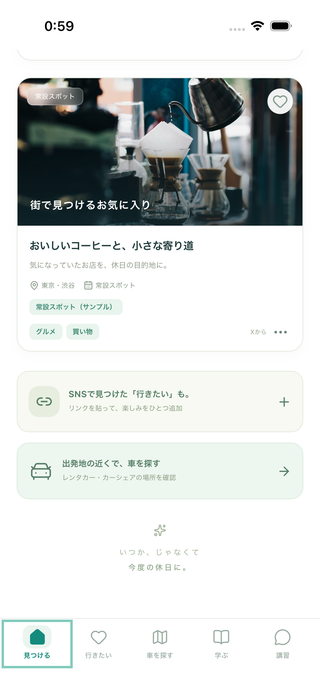
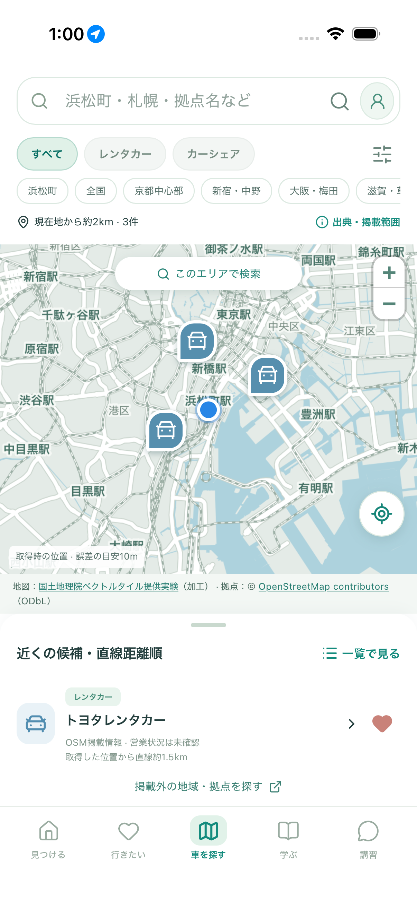
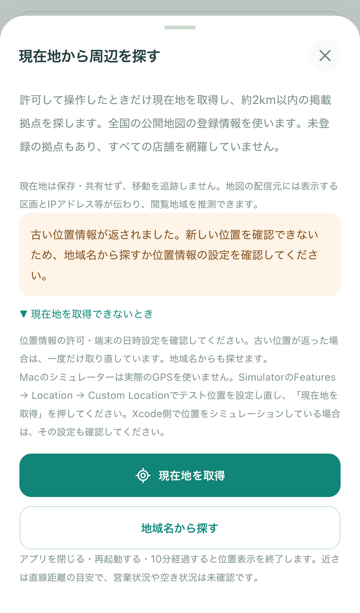

# iPhoneシミュレーターのスクロール・現在地の確認

2026-10-02 / Issue #86

## 何が分かったか

ホームとコラムは、iPhone 17相当のiOS 26.5シミュレーターで、指に相当するドラッグ操作で下まで読めました。今回、スクロール用のCSSは変更していません。報告された画面・入力方法がまだ特定できていないため、全画面で問題がないと断定するものではありません。

現在地のエラーは、位置の測定時刻が2分を超えて古い場合に出ます。以前は端末より10秒超未来の時刻も同じメッセージでした。利用者の実際の位置・時刻のログを採取していないため、今回どちらだったかは確定していません。シミュレーターに新しいテスト位置を設定した場合は、取得と周辺拠点の表示に成功しました。

## 変更したこと

- 古い位置だった場合だけ、同じ操作内で最大1回取り直します。全体で最大30秒です。
- 取り直しても古い場合は採用せず、設定を確認する案内を表示します。未来の時刻は別の説明にしました。
- 取得をキャンセルした後・アプリを閉じた後・時間切れ後の結果は採用せず、それをきっかけに再取得しません。
- スクロール方法とシミュレーターの位置設定を手順書に追加しました。

## 利用者の確認（3操作）

1. Xcodeでこのフォルダのプロジェクトを実行し、「見つける」のカードをクリックしたまますぐ上へドラッグします。下の「SNSで見つけた」まで進めることを確認します。長押しすると文字選択になる場合があります。
2. Simulatorの **Features → Location → Custom Location** に緯度 `35.6554`、経度 `139.7571` を設定します。浜松町駅付近のテスト位置で、本人の現在地ではありません。Xcode側の **Debug → Simulate Location** に別の設定があれば合わせて確認します。
3. 「車を探す」→「現在地から探す」→「現在地を取得」。青い点と近くの拠点候補が表示されることを確認します。エラー時は「現在地を取得できないとき」を開くと手順を読めます。

詳細：[iOSの操作・更新手順](../../IOS_DEVELOPMENT.md)、[位置取得の手順](../../LOCATION_SEARCH.md#古い位置情報と表示されたとき)。

## 開発側の確認

| 確認 | 結果 |
| --- | --- |
| 整形、型チェック・ビルド、配信物検査 | 成功 |
| ブラウザの位置情報・ネイティブ連携テスト | PC Chromium、スマホ Chromium、スマホ WebKitで計75件成功 |
| iOSネイティブ：ホームのタッチスクロール | 見出しが80ポイント以上移動し、下部CTAに到達、タブ切替も成功 |
| iOSネイティブ：コラム | 本文のスクロールと末尾から戻る操作に成功 |
| iOSネイティブ：疑似位置の変更 | 国内範囲外のエラー後、浜松町のテスト位置に変更すると取得成功 |
| iOSネイティブ：位置取得の一連の流れ | 許可、新宿駅のテスト位置、拠点詳細・保存・一覧、バックグラウンド／再起動後の位置消去に成功 |

古い位置・未来の時刻・取得中のキャンセル・期限切れは、ブラウザ側でOS応答を差し替えて検査しています。XCTestの位置指定は時刻を更新するため、実際のiOSから古い測定時刻が返る現象を再現できたわけではありません。実機iPhoneのGPSは未確認です。

既存の位置取得テストは個別ピンを前提としていましたが、全国地図ではピンがまとまるため、同じ拠点に進める下部カードを使うように更新しました。最終再実行は成功しています。

検証用コマンド：

```bash
npm run format:check
npm run ios:sync
npm run verify:preview
CI=true PLAYWRIGHT_PORT=5198 PLAYWRIGHT_SERVER=preview npx playwright test tests/location-search.spec.ts tests/native-bridge.spec.ts
```

iOSのテストはユーザーの端末と分けた専用シミュレーターで実行します。対象は `testHomeTouchScroll`、`testLearningColumns`、`testSimulatorLocationRecovery`、`testCurrentLocation`。位置許可の確認には実行前に専用端末の許可をリセットします。

## 画面の証跡

以下の地図は公共の駅に設定した疑似位置です。実際の個人の所在地は含みません。

### ホームをタッチで下までスクロール（iOS）



### テスト位置の取得成功（iOS）



### 古い位置と設定案内（ブラウザでOS応答を差し替え）



## 保存・費用への影響

保存データの形式は変更しません。位置は従来どおり一時利用し、端末への永続保存・サーバーへの位置記録・継続追跡は追加しません。地図表示時のタイル取得は従来どおり発生します。有料APIやWeb検索の利用回数は使用しておらず、今回の追加費用はありません。
