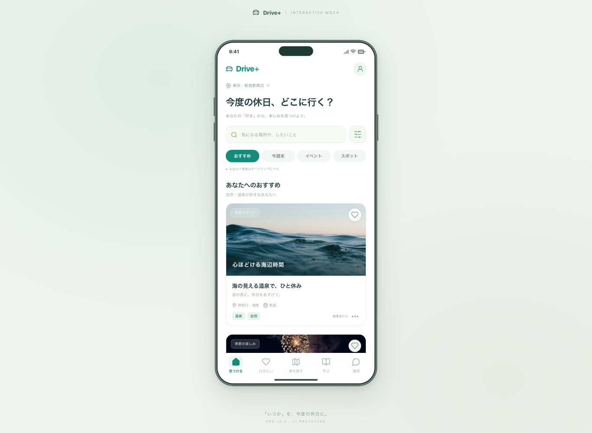
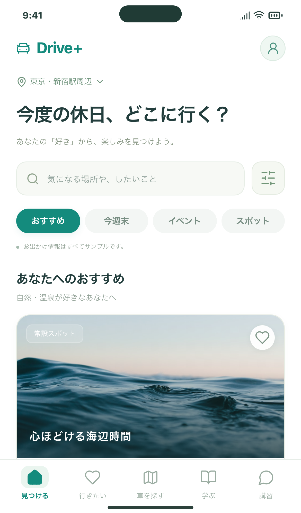

# Issue #4：開発・レビュー基盤の確認結果

確認日：2026-09-14。対象：[Issue #4](https://github.com/Greek-Academy/Let-s-go-anywhere/issues/4)。

今回追加したものは、ランタイムの指定、PRのCI、画像付きHTMLレポート、レビュー手順・PRテンプレート・依存更新設定です。最初のコード反映のため、PRには既存のモック一式も含まれます。

## ローカルの再現確認

アプリとCI設定の検証対象：[コミット b90845d](https://github.com/Greek-Academy/Let-s-go-anywhere/commit/b90845d2b57732d69384c35b4d689cbdd2caac93)。この文書と画像は検証後に追加しています。

| 確認 | 結果 |
| --- | --- |
| 別フォルダへの新規cloneと`npm ci` | Node.js 24.20.0 / npm 11.19.0で成功 |
| 指定外ランタイム | Node.js 26での`npm ci`をengines設定で拒否 |
| `npm run format:check` | 成功 |
| `npm run build` | 型チェックとViteビルド成功 |
| `CI=true PLAYWRIGHT_PORT=5175 npm run test:e2e` | **20 passed**。PC 10件・モバイル相当10件 |
| HTMLレポート | 成功20・失敗0・不安定0・スキップ0。操作後の画像20枚を確認 |

テスト時は対象cloneのViteを別ポートで起動し、普段のlocalhost:5173を再利用していません。テストデータは各ブラウザコンテキスト内のサンプルです。

## 実際の操作で確認した画面

以下は初期設定、戻る、複数の興味選択、5タブ移動、再読み込み後の保存確認まで行ったテストの添付画像です。

### PC

### スマートフォン相当

## GitHubでの確認方法

1. Issue #4の実装結果コメントからレビュー用PRとCI実行を開きます。
2. Checksの`Build and browser tests`で各確認の結果を見ます。
3. CI実行画面のArtifactsから`playwright-report`を取得・展開します。
4. プロジェクトで`npx playwright show-report /path/to/extracted/playwright-report`を実行すると、各テストのステップと画像を確認できます。

CIのレポート・失敗時成果物は14日保持します。このページの画像はコミットに残る確認資料です。

## 確認待ちの事項

- IssueとPRは担当者のレビュー待ちで残します。レビュー前に自動クローズ・マージしません。
- GitHub Actionsの実行URLと結果はIssueコメントに記録します。Dependabotは設定がmainへマージされた後の更新PRで運用します。
- テストはChromiumのPC／スマートフォン相当です。実機Safari・Android、本番API、認証・実相談送信の検証は別Issueです。
- 素材の出典・取り扱いは[画像素材](../ASSETS.md)、レビュー手順は[CONTRIBUTING.md](../../CONTRIBUTING.md)を参照してください。
