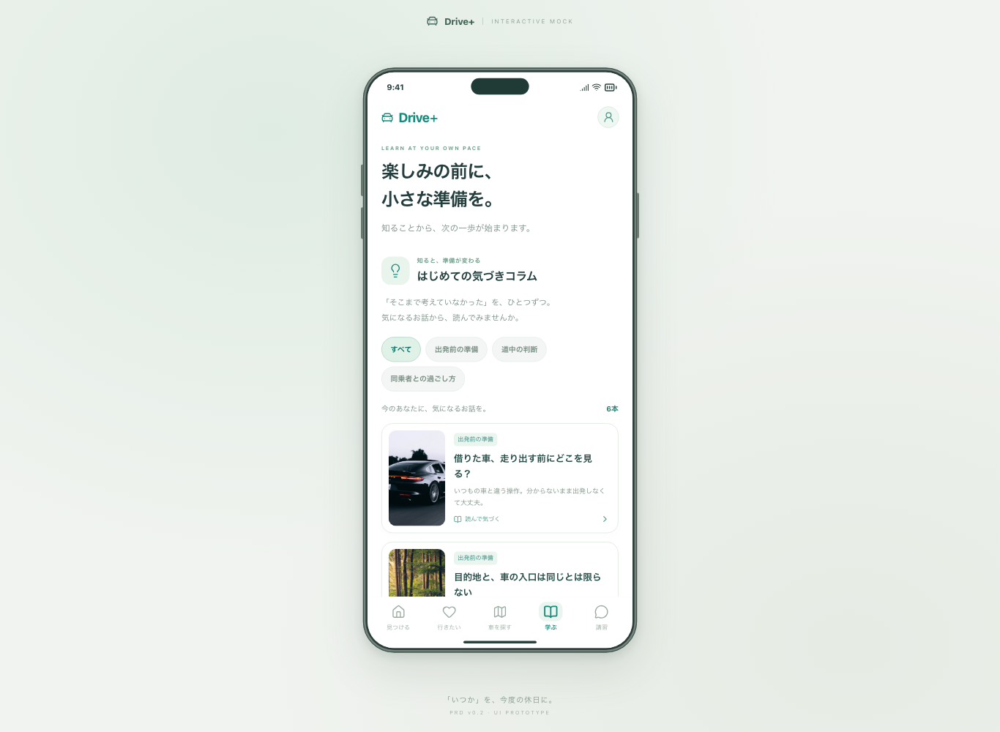
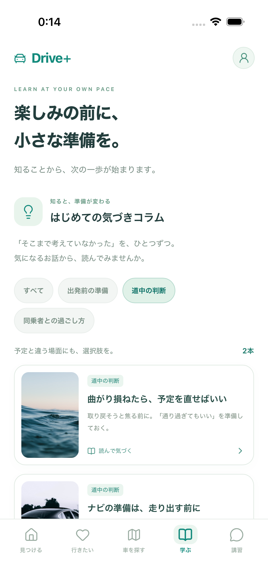
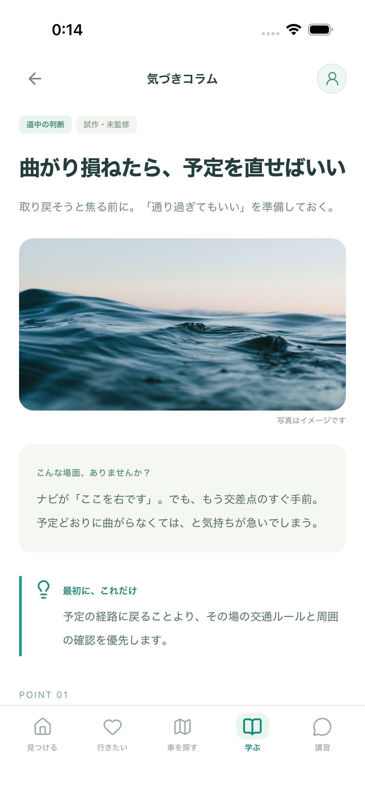
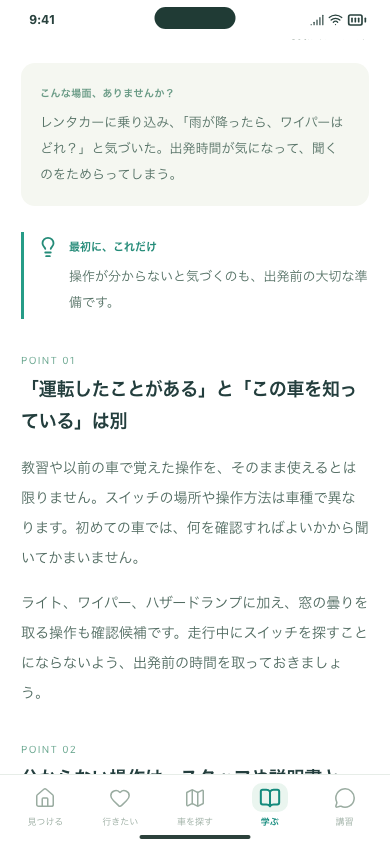
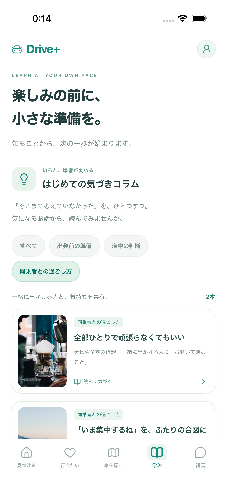

# 学ぶ：気づきコラムの確認

2026-10-01 / Issue #81 / 追加サービス費用0円

提供原稿のうち6項目を、3ジャンルで切り替えながら読む最小版です。試作・未監修で、閲覧を運転能力の評価やクイズの回答に変換しません。

## 試してほしいこと

Mac：http://127.0.0.1:5173/#/learn

1. **ジャンルを切り替える**：「出発前の準備」「道中の判断」「同乗者との過ごし方」は各2本、「すべて」は6本。
2. **パネルを押して読む**：場面の例、理由、具体的な準備、自分への問いまで読める。本文の丁寧さ・長さが期待どおりかをご確認ください。
3. **戻る**：上の矢印／下の「コラム一覧へ戻る」で、選択ジャンル・一覧の位置へ戻る。既存の教材・知識チェックは一覧の下にあります。

普段のiPhone 17シミュレーターにも反映済みです。実機iPhoneは今回の操作テストの対象外です。更新は [iPhone開発手順](../../IOS_DEVELOPMENT.md) の同期→Xcodeの▶で行います。

## 画面

PCでもアプリ領域内でスクロールします。

iPhoneシミュレーターでジャンルを切り替えた画面：

パネルから開いた本文：

説明部分は段落・見出しで区切っています（390pxブラウザ）：

別ジャンルの詳細から戻り、選択が残った画面：

## 開発側の検証

- `npm run format:check`：成功。
- `npm run build` / `npm run ios:sync`：成功。既存の大きなJSバンドルの警告は継続。
- `PLAYWRIGHT_PORT=5197 npm run test:preview -- tests/learning-columns.spec.ts tests/flows.spec.ts --workers=3`：**42件成功**。PC Chromium、スマホ幅Chromium、スマホ幅WebKitで確認。
- 新規12ケース相当：3ジャンルの切り替え、全6本文、戻る・フォーカスとスクロール復元、再読み込み、直接URLと不明ID/ジャンル、320px・文字拡大、外部資料を別タブで開く操作。閲覧中に外部通信が発生せず、既存の保存内容を変更しないことも確認。
- 既存30ケース相当：オンボーディング、5タブ、保存、知識チェック、教材の前後移動・相談メモ・学習記録、地図、講習相談、設定、画面幅、ボトムシートの回帰確認。
- XCTest `DrivePlusUITests/testLearningColumns`：**1件成功**。専用iOS 26.5シミュレーターで、ジャンル切り替え・本文スクロール・上下の戻る操作を実際のWKWebViewで確認。普段の端末の保存内容にはテストを実行していません。
- 初回のブラウザテストで画像の固定幅の想定とダミー資料のContent-Typeに誤りがあり、テストを修正後、上記42件が成功しました。

CI全体の結果はPRのChecksとIssue #81の結果コメントに記載します。

## 今回の範囲と、その後

本文・ジャンルのデータはアプリに同梱。追加API、課金、外部への自動送信はありません。参考リンクを本人が開くときだけ、移動先への通信が発生します。保存形式は変更しません。

残り95項目、読了履歴、公開用の監修・承認・教材配信は今回の対象外です。題材と参考資料、編集の変更点は [コラムのガイド](../../LEARNING_COLUMNS.md) にまとめました。#9・#25の本公開に向けた作業は継続します。
