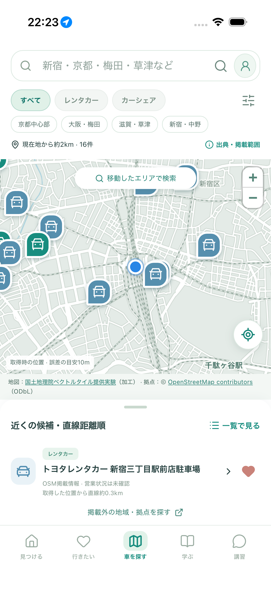
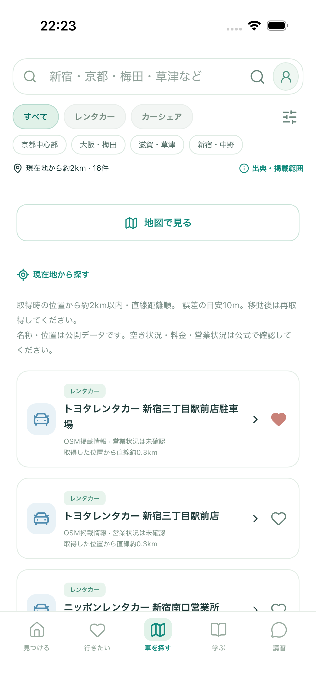
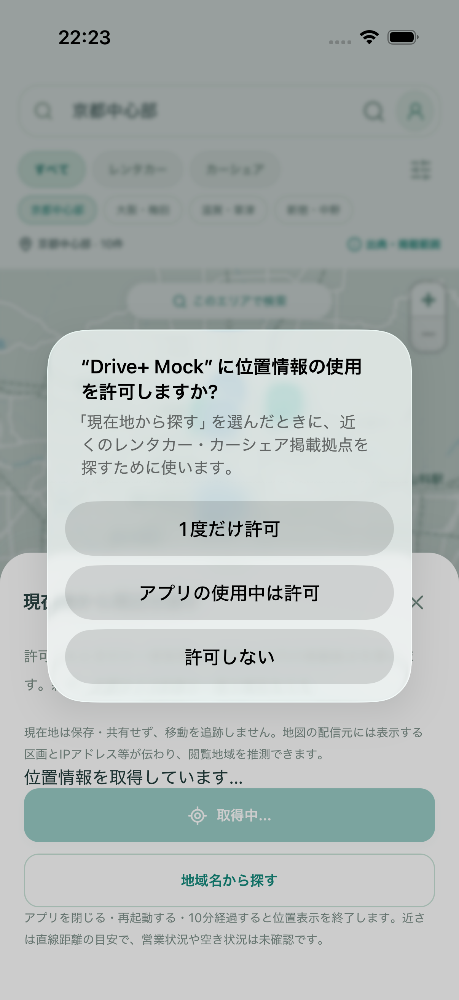
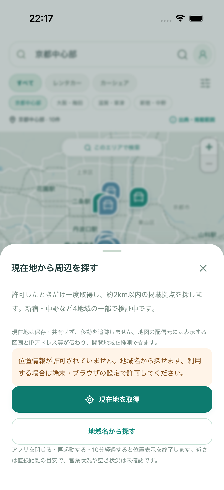

# 現在地から近くの拠点を探す：確認結果

2026-09-30 / [Issue #79](https://github.com/Greek-Academy/Let-s-go-anywhere/issues/79)。PR #78を土台にした追加実装です。

**「車を探す」の照準ボタンから、現在地を起点に候補を探せるようになりました。** 新宿・中野の公開地図情報27件を追加し、既存3地域と合わせ45件で検証しています。現在地から約2km以内・直線距離順です。全国の拠点検索ではありません。

## 確認していただきたい3操作

1. Xcodeで自分のiPhoneを選び▶で更新。「車を探す」→照準ボタン→「現在地を取得」→位置情報を許可し、青い点と近くの候補を確認する。
2. ピン→詳細→保存。「一覧で見る」で距離を確認する。種別・事業者の絞り込みも同じ条件で動きます。
3. アプリを一度ホーム画面へ戻し、開き直す。以前の位置は消え、必要なときだけ再取得できます。許可しない場合は「地域名から探す」→「新宿」などで確認できます。

詳しい手順は [LOCATION_SEARCH.md](../../LOCATION_SEARCH.md)。追加のAPIキーや有料サービスは不要です。手元のiPhone実機での位置精度・許可画面の本人確認は未実施です。

Macの確認URL：`http://127.0.0.1:4197/#/cars`。MacではMacの位置になります。シミュレーターは実機と別で、Features → Locationから位置を指定します。今回の自動テストと画像は **公共の新宿駅付近のテスト座標** で、ご自身の所在地ではありません。

| iPhone 17・地図 | iPhone 17・一覧 |
| --- | --- |
|  |  |

| 位置情報の許可 | 許可しない場合 |
| --- | --- |
|  |  |

地図：国土地理院ベクトルタイル提供実験（加工）／拠点：© OpenStreetMap contributors、ODbL。営業状況や空車を確認済みという意味ではありません。

## 検証で確認したこと

ビルド・型チェック・整形・静的プレビュー検証に成功。最終版のブラウザ全体実行は363件成功・3件タイムアウト・通常の環境限定3件スキップでした。タイムアウトしたのはPCの既存地図操作3件で、変更せずに該当ファイル7件を再実行してすべて成功しました。位置検索・ネイティブ通知のテストは成功しています。GitHubのCI結果はPRに記録します。バックアップ9件、検索基盤14件も成功。有料APIは使っていません。

- ブラウザ：PC Chromium、スマホ Chromium、スマホ WebKitで一連の操作、拒否、取得不可、時間切れ、誤差が大きい位置、古い位置、海外、未収録地域、キャンセル後の遅延応答、10分経過を検証。通常CIは合成タイルと固定テスト位置を使い、公開地図へのアクセスはしません。
- 保存：GPSの位置・表示範囲はlocalStorage / Preferencesへ保存せず、車候補だけ保持。詳細から戻る・地図／一覧の切り替えでは同じ候補と選択を継続できます。
- iPhone 17 / iOS 26.5：専用シミュレーターで実際のGeolocationプラグインとOSの許可画面を使い、表示→詳細→保存→一覧→バックグラウンド→再起動を確認。拒否の場合も別テストで確認しました。
- 見た目：実タイルを使った390px・320px幅を確認。小画面では現在地ボタンを左へ寄せ、拡大・縮小ボタンと重ならないようにしています。長い拠点名は地図下の小カードだけ省略し、詳細で全文を確認できます。

開発中に見つかった点も修正しました。iPhoneのWKWebViewでは、ブラウザの非表示通知だけでは位置を消せなかったため、ネイティブのバックグラウンド通知を追加しています。テスト側では、XCTestの既定位置がsimctlの指定を上書きすることと、詳細の保存後に戻るボタンへスクロールする方向を修正しました。

## 地図取得量と費用

新宿駅の固定テスト位置から2kmで **16件** を表示しました。道路距離・徒歩時間・空車台数ではありません。別の位置やフィルターでは件数が変わります。

| ブラウザ | 現在地検索で追加したタイル | PBF応答本文 | 操作から地図表示まで |
| --- | ---: | ---: | ---: |
| Chromium | 2区画 | 543,613 bytes（約0.54 MB） | 約0.19秒 |
| WebKit | 2区画 | 1,096,133 bytes（約1.10 MB） | 約0.49秒 |

測位・許可は固定したテスト値なので、**この秒数に実機の測位待ちは含みません**。初期京都表示の通信量も別です。ブラウザ間で取得区画が異なり本文量も異なりました。通信ヘッダー・中断・圧縮等を含む実通信量や請求額ではありません。[計測JSON](../../screenshots/issue-79/measurements.json)、再実行用 `scripts/measure-location-pilot.mjs --live`。

Playwright WebKitの位置シミュレーションでは時刻がマイクロ秒単位で返る問題を観測したため、実タイル計測スクリプト内だけ単位を補正しています。アプリ本体の古い／不正な時刻を拒否する検証は緩めていません。

追加サービス利用料・新規契約は0円。OpenAIなどの有料APIを呼んでいません。通信回線・既存機器は別で、全国運用の無料保証ではありません。

## 次に残ること

本人の実機確認、全国の拠点データと更新（#21）、全国の地域検索・密集ピン・地図の運用設計（#22）、公開に向けた情報源・体制の確認（#8）。今回の結果だけで親Issue全体を完了にしません。
