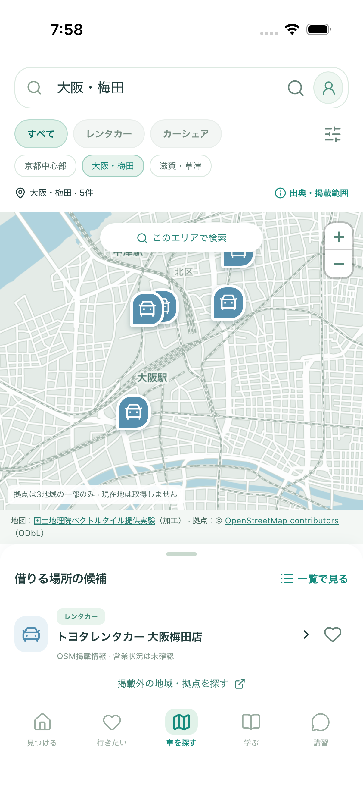
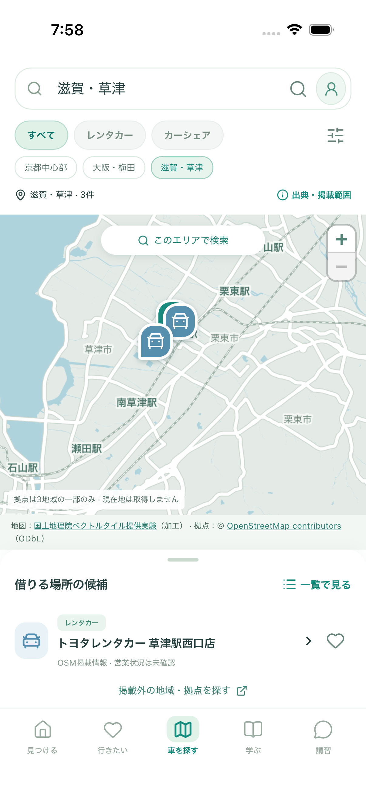

# 3地域の地図を触って確認する

2026-09-30 / [Issue #77](https://github.com/Greek-Academy/Let-s-go-anywhere/issues/77)。PR #76を土台にした追加検証です。

**京都に加えて、梅田・草津を切り替えられるようにしました。** 地図を全国分まとめてアプリに入れず、見ている場所と拡大率に合わせて小さな区画（タイル）を取得します。最近見た区画は再利用します。

## まず確認していただきたい3つ

1. 「車を探す」→「大阪・梅田」「滋賀・草津」を順に押す。地図が切り替わること、道の見やすさ、表示の待ち時間を確認する。近いピンは＋で拡大するか一覧から選ぶ。
2. ピン→「拠点の詳細・保存へ」→「車候補に保存」→「行きたい」の「車候補」で確認する。
3. 地図を動かす→「移動したエリアで検索」→「一覧で見る」→「地図で見る」。同じ絞り込みと表示位置に戻ることを確認する。

Web確認用：`http://127.0.0.1:4197/#/cars`（ビルド済みの確認サーバーを起動している間）。

通常の開発：`npm run dev` → `http://127.0.0.1:5173/#/cars`。

iPhone：`npm run ios:sync` → Xcodeで `ios/App/App.xcodeproj` を開き、iPhone 17を選んで▶。地図を見るには通信が必要です。APIキーや検索用サーバーの起動は不要です。

| 梅田・iPhone 17 | 草津・iPhone 17 |
| --- | --- |
|  |  |

地図：国土地理院ベクトルタイル提供実験（加工）／拠点：© OpenStreetMap contributors、ODbL。画像は実データですが、営業や空車を確認済みという意味ではありません。

## 通信量を測ってわかったこと

Mac上のChromium・WebKit、スマホ幅390px、同一回線で各1セッション。初期京都→京都全体→梅田→草津→梅田へ戻る→一度拡大→地図の移動、の順に実行。大量アクセス試験はしていません。

| 操作 | 追加取得した区画 | 取得したPBF本文 | 表示完了まで・Chromium / WebKit |
| --- | ---: | ---: | ---: |
| 最初に京都の地図を開く | 2 | 約64 KB | 1.83秒 / 0.90秒 |
| 京都中心部を全体表示 | 2 | 約197 KB | 0.18秒 / 0.15秒 |
| 梅田へ切り替え | 2 | 約72 KB | 0.12秒 / 0.12秒 |
| 草津へ切り替え | 2 | 約122 KB | 0.12秒 / 0.09秒 |
| 梅田へ戻る | 0 | 0 | 0.07秒 / 0.06秒 |
| 梅田を一段拡大 | 4 | 約1,509 KB | 下記参照 |

拡大・移動の計測はアニメーション終了を待つ1.2秒を含むため、上表の表示速度とは比較しません。小さな移動では既に読んだ区画の範囲内に収まり、追加取得は0でした。大きく移動すれば別の区画を取得します。

取得完了した本文の合計は両ブラウザとも **1,964,306 bytes（約1.96 MB）**。WebKitでは再マウント後などに中断を含む追加要求も観測し、ブラウザ側で読めた応答本文は約2.00 MBでした。画面内の計測と実ネットワークの要求数は同一ではありません。

この値は通信料金・サーバー請求額ではなく、正常取得した地図ファイルの本文サイズです。ヘッダー、TLS、圧縮、中断した通信、ブラウザのHTTPキャッシュなどで実通信量は変わります。表示速度も回線・端末・縮尺によって変わり、保証値ではありません。[計測JSON](../../screenshots/issue-77/measurements.json)に応答URLと件数を残しています。

地図の「出典・掲載範囲」→「今回の地図読み込み（検証用）」でも、起動中の取得量・再利用数を確認できます。計測値は端末内だけで扱い、外部へ送信しません。

## 費用の判断

- **今回の追加契約・API利用料は0円**です。OpenAI APIを使わず、有料地図契約・独自配信サーバーも追加していません。通信回線や既存機器の費用は別です。
- 今回は国土地理院から端末へ直接取得します。地図ファイルが自分のサーバーを通らないので、その地図本文分の自社配信費は発生しません。一般公開したWebアプリ自体の配信費などは別です。
- 全国へ拡大しただけで自動的に課金が始まる仕組みではありません。ただし、提供実験の継続性、アクセス増への対応、拠点の全国データ・更新運用はこの検証では解決していません。
- 将来、独自の地図配信や有料事業者へ切り替える場合には費用が変わります。例えば「1操作セッションで約2 MB」という今回の値を仮置きすると、1,000セッションで約2 GB、1万で約20 GB、10万で約200 GB。これは通信規模の例で、請求額の見積もりでも利用者数の予測でもありません。

**少人数で3地域を試す方向は継続できます。全国向けの公開サービスとしての安定性や、全体予算3,000円内の継続運用まで確認できたわけではありません。** [提供元の仕様・注意事項](https://github.com/gsi-cyberjapan/gsimaps-vector-experiment)、[利用条件](https://www.gsi.go.jp/kikakuchousei/kikakuchousei40182.html)を参照してください。

## 開発側の検証と再実行

- 地図関連33件：PC Chromium / スマホ Chromium / スマホ WebKitで成功。3地域、出典、絞り込み、地図・一覧、ピン、詳細、保存、再読込、通信失敗・不正データの再試行、キャッシュの容量・期限・重複要求・中断を確認。
- ビルド済みアプリ全体：324件成功、環境専用の復旧テスト3件は通常どおりスキップ。
- iPhone 17 / iOS 26.5：専用シミュレーターで3地域→拡大→検索範囲→ピン→保存→再起動を確認。実機の携帯回線では未測定。初回のテストは画面切り替え直後の判定で失敗したため、一覧の表示待ちを追加。新規状態と保存済み状態からの再実行が成功しています。
- 自動ブラウザテストは合成したPBFを返し、公開地図サービスを呼びません。実地図の小規模計測だけ明示的な別コマンドで行います。

```sh
npm run build
PLAYWRIGHT_PORT=5197 npm run test:preview -- tests/real-cars.spec.ts tests/map-pilot.spec.ts

# 実地図の取得を伴う小規模計測。通常のCIでは実行しない。
npm run preview -- --host 127.0.0.1 --port 4197 --strictPort
node scripts/measure-map-pilot.mjs --live
```

## 今回の範囲と人間のTODO

**今すぐAPIキー・支払い・情報登録をしていただく必要はありません。** 上の3操作で、表示範囲・道路の見やすさ・待ち時間を確認してください。

背景地図は3地域の外へ動かせますが、拠点は京都10件・梅田5件・草津3件だけです。全国の拠点検索、GPS現在地、ナビ、リアルタイム空車・料金、予約、自動更新は含みません。

本公開前に、人間が対象地域・必要な拠点のカバー範囲・確認担当・更新頻度を決めます。開発側は、その条件に応じたデータ更新、配信方式の選定、費用制限・障害時対応を実装します。地図の継続性は#22、拠点取得・更新は#21、情報利用と運用判断は#8で継続します。
