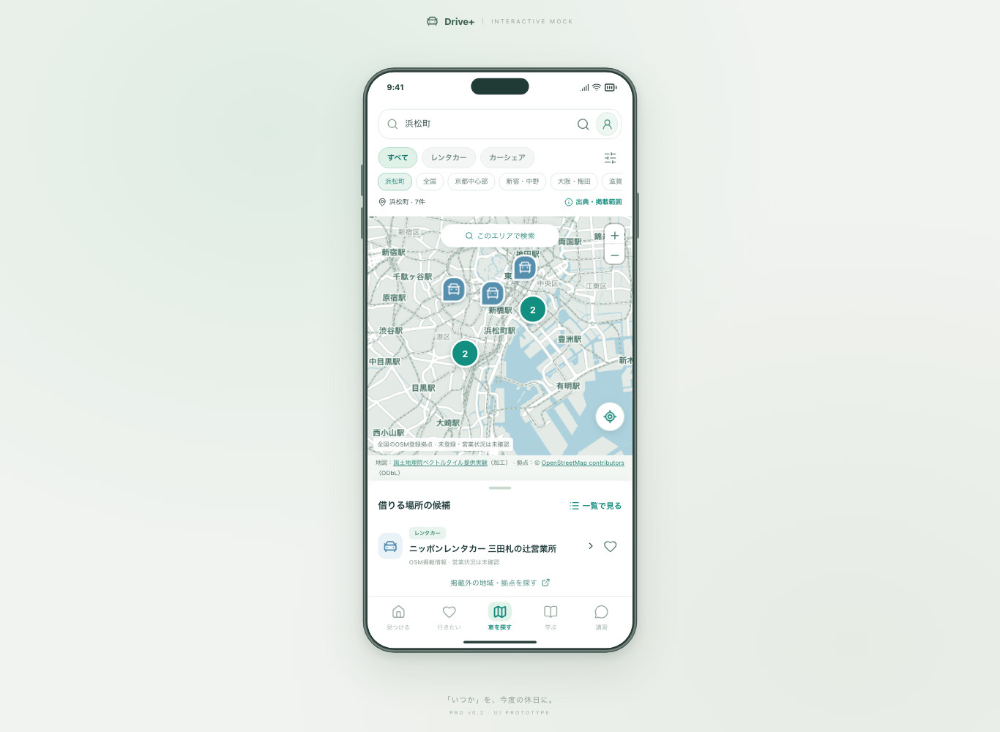
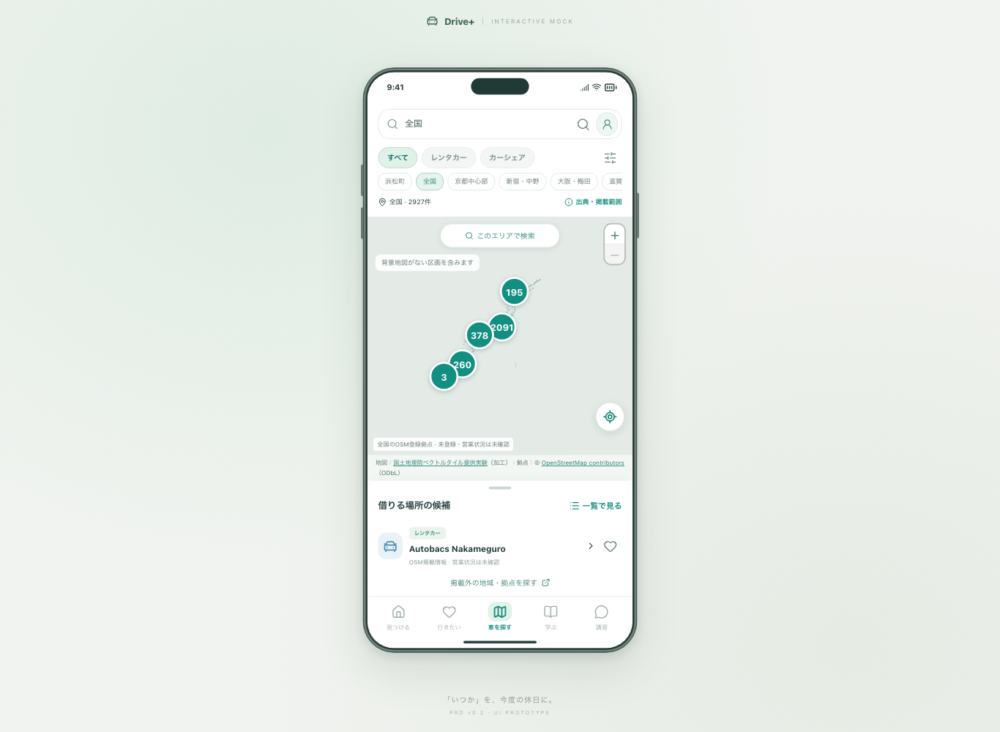
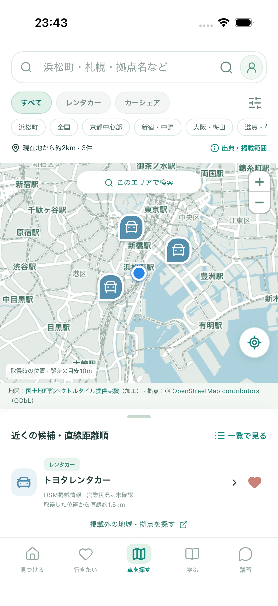
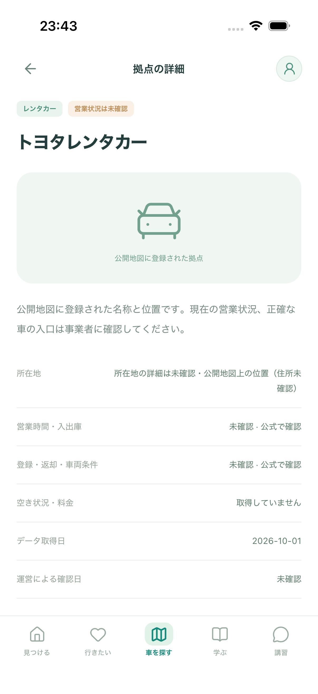
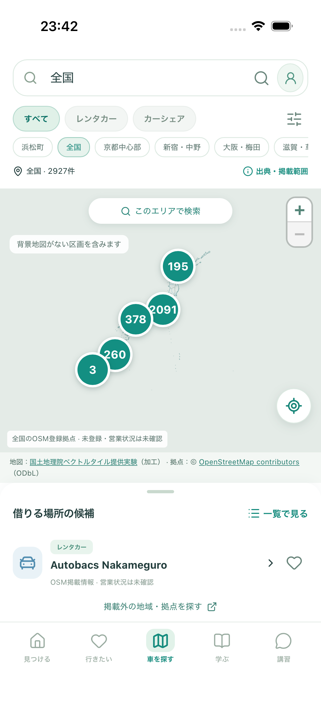
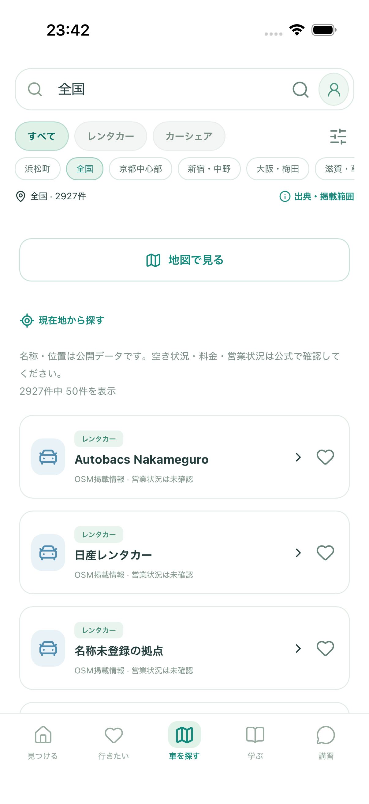

# 全国の拠点検索：確認結果

Issue #83。PR #82の上に積む変更です。既存のPRはマージしません。

## 確認してほしいこと

1. 「車を探す」→「浜松町」→ 候補の詳細 → 車候補に保存。「行きたい」の車候補にも残ります。
2. 「全国」→ 数字の丸を押して拡大 → 地図を移動して「このエリアで検索」。拠点が重なる場所はまとめて表示します。「一覧で見る」では50件ずつ確認できます。
3. 現在地ボタン → 許可して取得。約2km以内の登録を表示します。ピンがない場合も店舗がないと断定せず、公式検索へ進めます。

ブラウザ：`http://127.0.0.1:5173/#/cars`。アプリの初期設定がまだの場合は「まずは見てみる」から入れます。iPhoneへの更新は [iOS開発手順](../../IOS_DEVELOPMENT.md)、掲載範囲・更新方法は [全国の拠点検索](../../NATIONAL_STATIONS.md) を参照してください。

## 今回できるようになったこと

- 日本の行政区域内にOSM登録されている2,927件（レンタカー2,299、カーシェア628）を同梱。以前の45件のIDをすべて維持。
- 全国の地図移動・現在地周辺の検索。浜松町・札幌・福岡・那覇などの主要地域、収録済みの拠点名・住所の検索。
- 多数・密集する拠点の集約表示、拡大、最大拡大時の重複候補一覧。地図／一覧・種別・事業者条件の維持。
- 情報源・取得日・営業状況未確認の表示。将来の更新で掲載データから消えた保存IDも、消去せず案内を表示。
- 現在地取得後は約2kmの範囲を画面へ収め、候補が画面外へ隠れる問題を修正。GPS由来の表示範囲は一時利用のまま。

## 開発側の検証

- ビルド・型検査・整形・配信物検査。
- 地図・現在地・ネイティブ保存境界のPlaywright **105件成功**（PC Chromium、スマホ幅Chromium、スマホ幅WebKit）。CIはPRのChecksから参照します。
- データ取り込みのテスト **2件成功**。部分応答、急減、重複ID、不正座標を拒否。ネットワークへの呼び出しはありません。
- XCTestでインストール済みのiOSアプリを操作。浜松町の地域検索 → 全国表示 → 一覧 → 浜松町駅の疑似位置 → 詳細・保存 → 戻るを確認。シミュレーターの位置情報許可を設定して実施。ユーザー本人の実機GPS取得とは異なります。
- 地図がない区画の404と通信失敗を区別。ネットワークがなくても同梱拠点の一覧を操作できます。

ブラウザ自動テストの地図は合成タイルです。下の画像は、実際のGSI背景地図とOSM登録データを使った表示です。シミュレーターのGPS位置は公共施設の浜松町駅座標（35.6554, 139.7571）を指定しています。端末の実際の測位精度や現地の営業は未確認です。

## 見た目

| PCブラウザ：浜松町 | PCブラウザ：全国 |
| --- | --- |
|  |  |

| iPhoneシミュレーター：現在地周辺 | 詳細・保存 |
| --- | --- |
|  |  |

| 全国の集約表示 | 一覧 |
| --- | --- |
|  |  |

## データ・費用・残る範囲

追加有料API・サーバー契約なし。OpenAIの実検索は実行していません。OSMの元応答は1,207,099 bytes、転送圧縮時152,217 bytes、取得約53秒（開発者が1回取得）。表示に不要なタグを除いた同梱JSONは895,260 bytes、gzip換算95,355 bytesです。利用者ごとのOverpass検索・全国データの一括地図ダウンロードは行いません。

全国の全店舗を網羅したデータではありません。浜松町駅から直線約2km以内はこのデータでは3件で、駅のすぐ近くの未登録店は表示されません。営業・空き状況・料金・最新の利用条件は公式確認が必要です。住所検索の完全対応・自動更新・公式情報源との連携は後続です（#8・#21・#22）。今回の確認に新しいAPIキーや有料契約の準備は不要です。

データは © OpenStreetMap contributors / ODbL 1.0。背景地図は国土地理院ベクトルタイル提供実験を加工しています。出典と規約へのリンクはアプリ内と [説明資料](../../NATIONAL_STATIONS.md) に残しています。
