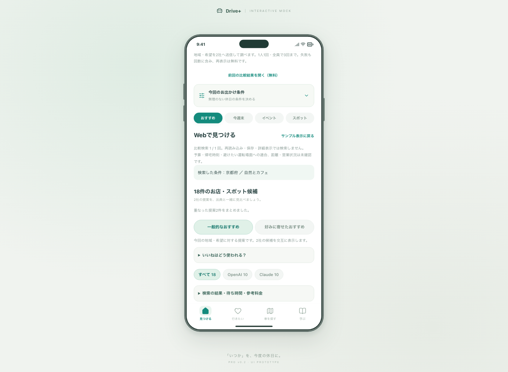
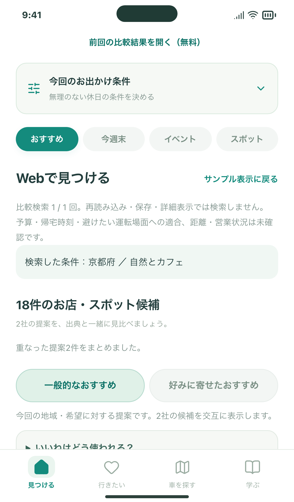
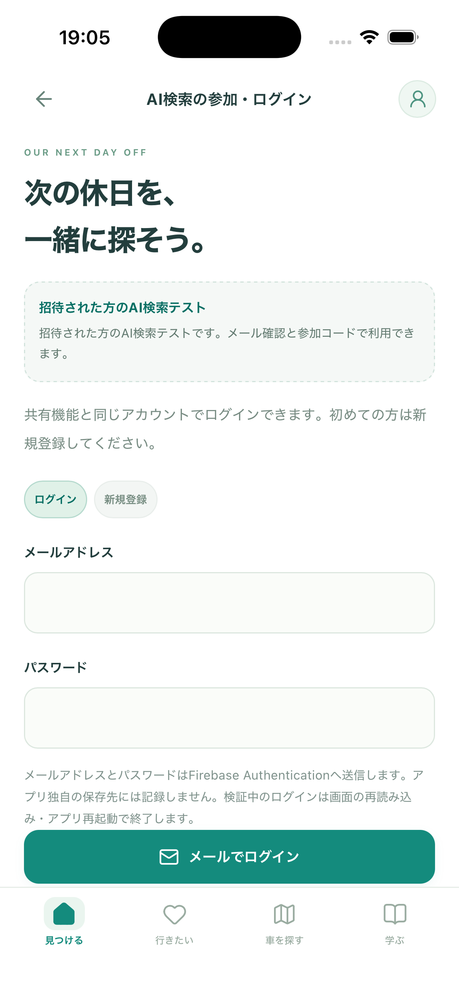

# スマホからの公開AI検索：実装の確認

Issue #99 / 2026-10-06。公開の進捗はIssueに記録します。この画像は **Firebase Auth Emulator＋架空のAPI応答** による操作結果で、実際のお店の検索結果ではありません。

## 変わること

公開URLでメール確認済みのアカウントと参加コードを使い、Macを起動せずにAI検索を試す入口を追加しました。検索先はCloudflare Workerです。APIキーをブラウザに渡さず、全員で3回・1アカウント1回をD1台帳で守ります。

## 確認したこと

- 実際のWorker実行環境とD1をローカルで動かし、同時に8人が検索しても3人分だけを処理。Node側では20人同時・同じ人の連打も検証。
- 未認証・未確認メール・違う参加コード・許可外オリジン・不正入力で有料リクエストを送らないこと。他アカウントの結果を読めないこと。
- 前回結果は7日間本人だけが開けること。期限後は結果を消して回数は戻さないこと。停止中も結果の読み取りは維持すること。
- PC Chromium・スマホ幅Chromium・WebKitで、ログイン→コード→検索→保存→好み順→詳細→戻る→無料の復元→別アカウントへの切替を確認。横はみ出しなし。
- 既存のローカル検索サーバー・比較検索の保存・重複まとめ・復元を27件のNodeテストと39件のブラウザテストで再確認。
- 掲載情報入力ツール内のアプリプレビューも含め、54件の操作・データ検査が成功。ツールでは公開検索を無効に保ち、個人データとネットワーク送信を分離。
- ビルド・整形・配信物検査を実施。接続準備スクリプトを架空設定で動かし、元の環境ファイルを変えず、参加コードを再発行せず、検索停止状態の設定を生成することを確認。

開発テストに本物のAI APIは使っていません。テスター用の3回は消費していません。本物のiPhone・本番ネットワークでのAI応答品質は公開後の確認対象です。

## 操作画像

| PCの中央スマホ表示 | スマホ幅の表示 |
| --- | --- |
|  |  |

[試す手順・公開と停止の方法](../../DOGFOOD_PUBLIC_TEST.md)

## 2026-10-07：iPhoneアプリへの反映

Capacitorで画面を同梱したiPhoneアプリからも、同じ公開検索サーバーへ接続できるようにしました。`capacitor://localhost` を限定して許可し、メール確認済み認証・参加コード・Webと共通の回数制限を維持します。

- iPhone 17 / iOS 26.5の検証用シミュレーターでXCTestを実行。ホームのタッチスクロール、AI検索ログイン画面、新規登録への切替、戻る、タブ切替を確認しました。
- Worker検査は9件成功。WebとiOSが同時に検索しても全員3回、同じアカウントは画面を変えても1回までです。
- 公開WorkerにiOSのオリジンを指定し、検証用アカウントで実Firebase認証・本人用の無料読み取りを確認。未確認メールは拒否し、確認後は正常に取得。検証用アカウントは削除済みです。
- この追加検証で有料AI呼び出しは0回。確認時の残りは2回でした。実機の操作と有料検索の内容は利用者の確認対象です。

以下は実際のiOSシミュレーターの画面です。上のブラウザ画像とは検証方法が異なります。

