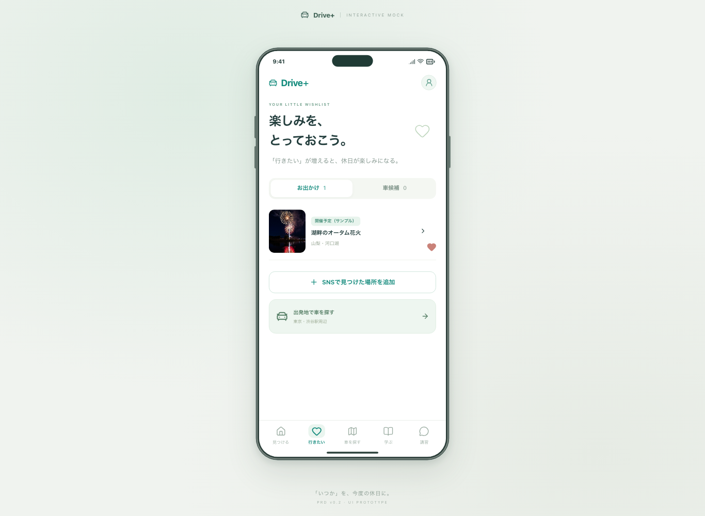
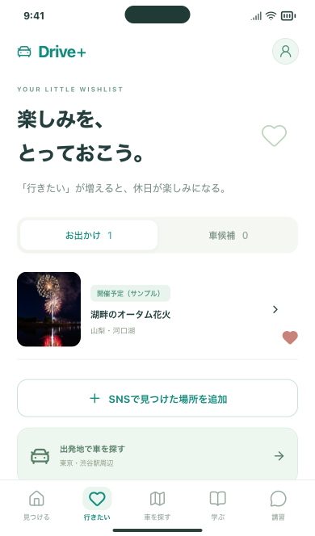

# Issue #33：静的配信物の復旧

確認日：2026-09-17（JST）。PR #62をmainへ反映した後、追加サービス費用0円で実装しました。初期費用・運用費を含む累計3,000円の上限を維持しています。

## 今回できること

配信ファイルの保管・照合・復元をコマンド化しました。以前はCI Artifactを手動保管・再配信する説明のみでしたが、保存後の欠損・変更を検出し、新しいフォルダに復元して操作確認できます。SHA-256の記録は真正性を証明する署名ではありません。信頼するCIとコミットの照合も必要です。

- `npm run release:backup -- create <配信フォルダ> <新しい保管先>`
- `npm run release:backup -- verify <保管先>`
- `npm run release:backup -- restore <保管先> <新しい復元先>`

入力はコミット済み・未変更のサンプル検証版に限定し、既存の配信物検査を通します。既存フォルダを上書きせず、壊れたファイルや不正な記録からの復元は停止します。バックアップ記録と既定の保管フォルダが配信物に混ざった場合も検査を停止します。

具体的な手順と失敗時の扱いは[復旧ガイド](../../RELEASE_RECOVERY.md)を参照してください。

## 確認結果

| 対象 | 結果 |
| --- | --- |
| バックアップと復元のNodeテスト | 9件成功。往復復元・改変・欠損・追加・不正記録・パス・リンク・既存出力・上限・CLIを確認 |
| ビルド済みアプリの自動テスト | 210件成功。Chromium PC・モバイル相当・WebKitモバイル相当で各70件 |
| 掲載情報入力ツール | 18件成功 |
| 合計 | 237件成功 |
| 整形・型チェック・ビルド・配信物検査 | 成功 |

復旧のブラウザ試験は次の順序で行います。

1. 本物のビルド済み配信物からCLIでバックアップを作る。
2. 隔離ブラウザで「湖畔のオータム花火」を行きたいに保存する。
3. テスト用サーバーを503応答へ切り替え、配信失敗を模擬する。
4. CLIで新しいフォルダへ復元し、同じテストサーバーをそのフォルダに切り替える。
5. 保存内容が同一のまま残ること、`release.json`の一致、5タブ・詳細・画像、外部通信や画面例外がないことを確認する。

失敗時と復旧後の画像はCIのPlaywrightレポートにも保存します。テスト用サーバーは127.0.0.1の一時ポートで起動・終了し、通常のブラウザや開発サーバーには影響しません。

| PCで復旧した保存一覧 | WebKitのモバイル相当で復旧した保存一覧 |
| --- | --- |
|  |  |

## 残作業

- 実配信先のアカウント・公開範囲・保管先と担当者の決定は人間が行います。施設・写真の確認は引き続き保留です。
- 実配信サービスの復旧、キャッシュ・HTTPヘッダーの検証、障害・更新遅延・累計費用の監視と通知は未接続です。
- localStorageやDBの復元・保存形式変更の移行は対象外です。同じ配信元で今回の保存形式を維持した場合の確認であり、任意の旧版への互換性は保証しません。
- コマンドは自動デプロイ・配信先の停止・再開を行いません。新規契約・課金・本番公開はしていません。

Issue #33は一部実装として開いたままにします。
