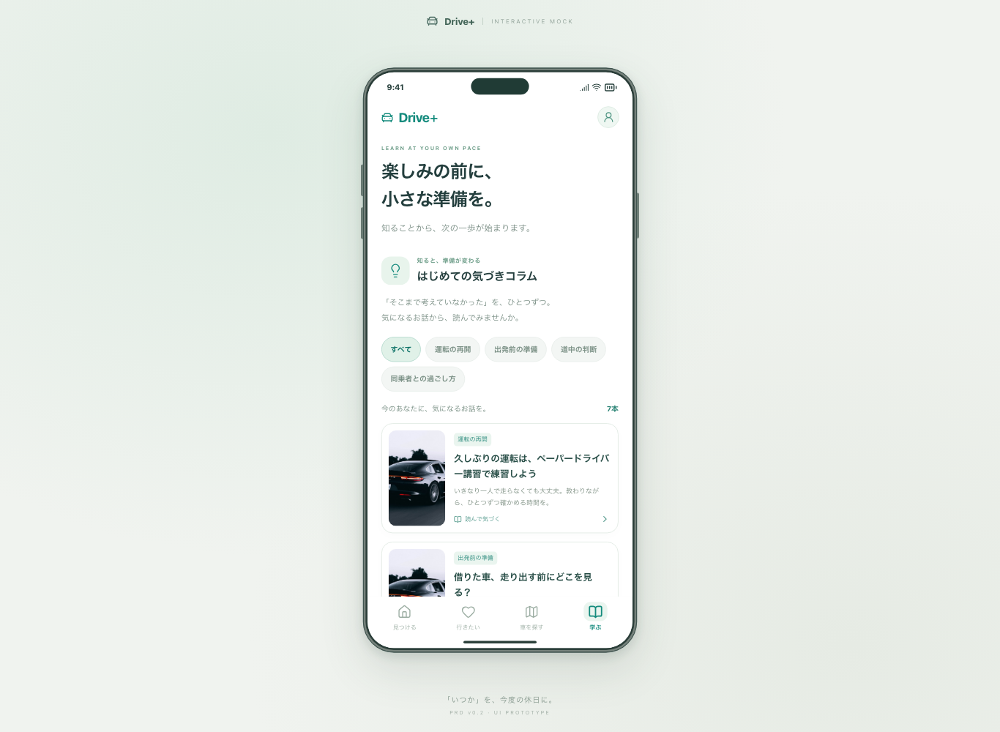
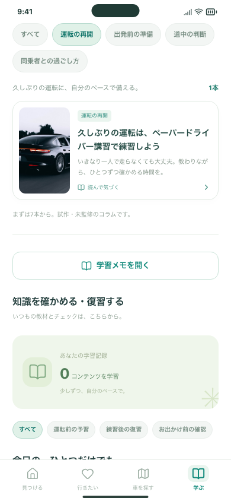
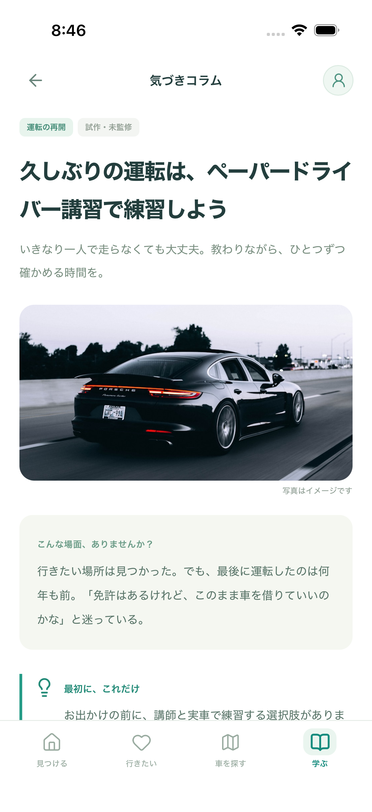
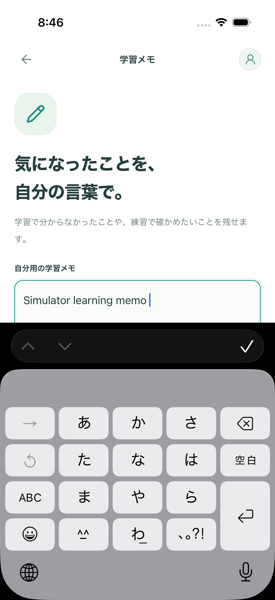
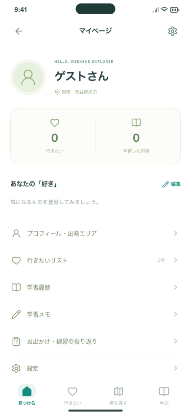

# 講習タブを終了し、運転再開のコラムを追加

2026-10-02 / [Issue #88](https://github.com/Greek-Academy/Let-s-go-anywhere/issues/88)

## 何が変わったか

講習会社の一覧・詳細・相談フォーム・共有確認・受付デモ・相談履歴を削除しました。下部は「見つける／行きたい／車を探す／学ぶ」の4タブです。プロフィール、設定、お出かけ詳細、チェック結果にも、会社相談へ進む入口はありません。

「学ぶ」の最初に「久しぶりの運転は、ペーパードライバー講習で練習しよう」の写真パネルを追加しました。「運転の再開」で絞り込み、本文と参考情報を読めます。希望や不安の伝え方、受講前の確認点、無理をしない予定の見直しを説明します。会社の紹介・推薦・申込みは行いません。

## 確認していただきたい3操作

1. 下部の4タブを切り替え、プロフィール・設定にも講習会社への入口がないことを確認してください。
2. **学ぶ → 運転の再開 → 新しいパネル**を開いてください。本文を下まで読み、戻ると絞り込みが残ります。読みやすさと内容が意図に合うかをご確認ください。
3. **学ぶ → 学習メモを開く**で入力し、別のタブから戻ってください。以前のメモも含めて残ります。端末の外へ送信する機能はありません。

Webでの確認先：<http://127.0.0.1:5173/#/learn>。起動していない場合はリポジトリで `npm run dev`。iPhone版は `npm run ios:sync` 後、Xcodeで `App` と対象端末を選び▶を押します。WebとiPhoneは別々の保存領域です。

## 保存データ・外部通信・費用

お出かけ、車候補、知識チェック、学習履歴を維持します。旧版の質問メモは同じ保存項目を使う本人用の「学習メモ」にしました。過去の振り返りも残ります。旧相談デモ・絞り込みの保存項目は互換性のためにだけ保持し、新規作成・表示・送信はしません。

旧URLは終了のお知らせがある「学ぶ」へ移ります。戻る操作で相談画面が復活することはありません。保存形式の初期化や破損時の保護を回避する処理も入れていません。[変更の仕様](../../LESSON_REFERRAL_RETIREMENT.md)。

新たなAPI・契約・課金はありません。実検索APIは呼び出しておらず、許可されたWeb検索3回の枠も消費していません。コラムの写真は既存の同梱画像を使っています。

## 開発側の検証

- 型チェック・Webビルド・配信ファイル検査・整形確認。
- PC Chromium、スマホ幅Chromium、スマホ幅WebKit：画面操作414件成功。4タブ、旧URLの戻る操作、新コラムの絞り込みと本文、320px幅・文字拡大、既存保存の引き継ぎを含みます。
- 公開ファイルの復旧：未コミットのビルドを拒否する保護条件を維持し、変更をコミットした検証用コピーで3件成功。配信失敗を模擬し、復元後に保存状態と4タブが使えることを確認。
- 掲載情報入力ツール：51件成功。確認用アプリにも4タブを反映。
- iOS 26.5 / iPhone 17相当の専用Simulator：2件成功。保存・再起動、地図、学習メモのキーボード入力と保持、新コラム、ジャンル切り替え、長文スクロール・戻るを検証。利用者のSimulatorデータをテスト用に初期化していません。
- 最後に残っていた「相談メモ」の表記を「学習メモ」に統一し、影響するWeb操作を再確認。64件成功、既存の外部リンク2件はWebKitの応答待ちでタイムアウトしたため操作記録を確認し、外部リンク5件を単独で再実行して全件成功。外部リンクの実装や待機時間は変更していません。

実機iPhoneでの今回の確認、VoiceOver、専門家による教材監修はこの検証に含みません。新コラムは試作・未監修です。一般公開前の内容確認はIssue #9に残しています。

## 画面

### PCでの4タブと学ぶ

### 新しいジャンルとパネル

### iPhone 17 Simulatorでの本文と学習メモ

### プロフィール

## Issueの整理

#10・#11・#23・#26・#27・#28・#38は「方針変更で対応不要（not planned）」として閉じました。機能を完成させたという意味ではありません。残る14件は講習紹介部分を外す、または新コラムを監修対象へ加える形で範囲を更新し、#1の優先順位・依存関係も更新しました。元の説明は履歴として残しています。

#88は利用者の確認待ちにし、本PRのマージは確認後に行います。
