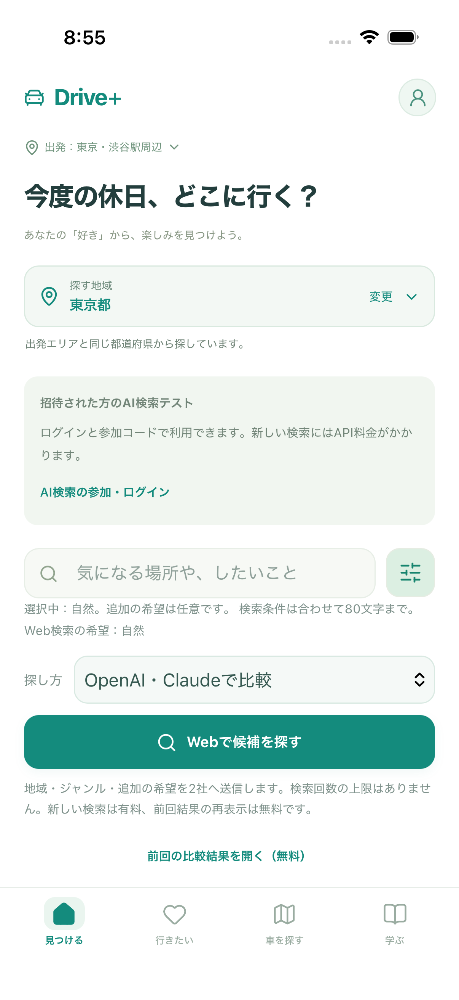

# ジャンルによるWeb検索と回数上限解除

Issue #101 / PR #102。2026-10-08の依頼に対応します。

## 試す3操作

1. 「見つける」→探す地域を東京都→入力欄右の絞り込みで自然→文章は空欄で「Webで候補を探す」。
2. 追加の希望に「静かな公園」を入力して再検索。結果の検索条件が「自然 / 静かな公園」になります。
3. 行きたいへの保存、詳細、前回の比較結果の無料復元を確認します。ジャンルや文章の変更だけでは検索しません。

ログイン・メール確認・参加コードは引き続き必要です。公開Web・接続済みiPhoneアプリの累計回数上限を解除します。新規検索には運営側のAPI料金がかかり、失敗時も料金が発生する場合があります。自動検索・自動再試行はありません。

## 開発側の検査

- PC・スマホ幅Chromium・WebKitの6フローで、文章なし／追加文章／ジャンル変更／4回以上／復元・保存・本人限定表示を確認。Auth Emulatorと架空応答で有料APIは使用していません。
- WorkerのSQLiteとCloudflare実行環境＋D1で11件。繰り返し検索、同一アカウントの同時実行、認証拒否、移行、失敗後の復元、7日期限、遅れて返った古い結果の上書き防止を確認。
- 既存検索のNode 28件、ブラウザ39件が成功。
- iPhone 17 / iOS 26.5のXCTestで、ジャンルのみの入力が認証確認まで進むこと、スクロール・タブ操作を確認。未ログインで止め、本物のAI検索は実行していません。

公開への反映・CI最終結果はIssue #101に記録します。実機と検索結果の内容は利用者の確認対象です。

[データ移行・公開・停止の手順](../../DOGFOOD_PUBLIC_TEST.md)
