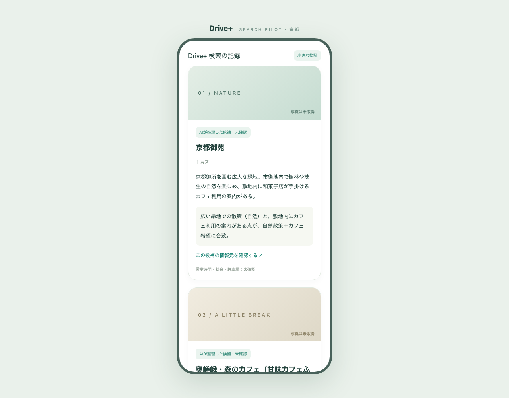

# 京都市のスポット検索：実検索1回目の結果

2026-09-28 20:37 JST。Issue #71 / PR #72。

**地域と希望からWeb検索し、3件の候補をカードに表示できました。** 今回は1回で止め、上限3回のうち2回を残しています。通常アプリ・iPhone版の画面や掲載データは変更していません。

## 何を試したか

- 地域：京都市
- 希望：自然を楽しんで、カフェにも寄りたい
- 対象：京都市公式観光サイト `kyoto.travel` とそのサブドメイン
- モデル：`gpt-5-mini`
- Macの検証画面でボタンを押し、実APIへの送信からカード表示までPlaywrightで確認

| 項目 | 実測結果 |
| --- | --- |
| APIリクエスト / Web検索 | 1回 / 1回 |
| 候補数 / 自動除外数 | 3件 / 0件 |
| サーバーで計測した応答処理時間 | 15.205秒 |
| 取得項目 | 名称・地域・短い説明・希望に合う理由・出典URL・検索日時 |
| 入力 / 出力トークン | 8,759 / 939（キャッシュ入力0） |
| 利用量からの参考費用 | **$0.01406775（約0.014ドル）** |
| 実請求額 | 本人のUsage画面で未確認。税・為替・前払い入金とは別 |

費用は `8,759 × $0.25 / 100万 + 939 × $2 / 100万 + 検索1回 × $0.01`。2026-09-28に[OpenAI公式料金](https://developers.openai.com/api/docs/pricing)を再確認し、実装の参考単価と一致しています。アカウント全体の利用額・残高を取得したものではありません。

## 元ページとの照合で分かったこと

以下は開発側で元ページの記載と照合した結果です。施設への問い合わせ、営業状況の確認、掲載・写真の許諾を行ったものではありません。

| 候補 / 出典 | 照合できた内容 | 改善・確認したい点 |
| --- | --- | --- |
| [京都御苑](https://ja.kyoto.travel/tourism/single01.php?category_id=8&tourism_id=1163) | 上京区の所在地、緑地・散策、苑内のカフェの案内 | 営業状況・利用条件は別途確認 |
| [“奥嵯峨-森のカフェ” ふらっと](https://ja.kyoto.travel/tourism/single01.php?category_id=4&tourism_id=3080) | 右京区嵯峨越畑の所在地、里山・散策路、カフェの説明 | AIの名称は説明を付け足した表記。元ページの正式表記を優先したい。「嵯峨」だけでは位置が粗く、季節・営業日の確認も必要 |
| [mushroom-rental office&cafe](https://ja.kyoto.travel/tourism/single01.php?category_id=14&tourism_id=3033) | 右京区京北の所在地、自然とデッキカフェの説明 | 京都市内でも中心部と同じ近さではない。利用条件・営業状況は未確認 |

3件とも元ページに該当施設の掲載があり、地域と希望に関係する記述を確認できました。ただし、検索1回だけで全般的な精度は判断できません。自動のURL照合だけで本文・地域の正しさを認定できるわけでもありません。

## 画面と結果の確認

- 実検索で3枚のカードが表示され、エラーがないことを確認。
- 取得済みの応答を再表示し、JSONの保存内容が取得結果と一致することを確認。再表示・保存の確認ではAPIを呼んでいません。
- 下の画像も取得済み応答の再表示です。閲覧専用という注記を加えた記録で、アプリのデザイン変更ではありません。
- 手元の `.local-research/results/attempt-1-review.html` は取得済み結果を読むだけのHTMLです。スクリプト・検索操作は含まず、開いてもAPIを使いません。元のJSONと一緒にGit対象外で保管しています。

新しく検索する場合は http://127.0.0.1:4181/ を開き直します。実検索モードへ切り替え済みです。画面を開くだけでは課金されず、検索ボタンで追加の1回を使います。再読み込みで前回の候補は消えるため、取得後は「検証結果をファイルに保存」で残してください。利用回数は消えません。

## 次に判断すること

1. 本人が候補を見て、行きたいと思えるか・15秒程度の待ち時間をどう感じるか確認する。
2. 残り2回は別の希望で試す余地として残す。現時点で追加実行はしていない。
3. 次の開発では元ページの施設名を保つこと、地域をより具体的に示すこと、距離・営業状況などの未確認を扱うことを検討する。
4. 今の「見つける」画面・検索欄・カードの見た目を保って検索処理を接続する。今回の4181画面で置き換えない。

写真・SNS検索・距離計算・本番サーバー・iPhoneへの検索接続は今回の対象外です。本人の候補評価・実請求確認・次の範囲の判断が残るため、Issue #71は閉じません。
