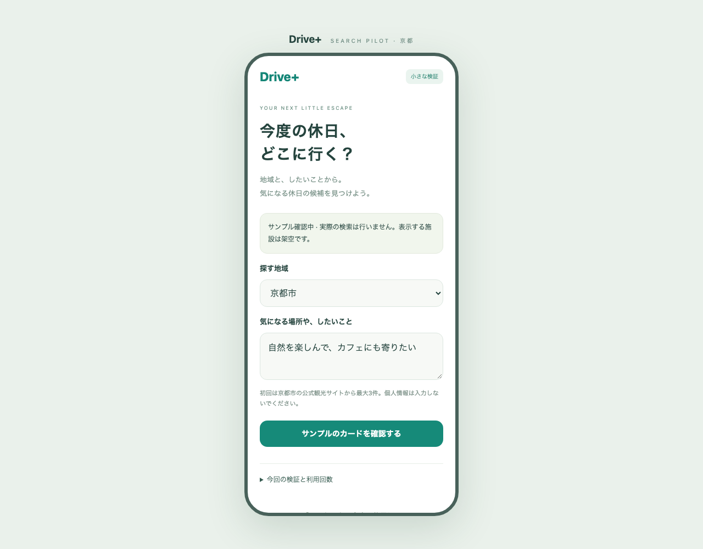
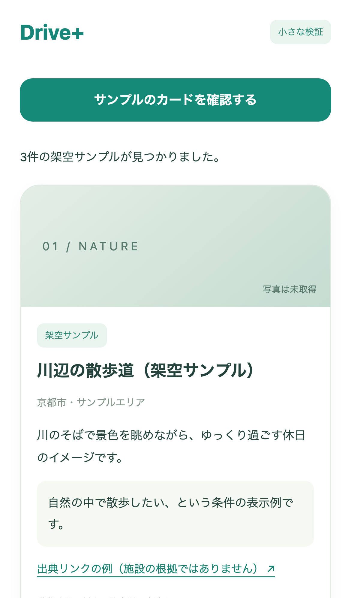

# 京都市のスポット検索：最小検証の確認資料

Issue #71（親 #35）。2026-09-27。

## 変わること

地域と「したいこと」を指定し、出典付きの候補カードと利用量を見るローカル検証画面を追加しました。通常のiPhoneアプリの表示や保存データは変わりません。

今はサンプルで開発側の動作を検証済みです。OpenAI APIキー準備後に実検索し、候補の質と実費を測る作業が残っています。この資料の画像はすべて架空のサンプルです。

## あなたが試す3つの操作

1. `npm run research:demo` で起動し、http://127.0.0.1:4181/ を開く。
2. 「したいこと」を入力し、「サンプルのカードを確認する」を押してカード・未確認表示・出典リンクを見る。
3. 「検証結果をファイルに保存」を押し、サンプルの結果を保存できることを確認する。

APIキーと実検索の手順は[検索検証ガイド](../../SPOT_SEARCH_PILOT.md)を参照してください。実検索は最大3回で、失敗も数えます。実検索の開始前に画面上のモードを確認します。

## 開発側で確認したこと

- 偽のAPI応答による14件の検査：APIキー非公開、Host／Origin／一時トークンの制限、出典のない回答を除外、3回の上限・再起動・同時送信・タイムアウト、費用が未確定の扱い。
- Playwrightの12件：PCのChromium、スマホ幅のChromiumとWebKitで入力・カード・結果保存・0件・エラー・キーなし・上限・内部スクロールを検査。
- 通常アプリと入力ツールのビルド・配信物の検査。通常アプリのソースコード・個人データ・Xcode署名設定は変更していません。
- CIで既存アプリ・入力ツールも検証します。結果はPRのChecksを参照してください。CIは実APIを使いません。

## まだ確認していないこと

- 実APIアカウントのモデル利用可否、実際の候補数・回答の正確さ・遅延・利用料。
- 本番への掲載許可、写真、Google Places／TikTok／X連携、iPhone版への組み込み。
- サンプルの成功は実情報の取得成功・公開承認ではありません。親 #35 と今回 #71 は継続します。

## サンプル画面

