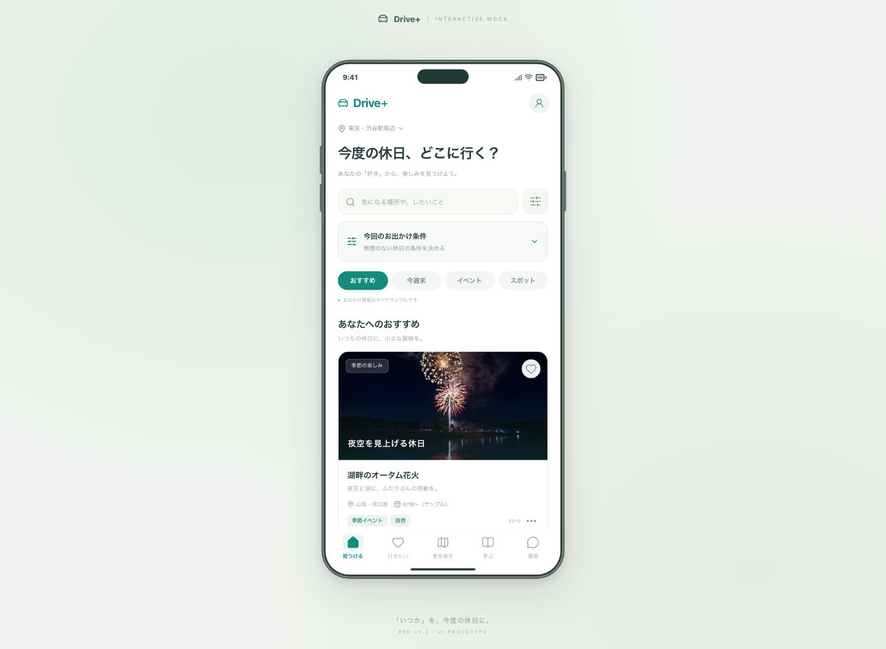
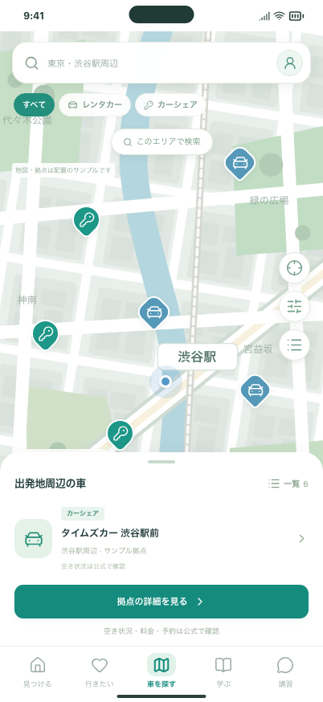

# Issue #5・#14 先行実装の確認

施設選定・写真の利用条件の確認は保留し、既存モックを保ったまま開発できる構成整理と静的検証版の生成を実装しました。

## 実装範囲

| Issue | 今回できたこと | 残ること |
| --- | --- | --- |
| #5 | 各画面の直接モック参照をContentProviderへ集約。掲載データを注入する入口、ID・参照の検査、構成と段階移行の記録 | 実データの検証・接続、API契約、本番DB・認証・管理権限の設計と採用決定 |
| #14 | ビルド設定の検査、サンプル版の識別情報、配信ファイル検査、ビルド済みアプリのCIテスト、成功Artifact、手動配信・復旧手順 | 配信先・公開範囲の決定、実デプロイ、HTTPヘッダー・復旧の現地検証、本番のサービス接続 |

両Issueとも先行部分の実装で、Issue全体の完了ではありません。追加サービスの契約・課金・外部公開は行っていません。

## 操作で確認する

起動手順の詳細は [静的検証版のガイド](../../STATIC_PREVIEW.md) にあります。

```bash
npm ci
npm run build
npm run verify:preview
npm run preview -- --port 4173 --strictPort
```

http://localhost:4173/ を開き、次を確認します。別ポートは別のlocalStorageになるため、5173で保存した候補は4173には引き継がれません。

1. 「はじめる」から初回設定、または「まずは見てみる」からホームへ進む。
2. 写真カードのハートを押し、「行きたい」で保存されていることを確認する。再読込しても保存が残る。
3. 「車を探す」でピン・フィルター・拠点詳細を操作する。
4. 知識チェック・学習・講習相談へ進む。表示は引き続きサンプルで、実送信や予約を行わない。
5. 最初から試す場合は右上プロフィール → 設定 →「モックの保存データを削除」。

## 開発者向けの確認

- ローカルで `npm run format:check`、`npm run build`、`npm run verify:preview` を実行。
- `CI=true PLAYWRIGHT_PORT=5176 npm run test:preview`：**52件成功**。既存操作・下見/条件/SNSの確認に加え、データ整合性、実際の不正設定ビルドの停止、不要ファイル検知、静的配信版の保存・再読込を確認。
- ビルド済みのホームで外部へのリクエストとページ実行エラーがないことを確認。
- PCと402 × 874pxで撮影し、端末枠・下部ナビ・地図表示を目視確認。スタイル・画像アセット・保存形式は変更していません。
- CIの最終結果と対象コミットはPRのChecksを参照。Artifactに静的ファイルとPlaywright HTMLレポートを保存します。

検証ブラウザはChromiumです。実機Safari、外部配信先でのHTTPヘッダー、実施設の情報・権利は今回の検証対象に含まれません。

## 表示確認の画像

ビルドしたファイルをVite previewで開いて撮影しています。

### PCホーム（1366 × 1000px）



### スマホ幅の地図（402 × 874px）


