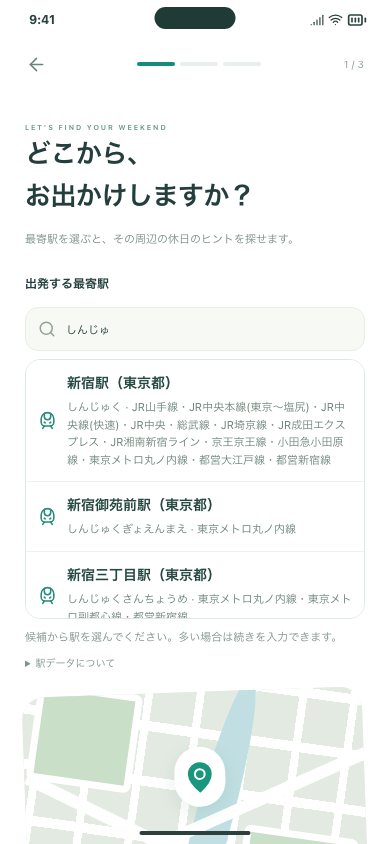
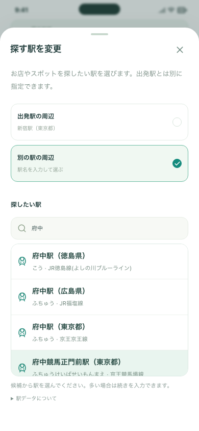
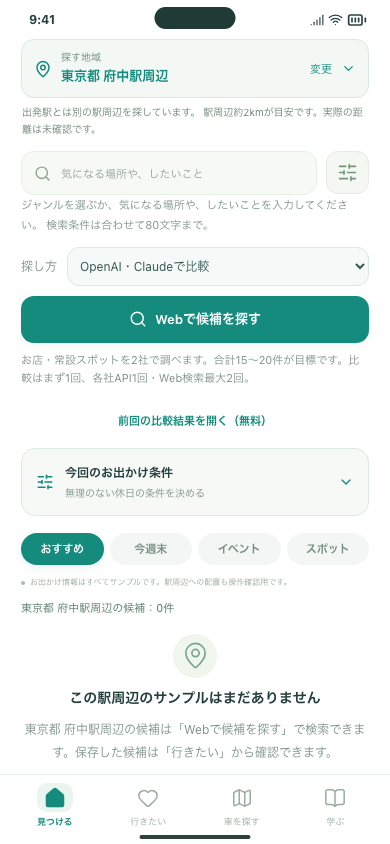

# #104 駅名で「出発地」と「探す地域」を選ぶ

都道府県では範囲が広すぎるため、文字を入力すると駅候補が出る形に変更しました。出発する最寄駅と、遊びに行きたい駅は別々に指定できます。追加のAPIキーは不要です。

## 試していただきたい3操作

1. 「見つける」の「探す地域」→「しんじゅ」と入力→「新宿駅（東京都）」→「この駅の周辺で探す」。表示が新宿駅周辺になることを確認します。同名駅は都道府県・路線を見て選べます。
2. 出発エリアを別の駅へ変更します。個別指定した検索先は変わりません。「探す地域」で「出発駅の周辺」を選ぶと出発駅に揃います。入力途中で閉じれば、前の検索先が残ります。
3. 「自然」などを選んで「Webで候補を探す」。選んだ駅周辺とジャンルを条件に調べます。この操作は従来どおりAPI料金が発生します。入力・駅選択だけなら検索料金は発生しません。

旧版から更新すると、最初だけ駅を選び直す必要があります。以前の都道府県から勝手に最寄駅を決めません。保存・学習メモ・共同リストは引き継ぎます。

## 開発側で確認すること

- 駅の漢字・かな・同名駅、上下キー・Enter、入力修正・未選択・キャンセル・再表示。
- 出発駅と検索先の独立、旧保存データ、個人保存と学習の保持、プロフィール／オンボーディング。
- サーバーで存在しない駅ID・改変した表示名・任意座標を拒否。有効な駅の代表座標・路線とジャンルを両社へ渡すこと。
- 架空のAPI応答とローカル認証で、検索→出典→保存→詳細→復元。駅選択だけで有料APIを呼ばないこと。
- PC、スマホ幅Chromium／WebKit、iPhone 17 SimulatorのWKWebView。実機の日本語キーボードでの使い心地と、本物の検索候補の質は利用者確認として残します。

自動テストは外部の有料AIへリクエストしません。最新の実行結果・CI・公開状況はIssue #104とPRに記録します。

## 確認画像

| 初回の最寄駅入力 | 同名駅を区別して選ぶ | 出発駅と検索先を別に指定 |
| --- | --- | --- |
|  |  |  |

約2kmはAIへ伝える範囲の目安で、候補までの距離を実測した保証ではありません。最新営業状況・写真・料金を確定する変更も含みません。[仕様・データの出典・更新方法](../../RAIL_STATIONS.md)。
